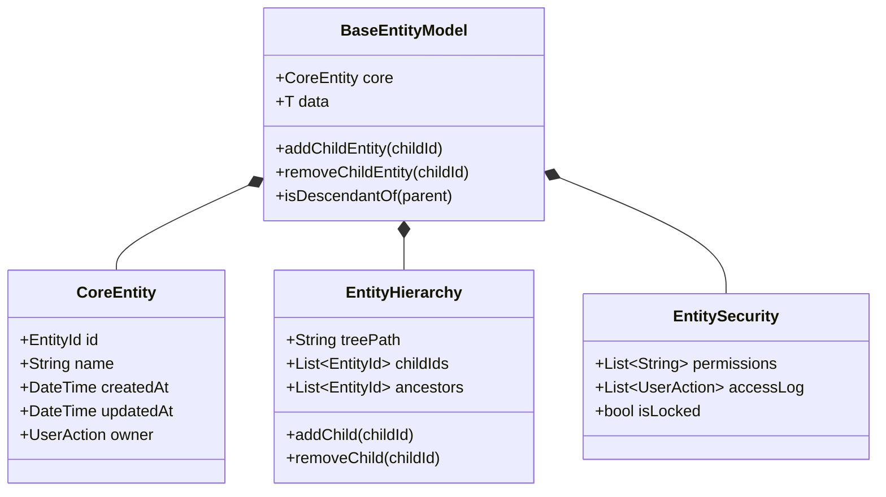
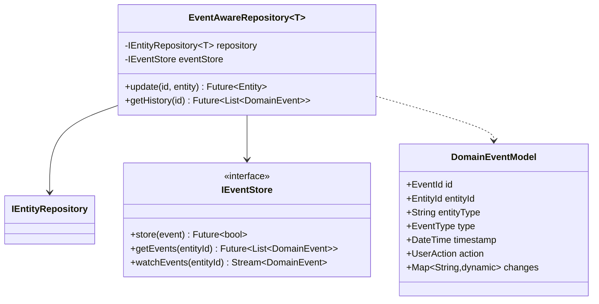
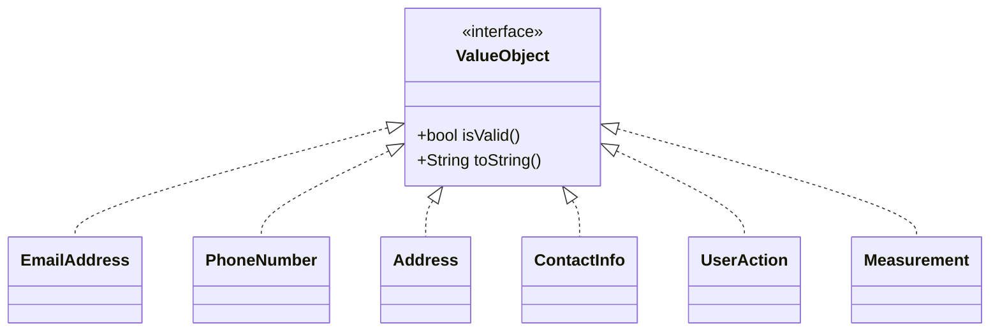

# Data Manager Project Codebase Snapshot

*Generated for AI-assisted development*

## Table of Contents

1. [Codebase Statistics](#codebase-statistics)
2. [Architecture Overview](#architecture-overview)
3. [Project Structure](#project-structure)
4. [Usage Examples](#usage-examples)
5. [Domain Entities](#domain-entities)
6. [Value Objects](#value-objects)
7. [Repositories](#repositories)
8. [Services](#services)
9. [Classes](#classes)
10. [Interfaces](#interfaces)
11. [Enums](#enums)
12. [Typedefs](#typedefs)
13. [Functions](#functions)
14. [UML Diagrams](#uml-diagrams)
15. [File Dependencies](#file-dependencies)
16. [Alphabetical Index](#alphabetical-index)

## Codebase Statistics

```
Total Dart Files: 22
Total Classes: 75
Total Interfaces: 10
Total Enums: 12
Total Typedefs: 8
Total Functions: 78

Domain Components:
  Entities: 34
  Repositories: 6
  Services: 1
  Value Objects: 14
```

## Architecture Overview

This project implements a **Domain-Driven Design (DDD)** architecture with **Clean Architecture** principles, organized into distinct layers:

### Architectural Layers

1. **Domain Layer** (`lib/src/domain/`)
   - Core business logic and rules independent of any external frameworks
   - Contains entities, value objects, domain events, and repository interfaces
   - Implements the Aggregate pattern for maintaining invariants across entity clusters

2. **Application Layer** (`lib/src/application/`)
   - Orchestrates the flow of data between the domain and infrastructure layers
   - Contains services, providers, and use cases that implement business workflows
   - Handles schema migrations and other cross-cutting concerns

3. **Infrastructure Layer** (`lib/src/infrastructure/`)
   - Implements technical capabilities required by the application
   - Contains repository implementations, data sources, and external service clients

### Key Design Patterns

- **Entity-Component System**: Core entities use a component-based architecture for flexible composition
- **Repository Pattern**: Abstracts data access through repository interfaces
- **Event Sourcing**: Domain events are the source of truth for entity state
- **Hexagonal Architecture**: Domain core is isolated from technical concerns through ports and adapters

### Domain Model Structure

- **Aggregates**: Clusters of entities with a root entity that maintains invariants
- **Value Objects**: Immutable objects representing domain concepts without identity
- **Domain Events**: Represent changes that have occurred in the domain
- **Factories**: Create complex domain objects with proper validation and relationship management

### Data Flow

```
User Action → Application Service → Domain Model → Repository Interface → Infrastructure Repository → Data Store
            ↓                                                                                        ↑
            └─── Domain Events ─── Event Store ─── Event Sourcing ─── Event Replay ──────────────────┘
```

### Testing Approach

- **Domain Layer**: Unit tests for business rules and invariants
- **Application Layer**: Integration tests for workflows and use cases
- **Infrastructure Layer**: Integration tests with external dependencies
- **End-to-End**: Full system tests via API endpoints

This architecture ensures high maintainability, testability, and separation of concerns while keeping the domain model at the center of the application.


## Usage Examples

### Creating Entities

```dart
// Creating a new site using the EntityBuilder
final siteEntity = EntityBuilder<SiteModel>()
  .withName('Headquarters')
  .withUser(currentUser)
  .withData(SiteModel(
    name: 'Headquarters',
    ownerId: ownerId,
    address: '123 Main St, City, Country',
    latitude: 37.7749,
    longitude: -122.4194,
  ))
  .withDescription('Corporate headquarters location')
  .withTags(['headquarters', 'office'])
  .withPriority(EntityPriority.high)
  .build();

// Creating an entity with direct factory method
final equipmentEntity = EntityFactory.create(
  EntityCreateConfig(
    name: 'Main Server',
    user: currentUser,
    data: EquipmentModel(
      name: 'Main Server',
      siteId: siteEntity.id,
      type: EquipmentType.pcs,
      serialNum: 'SRV-2023-001',
    ),
  ),
);
```

### Working with Repositories

```dart
// Fetching an entity by ID
final entityRepository = getIt<IEntityRepository<EquipmentModel>>();
final equipment = await entityRepository.getById(equipmentId);

// Updating an entity
final updatedEquipment = equipment.copyWith(
  data: equipment.data.copyWith(
    specs: {'cpu': '8-core', 'ram': '64GB', 'storage': '2TB'}
  )
);
await entityRepository.update(updatedEquipment.id, updatedEquipment);

// Querying entities with filters
final queryParams = QueryParams(
  filters: {'type': EquipmentType.pcs.name},
  sort: {'name': SortOrder.ascending},
);
final results = await entityRepository.query(queryParams);
```

### Working with Domain Events

```dart
// Creating a domain event
final event = DomainEventModel.entityUpdated(
  id: EventId.generate(),
  entityId: equipment.id,
  entityType: 'Equipment',
  action: UserAction.fromAuthUser(currentUser),
  changes: {
    'status': 'active',
    'lastChecked': DateTime.now().toIso8601String(),
  },
);

// Storing an event
final eventStore = getIt<IEventStore>();
await eventStore.store(event);

// Subscribing to events
eventStore.watchEvents(equipment.id).listen((event) {
  print('Entity ${event.entityId} was updated: ${event.changes}');
});
```

### Working with Hierarchy

```dart
// Adding a child to a parent entity
final (updatedSite, updatedEquipment) = 
  BaseEntityModel.addChildAndUpdateChild(siteEntity, equipmentEntity);

// Removing a child from a parent
final (updatedSite, removedEquipment) = 
  BaseEntityModel.removeChildAndUpdateChild(siteEntity, equipmentEntity);

// Navigating hierarchy
if (equipment.isDescendantOf(siteEntity)) {
  print('Equipment belongs to site: ${siteEntity.name}');
}

// Fetching children
final children = await entityRepository.getChildren(
  siteEntity.id,
  HierarchyParams(direction: HierarchyDirection.children),
);
```

### Working with Value Objects

```dart
// Creating a contact info value object
final contact = ContactInfo(
  contactName: 'John Doe',
  companyName: 'Acme Corp',
  phone: PhoneNumber(
    number: '555-1234',
    countryCode: '1',
  ),
  email: EmailAddress('john.doe@acme.com'),
  address: Address(
    street: '123 Main St',
    city: 'San Francisco',
    state: 'CA',
    country: 'USA',
    postalCode: '94105',
  ),
);

// Using reference numbers
final refNum = ReferenceNumber.parse('INV-1234-A');
print(refNum.formatted); // Outputs: INV-1234-A

// Working with time windows
final schedule = Schedule(
  window: TimeWindow(
    start: DateTime(2023, 6, 1, 9, 0),
    end: DateTime(2023, 6, 1, 17, 0),
  ),
  breakTimes: [DateTime(2023, 6, 1, 12, 0)],
);
final meetingTime = DateTime(2023, 6, 1, 10, 0);
if (schedule.isAvailable(meetingTime)) {
  print('Meeting can be scheduled at this time');
}
```

### Error Handling

```dart
try {
  await repository.update(entityId, updatedEntity);
} on EntityNotFoundException catch (e) {
  print('Entity not found: ${e.id}');
} on ValidationException catch (e) {
  print('Validation error in field ${e.field}: ${e.invalidValue}');
} on LockException catch (e) {
  print('Entity is locked: ${e.message}');
} on DataManagerException catch (e) {
  print('Operation failed: ${e.message}');
  if (e.details != null) print('Details: ${e.details}');
}
```


## Project Structure

- `lib/data_manager.dart` - Component of the data manager system
- `lib/src/application/extensions/domain_event_extensions.dart` - Extension methods for domain event
- `lib/src/application/providers/event_service_provider.dart` - Provider class that connects domain model with the application services
class EventServiceProvider {...
- `lib/src/application/services/event_migration_service.dart` - Service responsible for handling domain event schema migrations
class EventMigrationService {
  /// ...
- `lib/src/domain/core/core_entity.dart` - Default values and configurations for entities
abstract class EntityDefaults {
  /// Schema version ...
- `lib/src/domain/core/entity_config.dart` - Default values and configurations for entity configs
abstract class EntityConfigDefaults {
  /// Sch...
- `lib/src/domain/core/exceptions.dart` - Base exception class for all data manager errors
abstract class DataManagerException implements Exce...
- `lib/src/domain/entities/base_entity.dart` - Type aliases for improved code readability
typedef EntityVersionVector = Map<String, int>;
typedef E...
- `lib/src/domain/entities/entity_factory.dart` - Configuration object for creating new entities.
- `lib/src/domain/entities/entity_types.dart` - Domain-specific data models for business entities
@freezed
sealed class OwnerData with _$OwnerData {...
- `lib/src/domain/events/domain_event.dart` - Domain Event System  ===================   This module provides a structured approach to domain events in a clean architecture.
- `lib/src/domain/repositories/aggregate/aggregate_repository_base.dart` - Repository for managing aggregate repository base data
- `lib/src/domain/repositories/entity/i_entity_repository.dart` - Repository for managing i entity data
- `lib/src/domain/repositories/event/i_event_store.dart` - Core event store interface for domain event persistence
abstract class IEventStore {
  // Event oper...
- `lib/src/domain/repositories/event_aware_repository.dart` - Repository for managing event aware data
- `lib/src/domain/value_objects/contact_value_objects.dart` - Value objects related to contact
- `lib/src/domain/value_objects/enum_objects.dart` - Defines priority levels for entities in the data manager.
- `lib/src/domain/value_objects/identity_value_objects.dart` - Entity definition for identity value objects
- `lib/src/domain/value_objects/measurement_value_objects.dart` - Value objects related to measurement
- `lib/src/domain/value_objects/status_value_objects.dart` - Value objects related to status
- `lib/src/domain/value_objects/time_value_objects.dart` - Value objects related to time
- `lib/src/domain/value_objects/user_action.dart` - Represents a user action or event within the system
@freezed
sealed class UserAction with _$UserActi...

## Classes

### `AIProcessingException`

**File:** `lib/src/domain/core/exceptions.dart`

**Properties:**

- `String modelId`
- `String operation`

### `AccessException`

**File:** `lib/src/domain/core/exceptions.dart`

**Properties:**

- `String resource`
- `String action`

### `Address`

**File:** `lib/src/domain/value_objects/contact_value_objects.dart`

**Methods:**

- `Address({
    required String street,
    required String city,
    required String country,
    String? state,
    String? postalCode,
    double? latitude,
    double? longitude,
  }) = _Address;

  const Address._();

  bool get hasCoordinates => latitude != null && longitude != null;
  String get oneLine =>
      '$street, $city${state != null ? ', $state' : ''}, $country';

  factory Address.fromJson(Map<String, Object> json)`

### `AggregateRepositoryBase`

**File:** `lib/src/domain/repositories/aggregate/aggregate_repository_base.dart`

**Properties:**

- `IEventStore _eventStore`
- `final events`
- `final event`

**Methods:**

- `AggregateRepositoryBase(this._eventStore);

  Future<T> getById(EntityId id) async {
    final events = await _eventStore.getEvents(id);
    if (events.isEmpty) throw EntityNotFoundException(id);

    return reconstituteFromEvents(events);
  }

  Future<void> save(T aggregate) async {
    await _saveAggregate(aggregate);
    await _publishPendingEvents(aggregate.pendingEvents);
  }

  // Template methods
  Future<T> reconstituteFromEvents(List<DomainEvent> events);
  Future<void> _saveAggregate(T aggregate);
  Future<Map<String, BaseEntity>> loadRelatedEntities(T aggregate);

  Future<void> _publishPendingEvents(List<String> eventIds) async {
    for (final eventId in eventIds)`
- `if(event.isNotEmpty)`

### `BaseEntityModel`

**File:** `lib/src/domain/entities/base_entity.dart`

**Properties:**

- `final path` - Creates a new BaseEntityModel instance with its component parts
  ///
  /// [core] - Core entity properties and data
  /// [hierarchy] - Tree structure and relationships
  /// [security] - Access control and permissions
  /// [classification] - Tags, categories and workflow information
  /// [versioning] - Version control and history tracking
  /// [extraData] - Optional additional typed data
  const factory BaseEntityModel({
    /// Core entity data containing essential properties
    required CoreEntity<T> core,

    /// Component for hierarchy and tree structure
    required EntityHierarchy hierarchy,

    /// Component for access control and security
    required EntitySecurity security,

    /// Component for organization and workflow
    required EntityClassification classification,

    /// Component for change tracking and history
    required EntityVersioning versioning,

    /// Optional extra data of type T
    T? extraData,
  }) = _BaseEntityModel<T>;

  // Delegate core properties
  /// Unique identifier of the entity
  EntityId get id => core.id;

  /// Human-readable name of the entity
  String get name => core.name;

  /// Optional description of the entity
  String? get description => core.description;

  /// When the entity was created
  DateTime get createdAt => core.createdAt;

  /// When the entity was last updated
  DateTime get updatedAt => core.updatedAt;

  /// Schema version of the entity
  String get schemaVer => core.schemaVer;

  /// Current status of the entity
  EntityStatus get status => core.status;

  /// Custom metadata for the entity
  Map<String, Object> get meta => core.meta;

  /// User who owns the entity
  UserAction get owner => core.owner;

  /// User who created the entity
  UserAction get creator => core.creator;

  /// User who last modified the entity
  UserAction get modifier => core.modifier;

  // Component-based property getters
  /// Access to versioning component
  EntityVersioning get version => versioning;

  // Core helpers
  /// String representation of the entity ID
  String get uid => core.uid;

  /// Type name of the entity data
  String get type => core.type;

  // Short accessors to reduce verbosity
  /// Whether this entity is at the root of a hierarchy
  bool get isRoot => hierarchy.isHierarchyRoot;

  /// Whether this entity is a leaf node (has no children)
  bool get isLeaf => hierarchy.isHierarchyLeaf;

  /// Path to the parent entity, if any (just the parent ID)
  String? get parentPath => hierarchy.parentId?.value;

  /// Full path to the parent entity in the hierarchy (excluding this entity's ID)
  /// Returns null if this entity is root or treePath is not set.
  String? get parentFullPath {
- `final segments`
- `final now` - Adds a child entity relationship, ensuring hierarchy consistency
  ///
  /// [childId] - The ID of the child entity to add
  /// Returns an updated entity with the child added and leaf status updated
  BaseEntityModel<T> _addChildEntity(EntityId childId) {
    if (hierarchy.childIds.contains(childId)) return this;
    return copyWith(hierarchy: hierarchy.addChild(childId));
  }

  /// Removes a child entity relationship, ensuring hierarchy consistency.
  ///
  /// [childId] - The ID of the child entity to remove.
  /// Returns an updated entity with the child removed and leaf status updated.
  BaseEntityModel<T> _removeChildEntity(EntityId childId) {
    if (!hierarchy.childIds.contains(childId)) return this;
    return copyWith(hierarchy: hierarchy.removeChild(childId));
  }

  /// Validates and corrects the hierarchy leaf status if needed
  ///
  /// This method ensures that the [isHierarchyLeaf] property correctly reflects
  /// whether the entity has children or not.
  ///
  /// Returns an updated entity with corrected leaf status
  BaseEntityModel<T> validateHierarchyLeafStatus() {
    return copyWith(hierarchy: hierarchy.validateLeafStatus());
  }

  /// Creates a new entity with standard configuration or custom components
  ///
  /// [id] - Unique identifier for the entity
  /// [name] - Display name for the entity
  /// [owner] - User who owns the entity
  /// [data] - Typed payload data
  /// [config] - Optional configuration parameters
  /// [hierarchy] - Optional custom hierarchy component
  /// [security] - Optional custom security component
  /// [classification] - Optional custom classification component
  /// [versioning] - Optional custom versioning component
  factory BaseEntityModel.create({
    required EntityId id,
    required String name,
    required UserAction owner,
    required T data,
    EntityConfig? config,
    EntityHierarchy? hierarchy,
    EntitySecurity? security,
    EntityClassification? classification,
    EntityVersioning? versioning,
  }) {
- `final updatedParent` - Adds a child to a parent and updates both entities' hierarchy fields for consistency.
  ///
  /// Returns a Dart 3 record (updatedParent, updatedChild).
  static (BaseEntityModel<T>, BaseEntityModel<T>) addChildAndUpdateChild<
    T extends Object
  >(BaseEntityModel<T> parent, BaseEntityModel<T> child) {
- `final updatedChild`
- `final updatedParent` - Removes a child from a parent and updates both entities' hierarchy fields for consistency.
  ///
  /// Returns a Dart 3 record (updatedParent, updatedChild).
  static (BaseEntityModel<T>, BaseEntityModel<T>) removeChildAndUpdateChild<
    T extends Object
  >(BaseEntityModel<T> parent, BaseEntityModel<T> child) {
- `final updatedChild`
- `bool isAccessAction` - Records a user action in the entity's history efficiently.
  ///
  /// [action] - The user action to record.
  /// [isAccessAction] - Whether this is an access action (vs. modification).
  /// Returns an updated entity with the action recorded in history.
  BaseEntityModel<T> recordAction(
    UserAction action, {
- `final history`
- `final queue`
- `final updatedHistory`

**Methods:**

- `BaseEntityModel({
    /// Core entity data containing essential properties
    required CoreEntity<T> core,

    /// Component for hierarchy and tree structure
    required EntityHierarchy hierarchy,

    /// Component for access control and security
    required EntitySecurity security,

    /// Component for organization and workflow
    required EntityClassification classification,

    /// Component for change tracking and history
    required EntityVersioning versioning,

    /// Optional extra data of type T
    T? extraData,
  }) = _BaseEntityModel<T>;

  // Delegate core properties
  /// Unique identifier of the entity
  EntityId get id => core.id;

  /// Human-readable name of the entity
  String get name => core.name;

  /// Optional description of the entity
  String? get description => core.description;

  /// When the entity was created
  DateTime get createdAt => core.createdAt;

  /// When the entity was last updated
  DateTime get updatedAt => core.updatedAt;

  /// Schema version of the entity
  String get schemaVer => core.schemaVer;

  /// Current status of the entity
  EntityStatus get status => core.status;

  /// Custom metadata for the entity
  Map<String, Object> get meta => core.meta;

  /// User who owns the entity
  UserAction get owner => core.owner;

  /// User who created the entity
  UserAction get creator => core.creator;

  /// User who last modified the entity
  UserAction get modifier => core.modifier;

  // Component-based property getters
  /// Access to versioning component
  EntityVersioning get version => versioning;

  // Core helpers
  /// String representation of the entity ID
  String get uid => core.uid;

  /// Type name of the entity data
  String get type => core.type;

  // Short accessors to reduce verbosity
  /// Whether this entity is at the root of a hierarchy
  bool get isRoot => hierarchy.isHierarchyRoot;

  /// Whether this entity is a leaf node (has no children)
  bool get isLeaf => hierarchy.isHierarchyLeaf;

  /// Path to the parent entity, if any (just the parent ID)
  String? get parentPath => hierarchy.parentId?.value;

  /// Full path to the parent entity in the hierarchy (excluding this entity's ID)
  /// Returns null if this entity is root or treePath is not set.
  String? get parentFullPath {
    final path = hierarchy.treePath;
    if (path == null || !path.contains('/')) return null;
    final segments = path.split('/').where((s)` - Creates a new BaseEntityModel instance with its component parts
  ///
  /// [core] - Core entity properties and data
  /// [hierarchy] - Tree structure and relationships
  /// [security] - Access control and permissions
  /// [classification] - Tags, categories and workflow information
  /// [versioning] - Version control and history tracking
  /// [extraData] - Optional additional typed data
- `if(segments.length <= 1) return null;
    // Remove the last segment (this entity's ID)
    return '/${segments.sublist(0, segments.length - 1).join('/')}';
  }

  /// Adds a child entity relationship, ensuring hierarchy consistency
  ///
  /// [childId] - The ID of the child entity to add
  /// Returns an updated entity with the child added and leaf status updated
  BaseEntityModel<T> _addChildEntity(EntityId childId)`
- `if(hierarchy.childIds.contains(childId)) return this;
    return copyWith(hierarchy: hierarchy.addChild(childId));
  }

  /// Removes a child entity relationship, ensuring hierarchy consistency.
  ///
  /// [childId] - The ID of the child entity to remove.
  /// Returns an updated entity with the child removed and leaf status updated.
  BaseEntityModel<T> _removeChildEntity(EntityId childId)`
- `if(!hierarchy.childIds.contains(childId)) return this;
    return copyWith(hierarchy: hierarchy.removeChild(childId));
  }

  /// Validates and corrects the hierarchy leaf status if needed
  ///
  /// This method ensures that the [isHierarchyLeaf] property correctly reflects
  /// whether the entity has children or not.
  ///
  /// Returns an updated entity with corrected leaf status
  BaseEntityModel<T> validateHierarchyLeafStatus()`
- `copyWith(hierarchy: hierarchy.validateLeafStatus());
  }

  /// Creates a new entity with standard configuration or custom components
  ///
  /// [id] - Unique identifier for the entity
  /// [name] - Display name for the entity
  /// [owner] - User who owns the entity
  /// [data] - Typed payload data
  /// [config] - Optional configuration parameters
  /// [hierarchy] - Optional custom hierarchy component
  /// [security] - Optional custom security component
  /// [classification] - Optional custom classification component
  /// [versioning] - Optional custom versioning component
  factory BaseEntityModel.create({
    required EntityId id,
    required String name,
    required UserAction owner,
    required T data,
    EntityConfig? config,
    EntityHierarchy? hierarchy,
    EntitySecurity? security,
    EntityClassification? classification,
    EntityVersioning? versioning,
  })`
- `BaseEntityModel(core: CoreEntity(
        id: id,
        name: name,
        createdAt: now,
        updatedAt: now,
        owner: owner,
        creator: owner,
        modifier: owner,
        data: data,
      ),
      hierarchy:
          hierarchy ??
          EntityHierarchy(
            treePath: id.value,
            isHierarchyRoot: true,
            isHierarchyLeaf: true,
            hierarchyMeta: {
              'created': now.toIso8601String(),
              'pathType': 'root',
            },
          ),
      security: security ?? const EntitySecurity(),
      classification: classification ?? const EntityClassification(),
      versioning: versioning ?? const EntityVersioning(),
    );
  }

  /// Adds a child to a parent and updates both entities' hierarchy fields for consistency.
  ///
  /// Returns a Dart 3 record (updatedParent, updatedChild).
  static (BaseEntityModel<T>, BaseEntityModel<T>) addChildAndUpdateChild<
    T extends Object
  >(BaseEntityModel<T> parent, BaseEntityModel<T> child)`
- `return(updatedParent, updatedChild);
  }

  /// Removes a child from a parent and updates both entities' hierarchy fields for consistency.
  ///
  /// Returns a Dart 3 record (updatedParent, updatedChild).
  static (BaseEntityModel<T>, BaseEntityModel<T>) removeChildAndUpdateChild<
    T extends Object
  >(BaseEntityModel<T> parent, BaseEntityModel<T> child)`
- `return(updatedParent, updatedChild);
  }

  /// Records a user action in the entity's history efficiently.
  ///
  /// [action] - The user action to record.
  /// [isAccessAction] - Whether this is an access action (vs. modification).
  /// Returns an updated entity with the action recorded in history.
  BaseEntityModel<T> recordAction(
    UserAction action, {
    bool isAccessAction = false,
  })`
- `while(queue.length > maxSize)`
- `copyWith(security:
          isAccessAction
              ? security.copyWith(accessLog: updatedHistory)
              : security.copyWith(modHistory: updatedHistory),
    );
  }

  /// Increments the entity's version.
  ///
  /// [isStructural] - Whether this is a structural change (vs. data-only).
  /// Returns an updated entity with incremented version numbers.
  BaseEntityModel<T> incrementVersion({bool isStructural = false})`

### `ContactInfo`

**File:** `lib/src/domain/value_objects/contact_value_objects.dart`

**Methods:**

- `ContactInfo({
    required String contactName,
    required String companyName,
    PhoneNumber? phone,
    EmailAddress? email,
    Address? address,
  }) = _ContactInfo;

  const ContactInfo._();

  bool get hasValidContact => email != null || phone != null;
  String get displayName => companyName;

  factory ContactInfo.fromJson(Map<String, Object> json)`

### `CoreEntity`

**File:** `lib/src/domain/core/core_entity.dart`

**Properties:**

- `final updatedMeta` - Base entity class containing core properties and metadata
  /// [id] - Unique identifier for this entity
  /// [name] - Human-readable name for this entity
  /// [createdAt] - Timestamp of entity creation
  /// [updatedAt] - Timestamp of last update
  /// [data] - Optional typed payload data
  const factory CoreEntity({
    required EntityId id,
    required String name,
    String? description,
    required DateTime createdAt,
    required DateTime updatedAt,
    @Default(EntityDefaults.version) String schemaVer,
    @Default(EntityDefaults.status) EntityStatus status,
    @Default({}) Map<String, Object> meta,
    required UserAction owner,
    required UserAction creator,
    required UserAction modifier,
    T? data,
  }) = _CoreEntity<T>;

  factory CoreEntity.fromJson(
    Map<String, Object> json,
    T Function(Object? json) fromJsonT,
  ) => _$CoreEntityFromJson(json, fromJsonT);

  /// Unique identifier string from entity ID
  String get uid => id.value;

  /// Runtime type of entity data
  String get type => data?.runtimeType.toString() ?? T.toString();

  /// Type-safe metadata accessor
  TypedMetadata get typedMeta => TypedMetadata(meta);

  /// Gets typed value from metadata
  R? getMetadataAs<R>(String key) => getMetadata<R>(key);

  /// Gets typed value from metadata
  R? getMetadata<R>(String key) => _getMetadataTyped<R>(key);

  /// Gets raw value from metadata
  Object? getMetadataValue(String key) => meta[key];

  /// Checks if metadata contains a key
  bool hasMetadata(String key) => meta.containsKey(key);

  /// Gets typed metadata with default fallback
  /// [key] - The metadata key to retrieve
  /// [defaultValue] - Value to return if the key doesn't exist or can't be converted
  R getMetadataOrDefault<R>(String key, R defaultValue) {
    return _getMetadataTyped<R>(key) ?? defaultValue;
  }

  /// Returns filtered metadata based on predicate
  /// [predicate] - Function that tests each key and value
  Map<String, Object> filterMetadata(
    bool Function(String key, Object value) predicate,
  ) {
    return Map.fromEntries(
      meta.entries.where((entry) => predicate(entry.key, entry.value)),
    );
  }

  /// Creates new instance with updated metadata
  /// [updates] - Map of key-value pairs to add or update in metadata
  /// [removeKeys] - Optional list of keys to remove from metadata
  CoreEntity<T> updateMetadata(
    Map<String, Object> updates, {
    List<String>? removeKeys,
  }) {
- `return id` - Gets typed value from metadata safely
  R? _getMetadataTyped<R>(String key) {
    if (!meta.containsKey(key)) return null;
    return typedMeta._convertSafely<R>(meta[key]);
  }

  /// Gets a core property by name
  Object? getProperty(String key) {
    switch (key) {
      case 'id':
- `return name`
- `return description`
- `return createdAt`
- `return updatedAt`
- `return schemaVer`
- `return status`
- `return owner`
- `return creator`
- `return modifier`
- `return data`
- `return null`
- `final propertyValue` - Provides unified access to properties and metadata
  /// Properties take precedence over metadata with same key
  operator [](String key) {
- `return propertyValue`

**Methods:**

- `CoreEntity({
    required EntityId id,
    required String name,
    String? description,
    required DateTime createdAt,
    required DateTime updatedAt,
    @Default(EntityDefaults.version) String schemaVer,
    @Default(EntityDefaults.status) EntityStatus status,
    @Default({}) Map<String, Object> meta,
    required UserAction owner,
    required UserAction creator,
    required UserAction modifier,
    T? data,
  }) = _CoreEntity<T>;

  factory CoreEntity.fromJson(
    Map<String, Object> json,
    T Function(Object? json) fromJsonT,)` - Base entity class containing core properties and metadata
  /// [id] - Unique identifier for this entity
  /// [name] - Human-readable name for this entity
  /// [createdAt] - Timestamp of entity creation
  /// [updatedAt] - Timestamp of last update
  /// [data] - Optional typed payload data
- `hasMetadata(String key)` - Unique identifier string from entity ID
  String get uid => id.value;

  /// Runtime type of entity data
  String get type => data?.runtimeType.toString() ?? T.toString();

  /// Type-safe metadata accessor
  TypedMetadata get typedMeta => TypedMetadata(meta);

  /// Gets typed value from metadata
  R? getMetadataAs<R>(String key) => getMetadata<R>(key);

  /// Gets typed value from metadata
  R? getMetadata<R>(String key) => _getMetadataTyped<R>(key);

  /// Gets raw value from metadata
  Object? getMetadataValue(String key) => meta[key];

  /// Checks if metadata contains a key
- `filterMetadata(bool Function(String key, Object value) predicate,)` - Gets typed metadata with default fallback
  /// [key] - The metadata key to retrieve
  /// [defaultValue] - Value to return if the key doesn't exist or can't be converted
  R getMetadataOrDefault<R>(String key, R defaultValue) {
    return _getMetadataTyped<R>(key) ?? defaultValue;
  }

  /// Returns filtered metadata based on predicate
  /// [predicate] - Function that tests each key and value
- `updateMetadata(Map<String, Object> updates, {
    List<String>? removeKeys,
  })` - Creates new instance with updated metadata
  /// [updates] - Map of key-value pairs to add or update in metadata
  /// [removeKeys] - Optional list of keys to remove from metadata
- `if(removeKeys != null)`
- `for(final key in removeKeys)`
- `copyWith(meta: updatedMeta);
  }

  /// Gets typed value from metadata safely
  R? _getMetadataTyped<R>(String key)`
- `if(!meta.containsKey(key)) return null;
    return typedMeta._convertSafely<R>(meta[key]);
  }

  /// Gets a core property by name
  Object? getProperty(String key)`
- `switch(key)`
- `if(propertyValue != null)` - Provides unified access to properties and metadata
  /// Properties take precedence over metadata with same key
  operator [](String key) {
    final propertyValue = getProperty(key);

### `DataManagerException`

**File:** `lib/src/domain/core/exceptions.dart`

**Properties:**

- `String message`
- `final buffer`

**Methods:**

- `DataManagerException({
    required this.message,
    this.details,
    this.context,
  });

  @override
  String toString()`

### `DomainEventModel`

**File:** `lib/src/domain/events/domain_event.dart`

**Properties:**

- `final minVer` - Schema validation
  bool hasValidSchema() {
    return EventSchemaConfig.supportedVersions.contains(schemaVersion);
  }

  bool isBackwardsCompatible() {
- `final paths`
- `final vectors` - Domain event interface method for schema migration
  /// Actual implementation is moved to application layer
  DomainEventModel migrateSchema(String targetVersion) {
    throw UnimplementedError(
      'Schema migration implementation should be provided by the application layer',
    );
  }

  /// Schema version vector operations
  bool hasVectorConflict(Map<String, int> otherVectors) {
    return otherVectors.entries.any(
      (entry) =>
          schemaVectors[entry.key] != null &&
          schemaVectors[entry.key]! > entry.value,
    );
  }

  DomainEventModel incrementVector(String node) {
- `final merged`
- `final current`

**Methods:**

- `DomainEventModel({
    // Core event data
    required EventId id,
    required EntityId entityId,
    required String eventType,
    required DateTime timestamp,
    required UserAction initiator,
    required Map<String, Object> changes,

    // Entity context
    String? entityType,
    EntityId? aggregateId,

    // Metadata
    Map<String, Object>? metadata,
    @Default(EventDefaults.isAsync) bool isAsync,
    @Default(EventDefaults.tags) List<String> tags,

    // Event chain
    EventId? correlationId,
    EventId? causationId,
    @Default(EventDefaults.version) int version,

    // Status
    String? status,

    // Schema versioning
    @Default(EventSchemaConfig.currentVersion) String schemaVersion,
    Map<String, Object>? schemaChanges,
    String? previousSchemaVersion,

    // Version vectors for distributed events
    @Default({}) Map<String, int> schemaVectors,
  }) = _DomainEventModel;

  factory DomainEventModel.fromJson(Map<String, Object> json)`
- `DomainEventModel(id: id,
      entityId: entityId,
      entityType: entityType,
      eventType: EventType.created.name,
      timestamp: action.timestamp,
      initiator: action,
      changes: initialData,
    );
  }

  factory DomainEventModel.entityUpdated({
    required EventId id,
    required EntityId entityId,
    required String entityType,
    required UserAction action,
    required Map<String, Object> changes,
  })`
- `DomainEventModel(id: id,
      entityId: entityId,
      entityType: entityType,
      eventType: EventType.updated.name,
      timestamp: action.timestamp,
      initiator: action,
      changes: changes,
    );
  }

  // Relationship events
  factory DomainEventModel.relationshipChanged({
    required EventId id,
    required EntityId entityId,
    required String entityType,
    required UserAction action,
    required String relationshipType,
    required Map<String, Object> changes,
  })`
- `DomainEventModel(id: id,
      entityId: entityId,
      entityType: entityType,
      eventType: EventType.relationshipChanged.name,
      timestamp: action.timestamp,
      initiator: action,
      changes: changes,
      metadata: {'relationshipType': relationshipType},
    );
  }

  // Status events
  factory DomainEventModel.statusChanged({
    required EventId id,
    required EntityId entityId,
    required String entityType,
    required UserAction action,
    required String oldStatus,
    required String newStatus,
  })`
- `DomainEventModel(id: id,
      entityId: entityId,
      entityType: entityType,
      eventType: EventType.statusChanged.name,
      timestamp: action.timestamp,
      initiator: action,
      changes: {'oldStatus': oldStatus, 'newStatus': newStatus},
      status: newStatus,
    );
  }

  // Hierarchy events
  factory DomainEventModel.hierarchyChanged({
    required EventId id,
    required EntityId entityId,
    required String entityType,
    required UserAction action,
    required EntityId? oldParentId,
    required EntityId? newParentId,
  })`
- `DomainEventModel(id: id,
      entityId: entityId,
      entityType: entityType,
      eventType: EventType.hierarchyChanged.name,
      timestamp: action.timestamp,
      initiator: action,
      changes: {
        'oldParentId': oldParentId?.value ?? '',
        'newParentId': newParentId?.value ?? '',
      },
    );
  }

  // TODO: Temporarily disabled validation events
  /* 
  factory DomainEventModel.validationPerformed({
    required EventId id,
    required EntityId entityId,
    required String entityType,
    required UserAction action,
    required ValidationResult result,
  })`
- `DomainEventModel(id: id,
      entityId: entityId,
      entityType: entityType,
      eventType: EventType.validated.name,
      timestamp: action.timestamp,
      initiator: action,
      changes: {
        'isValid': result.isValid,
        'issues': result.issues,
      },
    );
  }
  */

  /// Schema validation
  bool hasValidSchema()`
- `isBackwardsCompatible()`
- `migrateSchema(String targetVersion)` - Domain event interface method for schema migration
  /// Actual implementation is moved to application layer
- `UnimplementedError('Schema migration implementation should be provided by the application layer',
    );
  }

  /// Schema version vector operations
  bool hasVectorConflict(Map<String, int> otherVectors)`
- `incrementVector(String node)`
- `copyWith(schemaVectors: vectors);
  }

  DomainEventModel mergeVectors(Map<String, int> otherVectors)`
- `for(final entry in otherVectors.entries)`
- `if(entry.value > current)`

### `EmailAddress`

**File:** `lib/src/domain/value_objects/contact_value_objects.dart`

**Methods:**

- `EmailAddress(String value) = _EmailAddress;

  const EmailAddress._();

  bool isValid()`

### `EntityAuditReport`

**File:** `lib/src/domain/repositories/entity/i_entity_repository.dart`

**Properties:**

- `List<UserAction> modifications`
- `List<UserAction> accesses`
- `Map<String, int> operationCounts`
- `DateTime generatedAt`

### `EntityBuilder`

**File:** `lib/src/domain/entities/entity_factory.dart`

**Properties:**

- `return this`
- `return this`
- `return this`
- `return this`
- `return this`
- `return this`
- `return this`
- `return this`
- `return this`
- `return this`
- `return this`
- `return this`
- `return this`
- `return this`
- `final config`

**Methods:**

- `withName(String name)`
- `withUser(AuthUser user)`
- `withData(T data)`
- `withDescription(String description)`
- `withParentPath(String parentPath)`
- `withParentId(EntityId parentId)`
- `withAncestors(List<EntityId> ancestors)`
- `withMeta(Map<String, Object> meta)`
- `withTags(List<String> tags)`
- `withLabels(Map<String, String> labels)`
- `withPriority(EntityPriority priority)`
- `withStage(EntityStage stage)`
- `withExpiryDate(DateTime expiryDate)`
- `isPublic(bool isPublic)`
- `build()`
- `if(_name == null)`
- `ArgumentError('Entity name is required');
    }
    if (_user == null)`
- `ArgumentError('User is required');
    }
    if (_data == null)`

### `EntityClassification`

**File:** `lib/src/domain/entities/base_entity.dart`

### `EntityCloneBuilder`

**File:** `lib/src/domain/entities/entity_factory.dart`

**Properties:**

- `return this`
- `return this`
- `return this`
- `return this`
- `return this`
- `return this`
- `return this`
- `final config`

**Methods:**

- `fromSource(BaseEntityModel<T> source)`
- `withUser(AuthUser user)`
- `withName(String newName)`
- `withPath(String newPath)`
- `withMeta(Map<String, Object> newMeta)`
- `withLabels(Map<String, String> newLabels)`
- `withTags(List<String> newTags)`
- `build()`
- `if(_source == null)`
- `ArgumentError('Source entity is required');
    }
    if (_user == null)`

### `EntityCloneConfig`

**File:** `lib/src/domain/entities/entity_factory.dart`

**Properties:**

- `BaseEntityModel<T> source`
- `AuthUser user`

### `EntityConfig`

**File:** `lib/src/domain/core/entity_config.dart`

**Properties:**

- `const defaultConfig` - Configuration schema version for tracking changes to the configuration format itself
    @Default(EntityConfigDefaults.configVersion) String configVersion,

    // Path limits
    /// Maximum length of an entity path in characters.
    @Default(EntityConfigDefaults.maxPathLength) int maxPathLength,

    /// Maximum length of a single path segment in characters.
    @Default(EntityConfigDefaults.maxPathSegment) int maxPathSegment,

    /// Maximum allowed depth of entity hierarchies.
    @Default(EntityConfigDefaults.maxHierarchyDepth) int maxHierarchyDepth,

    // History limits
    /// Maximum number of history entries to retain per entity.
    @Default(EntityConfigDefaults.maxHistorySize) int maxHistorySize,

    /// Default number of history entries to show in views.
    @Default(EntityConfigDefaults.defaultHistorySize) int defaultHistorySize,

    // Lock settings
    /// Default duration before an entity lock expires.
    @Default(EntityConfigDefaults.defaultLockTimeout)
    Duration defaultLockTimeout,

    /// Duration by which a lock can be extended.
    @Default(EntityConfigDefaults.lockExtensionPeriod)
    Duration lockExtensionPeriod,

    /// Minimum duration for which an entity can be locked.
    @Default(EntityConfigDefaults.minLockDuration) Duration minLockDuration,

    /// Maximum duration for which an entity can be locked.
    @Default(EntityConfigDefaults.maxLockDuration) Duration maxLockDuration,

    // Entity defaults
    /// Default version string for new entities.
    @Default(EntityConfigDefaults.defaultVersion) String defaultVersion,

    /// Whether entities are public by default.
    @Default(EntityConfigDefaults.defaultIsPublic) bool defaultIsPublic,

    /// Default priority level for new entities.
    @Default(EntityConfigDefaults.defaultPriority)
    EntityPriority defaultPriority,

    /// Default workflow stage for new entities.
    @Default(EntityConfigDefaults.defaultStage) EntityStage defaultStage,

    // Path settings
    /// Character used to separate path segments.
    @Default(EntityConfigDefaults.pathSeparator) String pathSeparator,

    /// Regular expression pattern defining invalid characters in paths.
    @Default(EntityConfigDefaults.invalidPathChars) String invalidPathChars,
  }) = _EntityConfig;

  /// Creates a new instance of [EntityConfig] with configuration optimized for development
  ///
  /// This configuration has more permissive settings than the default
  factory EntityConfig.development() {
    return const EntityConfig(
      configVersion: '1.0.0',
      maxPathLength: 2048,
      maxHistorySize: 100,
      defaultLockTimeout: Duration(hours: 1),
      minLockDuration: Duration(seconds: 5),
      maxLockDuration: Duration(hours: 48),
    );
  }

  /// Creates a new instance of [EntityConfig] with configuration optimized for production
  ///
  /// This configuration has more restrictive settings than the default
  factory EntityConfig.production() {
    return const EntityConfig(
      configVersion: '1.0.0',
      maxPathLength: 512,
      maxPathSegment: 128,
      maxHierarchyDepth: 8,
      maxHistorySize: 25,
      defaultHistorySize: 10,
      defaultLockTimeout: Duration(minutes: 10),
      maxLockDuration: Duration(hours: 12),
      defaultIsPublic: false,
    );
  }

  /// Creates a new instance of [EntityConfig] with custom overrides.
  ///
  /// This factory allows you to define configuration settings for any environment (e.g., staging, testing, CI)
  /// by overriding only the fields you need. All unspecified fields will use the default values.
  ///
  /// Example:
  /// ```dart
  /// final stagingConfig = EntityConfig.custom(
  ///   maxPathLength: 1500,
  ///   defaultIsPublic: false,
  /// );
  /// ```
  factory EntityConfig.custom({
    String? configVersion,
    int? maxPathLength,
    int? maxPathSegment,
    int? maxHierarchyDepth,
    int? maxHistorySize,
    int? defaultHistorySize,
    Duration? defaultLockTimeout,
    Duration? lockExtensionPeriod,
    Duration? minLockDuration,
    Duration? maxLockDuration,
    String? defaultVersion,
    bool? defaultIsPublic,
    EntityPriority? defaultPriority,
    EntityStage? defaultStage,
    String? pathSeparator,
    String? invalidPathChars,
  }) {
- `final segments` - Validates if a path string conforms to the configuration constraints
  ///
  /// Returns true if the path is valid according to all path constraints
  bool isValidPath(String path) {
    // Check total path length
    if (path.length > maxPathLength) return false;

    // Check path segments
- `return true`
- `String result` - Sanitizes a path to conform to configuration constraints.
  ///
  /// This method removes invalid characters, truncates paths and segments
  /// that exceed maximum length.
  ///
  /// Returns a sanitized path that conforms to configuration constraints.
  String sanitizePath(String path) {
    // Start with the original path
- `final segments`
- `return result`
- `final joined` - Joins path segments using the configured path separator.
  ///
  /// This is a convenience method that ensures consistent path formatting.
  /// It also sanitizes the result to ensure it conforms to all path constraints.
  ///
  /// Returns the joined path, sanitized according to configuration constraints.
  String joinPath(List<String> segments) {
- `final trimmedPath` - Resolves a child path relative to a parent path.
  ///
  /// This ensures proper joining of paths using the configured path separator.
  ///
  /// Returns the full path to the child, sanitized according to configuration constraints.
  String resolvePath(String parent, String child) {
    // Remove trailing separators from parent
    if (parent.endsWith(pathSeparator)) {
      parent = parent.substring(0, parent.length - pathSeparator.length);
    }

    // Remove leading separators from child
    if (child.startsWith(pathSeparator)) {
      child = child.substring(pathSeparator.length);
    }

    return sanitizePath('$parent$pathSeparator$child');
  }

  /// Calculates the depth of a path based on the number of separators.
  ///
  /// Returns the hierarchy level (depth) of the path.
  int getPathDepth(String path) {
    // Count separators, accounting for leading/trailing separators
- `final segments`
- `return lockDuration` - Validates that a lock duration is within the configured limits.
  ///
  /// Returns true if the duration is between minLockDuration and maxLockDuration.
  bool isValidLockDuration(Duration lockDuration) {
    return lockDuration >= minLockDuration && lockDuration <= maxLockDuration;
  }

  /// Adjusts a lock duration to fit within the configured limits.
  ///
  /// If the input duration is too short, returns minLockDuration.
  /// If the input duration is too long, returns maxLockDuration.
  /// Otherwise, returns the original duration.
  Duration constrainLockDuration(Duration lockDuration) {
    if (lockDuration < minLockDuration) return minLockDuration;
    if (lockDuration > maxLockDuration) return maxLockDuration;
- `final segments` - Normalizes a path by removing redundant separators and ensuring constraints
  ///
  /// Returns a normalized path string.
  String normalizePath(String path) {
    // Handle empty paths
    if (path.isEmpty) return '';

    // Split into segments and filter out empty ones (that come from consecutive separators)
- `final normalized` - Extracts the parent path from a given path.
  ///
  /// Returns the parent path, or an empty string if the path has no parent.
  String getParentPath(String path) {
- `final lastSeparatorIndex`
- `final normalized` - Extracts the last segment (name) from a path.
  ///
  /// Returns the name component, or the full path if there are no separators.
  String getNameFromPath(String path) {
- `final lastSeparatorIndex`
- `return normalized`
- `final normalizedParent` - Checks if one path is a parent of another path.
  ///
  /// Returns true if parentPath is a parent of childPath.
  bool isParentPath(String parentPath, String childPath) {
- `final normalizedChild`
- `return true`
- `return true` - Validates an entity name based on configuration constraints.
  ///
  /// Returns true if the name:
  /// - Is not empty
  /// - Does not contain path separators
  /// - Does not contain invalid characters
  /// - Does not exceed maxPathSegment length
  bool isValidEntityName(String name) {
    if (name.isEmpty) return false;
    if (name.length > maxPathSegment) return false;
    if (name.contains(pathSeparator)) return false;
    if (RegExp(invalidPathChars).hasMatch(name)) return false;
- `return false` - Validates configuration values to ensure they are reasonable and consistent.
  ///
  /// Returns true if the configuration is valid.
  bool validate() {
    if (maxPathLength <= 0) return false;
    if (maxPathSegment <= 0) return false;
    if (maxHierarchyDepth <= 0) return false;
    if (maxHistorySize < 0) return false;
    if (defaultHistorySize < 0 || defaultHistorySize > maxHistorySize) {
- `return false`
- `return true`
- `final differences` - Compares this configuration with another to identify differences.
  ///
  /// Returns a Map with property names as keys and a sub-map with 'this' and 'other' values
  /// for each property that differs. Returns an empty map if the configurations are identical.
  Map<String, Map<String, Object>> compareWith(EntityConfig other) {
- `return differences`
- `return true` - Checks if this configuration is compatible with another configuration.
  ///
  /// A configuration is considered compatible when:
  /// 1. Its path limits are equal to or greater than the other configuration
  /// 2. It uses the same path separator character
  /// 3. Its lock duration constraints can accommodate the other's default lock duration
  ///
  /// Returns true if this configuration is compatible with the other configuration.
  bool isCompatibleWith(EntityConfig other) {
    // Path compatibility
    if (maxPathLength < other.maxPathLength) return false;
    if (maxPathSegment < other.maxPathSegment) return false;
    if (maxHierarchyDepth < other.maxHierarchyDepth) return false;
    if (pathSeparator != other.pathSeparator) return false;

    // Lock duration compatibility
    if (other.defaultLockTimeout < minLockDuration) return false;
    if (other.defaultLockTimeout > maxLockDuration) return false;

    // Compatible with associated defaults
    if (maxHistorySize < other.defaultHistorySize) return false;
- `return pattern1` - Creates a merged configuration using the most permissive values from both configurations
  ///
  /// This is useful when you need to ensure compatibility between two environments
  ///
  /// Returns a new EntityConfig that will be compatible with both source configurations
  EntityConfig mergeWith(EntityConfig other) {
    return EntityConfig(
      // Take the larger value for limits
      maxPathLength: math.max(maxPathLength, other.maxPathLength),
      maxPathSegment: math.max(maxPathSegment, other.maxPathSegment),
      maxHierarchyDepth: math.max(maxHierarchyDepth, other.maxHierarchyDepth),
      maxHistorySize: math.max(maxHistorySize, other.maxHistorySize),
      defaultHistorySize: math.min(
        math.max(defaultHistorySize, other.defaultHistorySize),
        math.max(maxHistorySize, other.maxHistorySize),
      ),

      // Take the wider ranges for durations
      defaultLockTimeout: Duration(
        milliseconds:
            (defaultLockTimeout.inMilliseconds +
                other.defaultLockTimeout.inMilliseconds) ~/
            2,
      ),
      lockExtensionPeriod: Duration(
        milliseconds: math.max(
          lockExtensionPeriod.inMilliseconds,
          other.lockExtensionPeriod.inMilliseconds,
        ),
      ),
      minLockDuration: Duration(
        milliseconds: math.min(
          minLockDuration.inMilliseconds,
          other.minLockDuration.inMilliseconds,
        ),
      ),
      maxLockDuration: Duration(
        milliseconds: math.max(
          maxLockDuration.inMilliseconds,
          other.maxLockDuration.inMilliseconds,
        ),
      ),

      // Preserve path separator from this config (they should be the same for compatibility)
      pathSeparator: pathSeparator,

      // Use most permissive regex pattern for invalid chars (if they differ)
      invalidPathChars:
          invalidPathChars == other.invalidPathChars
              ? invalidPathChars
              : _mergeInvalidCharsPatterns(
                invalidPathChars,
                other.invalidPathChars,
              ),

      // Use newest schema version
      defaultVersion:
          _compareVersions(defaultVersion, other.defaultVersion) >= 0
              ? defaultVersion
              : other.defaultVersion,

      // Keep other settings from this config
      defaultIsPublic: defaultIsPublic,
      defaultPriority: defaultPriority,
      defaultStage: defaultStage,
    );
  }

  /// Helper method to merge two regex patterns for invalid characters,
  /// creating a more permissive pattern that allows characters valid in either pattern.
  static String _mergeInvalidCharsPatterns(String pattern1, String pattern2) {
    // This is a simplified implementation - in a real system you might want
    // a more sophisticated regex manipulation approach
    try {
      if (pattern1 == pattern2) return pattern1;

      // Simple approach: just use the more restrictive pattern
      // A more complete approach would parse and merge the character sets
      if (pattern1.length > pattern2.length) return pattern2;
- `final v1Parts` - Helper method to compare semantic version strings.
  /// Returns positive if v1 > v2, negative if v1 < v2, 0 if equal.
  static int _compareVersions(String v1, String v2) {
    try {
- `final v2Parts`
- `final diff`
- `final version` - Checks if this configuration version is compatible with another version.
  ///
  /// [otherVersion] - Version string to check compatibility with (e.g., "1.2.3")
  /// [thisVersion] - Optional version to check, defaults to this config's version
  ///
  /// Returns true if versions are compatible.
  bool isVersionCompatible(String otherVersion, [String? thisVersion]) {
- `final vParts`
- `final otherParts`
- `return false`
- `return true`
- `return version`
- `final version` - Creates a new version string following semantic versioning.
  ///
  /// [increment] - Which part to increment: "major", "minor", or "patch"
  /// [baseVersion] - Optional base version, defaults to this config's version
  String incrementVersion(String increment, [String? baseVersion]) {
- `final parts`
- `final newVersion` - Creates a new config with the version number incremented.
  ///
  /// This creates a new configuration with an updated version while
  /// preserving all other settings.
  ///
  /// [increment] - Which part to increment: "major", "minor", or "patch"
  ///
  /// Returns a new EntityConfig with the updated version.
  EntityConfig withIncrementedVersion(String increment) {

**Methods:**

- `EntityConfig({
    /// Configuration schema version for tracking changes to the configuration format itself
    @Default(EntityConfigDefaults.configVersion) String configVersion,

    // Path limits
    /// Maximum length of an entity path in characters.
    @Default(EntityConfigDefaults.maxPathLength) int maxPathLength,

    /// Maximum length of a single path segment in characters.
    @Default(EntityConfigDefaults.maxPathSegment) int maxPathSegment,

    /// Maximum allowed depth of entity hierarchies.
    @Default(EntityConfigDefaults.maxHierarchyDepth) int maxHierarchyDepth,

    // History limits
    /// Maximum number of history entries to retain per entity.
    @Default(EntityConfigDefaults.maxHistorySize) int maxHistorySize,

    /// Default number of history entries to show in views.
    @Default(EntityConfigDefaults.defaultHistorySize) int defaultHistorySize,

    // Lock settings
    /// Default duration before an entity lock expires.
    @Default(EntityConfigDefaults.defaultLockTimeout)
    Duration defaultLockTimeout,

    /// Duration by which a lock can be extended.
    @Default(EntityConfigDefaults.lockExtensionPeriod)
    Duration lockExtensionPeriod,

    /// Minimum duration for which an entity can be locked.
    @Default(EntityConfigDefaults.minLockDuration) Duration minLockDuration,

    /// Maximum duration for which an entity can be locked.
    @Default(EntityConfigDefaults.maxLockDuration) Duration maxLockDuration,

    // Entity defaults
    /// Default version string for new entities.
    @Default(EntityConfigDefaults.defaultVersion) String defaultVersion,

    /// Whether entities are public by default.
    @Default(EntityConfigDefaults.defaultIsPublic) bool defaultIsPublic,

    /// Default priority level for new entities.
    @Default(EntityConfigDefaults.defaultPriority)
    EntityPriority defaultPriority,

    /// Default workflow stage for new entities.
    @Default(EntityConfigDefaults.defaultStage) EntityStage defaultStage,

    // Path settings
    /// Character used to separate path segments.
    @Default(EntityConfigDefaults.pathSeparator) String pathSeparator,

    /// Regular expression pattern defining invalid characters in paths.
    @Default(EntityConfigDefaults.invalidPathChars) String invalidPathChars,
  }) = _EntityConfig;

  /// Creates a new instance of [EntityConfig] with configuration optimized for development
  ///
  /// This configuration has more permissive settings than the default
  factory EntityConfig.development()`
- `EntityConfig(configVersion: configVersion ?? defaultConfig.configVersion,
      maxPathLength: maxPathLength ?? defaultConfig.maxPathLength,
      maxPathSegment: maxPathSegment ?? defaultConfig.maxPathSegment,
      maxHierarchyDepth: maxHierarchyDepth ?? defaultConfig.maxHierarchyDepth,
      maxHistorySize: maxHistorySize ?? defaultConfig.maxHistorySize,
      defaultHistorySize:
          defaultHistorySize ?? defaultConfig.defaultHistorySize,
      defaultLockTimeout:
          defaultLockTimeout ?? defaultConfig.defaultLockTimeout,
      lockExtensionPeriod:
          lockExtensionPeriod ?? defaultConfig.lockExtensionPeriod,
      minLockDuration: minLockDuration ?? defaultConfig.minLockDuration,
      maxLockDuration: maxLockDuration ?? defaultConfig.maxLockDuration,
      defaultVersion: defaultVersion ?? defaultConfig.defaultVersion,
      defaultIsPublic: defaultIsPublic ?? defaultConfig.defaultIsPublic,
      defaultPriority: defaultPriority ?? defaultConfig.defaultPriority,
      defaultStage: defaultStage ?? defaultConfig.defaultStage,
      pathSeparator: pathSeparator ?? defaultConfig.pathSeparator,
      invalidPathChars: invalidPathChars ?? defaultConfig.invalidPathChars,
    );
  }

  factory EntityConfig.fromJson(Map<String, Object?> json)` - Creates a new instance of [EntityConfig] with configuration optimized for production
  ///
  /// This configuration has more restrictive settings than the default
  factory EntityConfig.production() {
    return const EntityConfig(
      configVersion: '1.0.0',
      maxPathLength: 512,
      maxPathSegment: 128,
      maxHierarchyDepth: 8,
      maxHistorySize: 25,
      defaultHistorySize: 10,
      defaultLockTimeout: Duration(minutes: 10),
      maxLockDuration: Duration(hours: 12),
      defaultIsPublic: false,
    );
  }

  /// Creates a new instance of [EntityConfig] with custom overrides.
  ///
  /// This factory allows you to define configuration settings for any environment (e.g., staging, testing, CI)
  /// by overriding only the fields you need. All unspecified fields will use the default values.
  ///
  /// Example:
  /// ```dart
  /// final stagingConfig = EntityConfig.custom(
  ///   maxPathLength: 1500,
  ///   defaultIsPublic: false,
  /// );
  /// ```
  factory EntityConfig.custom({
    String? configVersion,
    int? maxPathLength,
    int? maxPathSegment,
    int? maxHierarchyDepth,
    int? maxHistorySize,
    int? defaultHistorySize,
    Duration? defaultLockTimeout,
    Duration? lockExtensionPeriod,
    Duration? minLockDuration,
    Duration? maxLockDuration,
    String? defaultVersion,
    bool? defaultIsPublic,
    EntityPriority? defaultPriority,
    EntityStage? defaultStage,
    String? pathSeparator,
    String? invalidPathChars,
  }) {
    const defaultConfig = EntityConfig();
- `isValidPath(String path)` - Validates if a path string conforms to the configuration constraints
  ///
  /// Returns true if the path is valid according to all path constraints
- `if(path.length > maxPathLength) return false;

    // Check path segments
    final segments = path.split(pathSeparator);

    // Check hierarchy depth
    if (segments.length > maxHierarchyDepth) return false;

    // Check each segment
    for (final segment in segments)`
- `if(segment.isEmpty) continue;

      // Check segment length
      if (segment.length > maxPathSegment) return false;

      // Check for invalid characters
      if (RegExp(invalidPathChars).hasMatch(segment)) return false;
    }

    return true;
  }

  /// Sanitizes a path to conform to configuration constraints.
  ///
  /// This method removes invalid characters, truncates paths and segments
  /// that exceed maximum length.
  ///
  /// Returns a sanitized path that conforms to configuration constraints.
  String sanitizePath(String path)`
- `for(int i = 0; i < segments.length; i++)`
- `if(segments[i].length > maxPathSegment)`
- `if(segments.length > maxHierarchyDepth)`
- `if(result.length > maxPathLength)`
- `joinPath(List<String> segments)` - Joins path segments using the configured path separator.
  ///
  /// This is a convenience method that ensures consistent path formatting.
  /// It also sanitizes the result to ensure it conforms to all path constraints.
  ///
  /// Returns the joined path, sanitized according to configuration constraints.
- `sanitizePath(joined);
  }

  /// Resolves a child path relative to a parent path.
  ///
  /// This ensures proper joining of paths using the configured path separator.
  ///
  /// Returns the full path to the child, sanitized according to configuration constraints.
  String resolvePath(String parent, String child)`
- `if(parent.endsWith(pathSeparator))`
- `if(child.startsWith(pathSeparator))`
- `sanitizePath('$parent$pathSeparator$child');
  }

  /// Calculates the depth of a path based on the number of separators.
  ///
  /// Returns the hierarchy level (depth) of the path.
  int getPathDepth(String path)`
- `if(trimmedPath.isEmpty) return 0;

    final segments =
        trimmedPath.split(pathSeparator).where((s)`
- `isValidLockDuration(Duration lockDuration)` - Validates that a lock duration is within the configured limits.
  ///
  /// Returns true if the duration is between minLockDuration and maxLockDuration.
- `constrainLockDuration(Duration lockDuration)` - Adjusts a lock duration to fit within the configured limits.
  ///
  /// If the input duration is too short, returns minLockDuration.
  /// If the input duration is too long, returns maxLockDuration.
  /// Otherwise, returns the original duration.
- `if(lockDuration < minLockDuration) return minLockDuration;
    if (lockDuration > maxLockDuration) return maxLockDuration;
    return lockDuration;
  }

  /// Normalizes a path by removing redundant separators and ensuring constraints
  ///
  /// Returns a normalized path string.
  String normalizePath(String path)`
- `if(path.isEmpty) return '';

    // Split into segments and filter out empty ones (that come from consecutive separators)
    final segments =
        path
            .split(pathSeparator)
            .where((segment)`
- `sanitizePath(segments.join(pathSeparator));
  }

  /// Extracts the parent path from a given path.
  ///
  /// Returns the parent path, or an empty string if the path has no parent.
  String getParentPath(String path)`
- `if(lastSeparatorIndex <= 0)`
- `getNameFromPath(String path)` - Extracts the last segment (name) from a path.
  ///
  /// Returns the name component, or the full path if there are no separators.
- `if(lastSeparatorIndex < 0)`
- `isParentPath(String parentPath, String childPath)` - Checks if one path is a parent of another path.
  ///
  /// Returns true if parentPath is a parent of childPath.
- `if(normalizedParent.isEmpty)`
- `isValidEntityName(String name)` - Validates an entity name based on configuration constraints.
  ///
  /// Returns true if the name:
  /// - Is not empty
  /// - Does not contain path separators
  /// - Does not contain invalid characters
  /// - Does not exceed maxPathSegment length
- `if(name.isEmpty) return false;
    if (name.length > maxPathSegment) return false;
    if (name.contains(pathSeparator)) return false;
    if (RegExp(invalidPathChars).hasMatch(name)) return false;
    return true;
  }

  /// Validates configuration values to ensure they are reasonable and consistent.
  ///
  /// Returns true if the configuration is valid.
  bool validate()`
- `if(maxPathLength <= 0) return false;
    if (maxPathSegment <= 0) return false;
    if (maxHierarchyDepth <= 0) return false;
    if (maxHistorySize < 0) return false;
    if (defaultHistorySize < 0 || defaultHistorySize > maxHistorySize)`
- `if(defaultLockTimeout.isNegative) return false;
    if (lockExtensionPeriod.isNegative) return false;
    if (minLockDuration.isNegative) return false;
    if (maxLockDuration.isNegative) return false;
    if (minLockDuration > maxLockDuration) return false;
    if (pathSeparator.isEmpty) return false;

    // Try to compile the regex pattern to check validity
    try {
      RegExp(invalidPathChars);
    } catch (e)`
- `if(defaultVersion != other.defaultVersion)` - Compares this configuration with another to identify differences.
  ///
  /// Returns a Map with property names as keys and a sub-map with 'this' and 'other' values
  /// for each property that differs. Returns an empty map if the configurations are identical.
  Map<String, Map<String, Object>> compareWith(EntityConfig other) {
    final differences = <String, Map<String, Object>>{};

    // Compare versions
- `if(maxPathLength != other.maxPathLength)`
- `if(maxPathSegment != other.maxPathSegment)`
- `if(maxHierarchyDepth != other.maxHierarchyDepth)`
- `if(maxHistorySize != other.maxHistorySize)`
- `if(defaultHistorySize != other.defaultHistorySize)`
- `if(defaultLockTimeout != other.defaultLockTimeout)`
- `if(lockExtensionPeriod != other.lockExtensionPeriod)`
- `if(minLockDuration != other.minLockDuration)`
- `if(maxLockDuration != other.maxLockDuration)`
- `if(defaultVersion != other.defaultVersion)`
- `if(defaultIsPublic != other.defaultIsPublic)`
- `if(defaultPriority != other.defaultPriority)`
- `if(defaultStage != other.defaultStage)`
- `if(pathSeparator != other.pathSeparator)`
- `if(invalidPathChars != other.invalidPathChars)`
- `isCompatibleWith(EntityConfig other)` - Checks if this configuration is compatible with another configuration.
  ///
  /// A configuration is considered compatible when:
  /// 1. Its path limits are equal to or greater than the other configuration
  /// 2. It uses the same path separator character
  /// 3. Its lock duration constraints can accommodate the other's default lock duration
  ///
  /// Returns true if this configuration is compatible with the other configuration.
- `if(maxPathLength < other.maxPathLength) return false;
    if (maxPathSegment < other.maxPathSegment) return false;
    if (maxHierarchyDepth < other.maxHierarchyDepth) return false;
    if (pathSeparator != other.pathSeparator) return false;

    // Lock duration compatibility
    if (other.defaultLockTimeout < minLockDuration) return false;
    if (other.defaultLockTimeout > maxLockDuration) return false;

    // Compatible with associated defaults
    if (maxHistorySize < other.defaultHistorySize) return false;

    return true;
  }

  /// Creates a merged configuration using the most permissive values from both configurations
  ///
  /// This is useful when you need to ensure compatibility between two environments
  ///
  /// Returns a new EntityConfig that will be compatible with both source configurations
  EntityConfig mergeWith(EntityConfig other)`
- `EntityConfig(// Take the larger value for limits
      maxPathLength: math.max(maxPathLength, other.maxPathLength),
      maxPathSegment: math.max(maxPathSegment, other.maxPathSegment),
      maxHierarchyDepth: math.max(maxHierarchyDepth, other.maxHierarchyDepth),
      maxHistorySize: math.max(maxHistorySize, other.maxHistorySize),
      defaultHistorySize: math.min(
        math.max(defaultHistorySize, other.defaultHistorySize),
        math.max(maxHistorySize, other.maxHistorySize),
      ),

      // Take the wider ranges for durations
      defaultLockTimeout: Duration(
        milliseconds:
            (defaultLockTimeout.inMilliseconds +
                other.defaultLockTimeout.inMilliseconds) ~/
            2,
      ),
      lockExtensionPeriod: Duration(
        milliseconds: math.max(
          lockExtensionPeriod.inMilliseconds,
          other.lockExtensionPeriod.inMilliseconds,
        ),
      ),
      minLockDuration: Duration(
        milliseconds: math.min(
          minLockDuration.inMilliseconds,
          other.minLockDuration.inMilliseconds,
        ),
      ),
      maxLockDuration: Duration(
        milliseconds: math.max(
          maxLockDuration.inMilliseconds,
          other.maxLockDuration.inMilliseconds,
        ),
      ),

      // Preserve path separator from this config (they should be the same for compatibility)
      pathSeparator: pathSeparator,

      // Use most permissive regex pattern for invalid chars (if they differ)
      invalidPathChars:
          invalidPathChars == other.invalidPathChars
              ? invalidPathChars
              : _mergeInvalidCharsPatterns(
                invalidPathChars,
                other.invalidPathChars,
              ),

      // Use newest schema version
      defaultVersion:
          _compareVersions(defaultVersion, other.defaultVersion) >= 0
              ? defaultVersion
              : other.defaultVersion,

      // Keep other settings from this config
      defaultIsPublic: defaultIsPublic,
      defaultPriority: defaultPriority,
      defaultStage: defaultStage,
    );
  }

  /// Helper method to merge two regex patterns for invalid characters,
  /// creating a more permissive pattern that allows characters valid in either pattern.
  static String _mergeInvalidCharsPatterns(String pattern1, String pattern2)`
- `if(pattern1 == pattern2) return pattern1;

      // Simple approach: just use the more restrictive pattern
      // A more complete approach would parse and merge the character sets
      if (pattern1.length > pattern2.length) return pattern2;
      return pattern1;
    } catch (e)`
- `_compareVersions(String v1, String v2)` - Helper method to compare semantic version strings.
  /// Returns positive if v1 > v2, negative if v1 < v2, 0 if equal.
- `for(var i = 0; i < math.min(v1Parts.length, v2Parts.length); i++)`
- `if(diff != 0) return diff;
      }

      return v1Parts.length - v2Parts.length;
    } catch (e)`
- `isVersionCompatible(String otherVersion, [String? thisVersion])` - Checks if this configuration version is compatible with another version.
  ///
  /// [otherVersion] - Version string to check compatibility with (e.g., "1.2.3")
  /// [thisVersion] - Optional version to check, defaults to this config's version
  ///
  /// Returns true if versions are compatible.
- `if(version == otherVersion) return true;

    try {
      final vParts = version.split('.').map(int.parse).toList();
      final otherParts = otherVersion.split('.').map(int.parse).toList();

      // Major versions must match (breaking changes)
      if (vParts.isNotEmpty &&
          otherParts.isNotEmpty &&
          vParts[0] != otherParts[0])`
- `if(vParts.length > 1 && otherParts.length > 1)`
- `if(vParts[1] < otherParts[1]) return false;
      }

      // Patch versions don't affect compatibility
      return true;
    } catch (e)`
- `incrementVersion(String increment, [String? baseVersion])` - Creates a new version string following semantic versioning.
  ///
  /// [increment] - Which part to increment: "major", "minor", or "patch"
  /// [baseVersion] - Optional base version, defaults to this config's version
- `if(parts.length != 3)`
- `switch(increment.toLowerCase())`
- `withIncrementedVersion(String increment)` - Creates a new config with the version number incremented.
  ///
  /// This creates a new configuration with an updated version while
  /// preserving all other settings.
  ///
  /// [increment] - Which part to increment: "major", "minor", or "patch"
  ///
  /// Returns a new EntityConfig with the updated version.

### `EntityConfigDefaults`

**File:** `lib/src/domain/core/entity_config.dart`

**Properties:**

- `String configVersion` - Schema version for config entities
- `int maxPathLength` - Maximum length of entity path in characters
- `int maxPathSegment` - Maximum length of path segment
- `int maxHierarchyDepth` - Maximum depth of entity hierarchies
- `int maxHistorySize` - Maximum number of history entries to retain
- `int defaultHistorySize` - Default number of history entries to show in views
- `Duration defaultLockTimeout` - Default duration before a lock expires
- `Duration lockExtensionPeriod` - Duration by which a lock can be extended
- `Duration minLockDuration` - Minimum duration for which an entity can be locked
- `Duration maxLockDuration` - Maximum duration for which an entity can be locked
- `String defaultVersion` - Default version string for new entities
- `bool defaultIsPublic` - Default public visibility setting
- `EntityPriority defaultPriority` - Default priority level for new entities
- `EntityStage defaultStage` - Default workflow stage for new entities
- `String pathSeparator` - Character used to separate path segments
- `String invalidPathChars` - Regular expression pattern for invalid path characters

### `EntityCreateConfig`

**File:** `lib/src/domain/entities/entity_factory.dart`

**Properties:**

- `String name`
- `AuthUser user`
- `T data`

### `EntityDefaults`

**File:** `lib/src/domain/core/core_entity.dart`

**Properties:**

- `String version` - Schema version for new entities
- `EntityStatus status` - Status for new entities
- `EntityPriority priority` - Priority level for new entities
- `EntityStage stage` - Workflow stage for new entities
- `bool isPublic` - Public visibility setting
- `int accessCount` - Access count for new entities
- `String pathSeparator` - Path separator character
- `String encodedPathSeparator` - URL-encoded path separator
- `String invalidPathChars` - Regex pattern for invalid path characters

### `EntityFactory`

**File:** `lib/src/domain/entities/entity_factory.dart`

**Properties:**

- `final _validTypes` - Valid entity types that can be created with this factory
- `final now` - Creates a new entity from the provided configuration.
  ///
  /// For a more fluent API, consider using [EntityBuilder] instead.
  ///
  /// Example with builder pattern:
  /// ```dart
  /// final entity = EntityBuilder<SiteModel>()
  ///   .withName('Site Name')
  ///   .withUser(currentUser)
  ///   .withData(siteData)
  ///   // ... more properties ...
  ///   .build();
  /// ```
  ///
  /// @param config The configuration containing all entity parameters
  /// @return A new entity with the specified configuration
  /// @throws ArgumentError if an invalid type is provided
  /// @throws PathValidationException if the provided path is invalid
  /// @throws HierarchyValidationException if a circular reference is detected
  static BaseEntityModel<T> create<T extends Object>(
    EntityCreateConfig<T> config,
  ) {
    if (!_validTypes.contains(T)) {
      throw ArgumentError('Invalid type: ${T.toString()}');
    }
- `final userAction`
- `final id`
- `final core`
- `var entity`
- `final searchIndex`
- `final now` - Creates a clone of an existing entity with optional modifications.
  ///
  /// For a more fluent API, consider using [EntityCloneBuilder] instead.
  ///
  /// Example with builder pattern:
  /// ```dart
  /// final clonedEntity = EntityCloneBuilder<SiteModel>()
  ///   .fromSource(existingEntity)
  ///   .withUser(currentUser)
  ///   .withName('New Name')
  ///   .build();
  /// ```
  ///
  /// @param config The configuration for cloning, including source entity and overrides
  /// @return A new entity based on the source with applied modifications
  static BaseEntityModel<T> clone<T extends Object>(
    EntityCloneConfig<T> config,
  ) {
- `final userAction`
- `final id`
- `final source`
- `final core`
- `var entity`
- `final searchIndex`

**Methods:**

- `if(!_validTypes.contains(T))` - Valid entity types that can be created with this factory
  static final _validTypes = <Type>{
    OwnerModel,
    SiteModel,
    EquipmentModel,
    VendorModel,
    PersonnelModel,
  };

  /// Creates a new entity from the provided configuration.
  ///
  /// For a more fluent API, consider using [EntityBuilder] instead.
  ///
  /// Example with builder pattern:
  /// ```dart
  /// final entity = EntityBuilder<SiteModel>()
  ///   .withName('Site Name')
  ///   .withUser(currentUser)
  ///   .withData(siteData)
  ///   // ... more properties ...
  ///   .build();
  /// ```
  ///
  /// @param config The configuration containing all entity parameters
  /// @return A new entity with the specified configuration
  /// @throws ArgumentError if an invalid type is provided
  /// @throws PathValidationException if the provided path is invalid
  /// @throws HierarchyValidationException if a circular reference is detected
  static BaseEntityModel<T> create<T extends Object>(
    EntityCreateConfig<T> config,
  ) {
- `ArgumentError('Invalid type: ${T.toString()}');
    }

    final now = DateTime.now();
    final userAction = UserAction.fromAuthUser(config.user);
    final id = EntityId(const Uuid().v4());

    // Create core entity
    final core = CoreEntity<T>(
      id: id,
      name: config.name,
      description: config.description,
      createdAt: now,
      updatedAt: now,
      owner: userAction,
      creator: userAction,
      modifier: userAction,
      data: config.data,
      meta: config.meta ?? {},
    );

    // Create entity with component structure
    var entity = BaseEntityModel<T>(
      core: core,
      hierarchy: EntityHierarchy(
        treePath: config.parentPath,
        parentId: config.parentId,
        ancestors: config.ancestors ?? [],
        isHierarchyRoot: config.parentId == null,
        isHierarchyLeaf: true,
      ),
      security: EntitySecurity(
        modHistory: [userAction],
        accessLog: [userAction],
        isPublic: config.isPublic ?? EntityDefaults.isPublic,
      ),
      classification: EntityClassification(
        tags: config.tags ?? [],
        labels: config.labels ?? {},
        priority: config.priority ?? EntityDefaults.priority,
        stage: config.stage ?? EntityDefaults.stage,
        expiryDate: config.expiryDate,
      ),
      versioning: const EntityVersioning(),
    );

    // Use extension methods for validation and path processing
    if (!entity.isValidPath(entity.hierarchy.treePath))`
- `PathValidationException(message: 'Invalid path format',
        path: entity.hierarchy.treePath,
      );
    }

    if (entity.hasCircularReference())`
- `HierarchyValidationException(message: 'Circular reference detected',
        field: 'hierarchy',
        depth: entity.hierarchy.ancestors.length,
        path: entity.hierarchy.ancestors.map((a)`

### `EntityHierarchy`

**File:** `lib/src/domain/entities/base_entity.dart`

**Properties:**

- `final now` - Creates a new EntityHierarchy instance
  const factory EntityHierarchy({
    /// Full path in the entity tree
    ///
    /// Format: '/parent_id/grandparent_id/entity_id'
    /// Paths use forward slashes as separators and start with a leading slash
    /// Path segments are entity IDs in reverse ancestry order
    String? treePath,

    /// Depth level in the hierarchy (0 = root)
    @Default(0) int treeDepth,

    /// List of ancestor entity IDs in order from root to parent
    @Default(<EntityId>[]) List<EntityId> ancestors,

    /// Direct parent entity ID
    EntityId? parentId,

    /// List of direct child entity IDs
    @Default(<EntityId>[]) List<EntityId> childIds,

    /// Indicates if this entity is a root node in a hierarchy
    @Default(true) bool isHierarchyRoot,

    /// Indicates if this entity is a leaf node (has no children)
    @Default(true) bool isHierarchyLeaf,

    /// Additional hierarchy-related metadata
    @Default({}) Map<String, Object> hierarchyMeta,
  }) = _EntityHierarchy;

  /// Creates a new root EntityHierarchy instance
  factory EntityHierarchy.root(String entityId) {

**Methods:**

- `EntityHierarchy({
    /// Full path in the entity tree
    ///
    /// Format: '/parent_id/grandparent_id/entity_id'
    /// Paths use forward slashes as separators and start with a leading slash
    /// Path segments are entity IDs in reverse ancestry order
    String? treePath,

    /// Depth level in the hierarchy (0 = root)
    @Default(0) int treeDepth,

    /// List of ancestor entity IDs in order from root to parent
    @Default(<EntityId>[]) List<EntityId> ancestors,

    /// Direct parent entity ID
    EntityId? parentId,

    /// List of direct child entity IDs
    @Default(<EntityId>[]) List<EntityId> childIds,

    /// Indicates if this entity is a root node in a hierarchy
    @Default(true) bool isHierarchyRoot,

    /// Indicates if this entity is a leaf node (has no children)
    @Default(true) bool isHierarchyLeaf,

    /// Additional hierarchy-related metadata
    @Default({}) Map<String, Object> hierarchyMeta,
  }) = _EntityHierarchy;

  /// Creates a new root EntityHierarchy instance
  factory EntityHierarchy.root(String entityId)` - Creates a new EntityHierarchy instance

### `EntityId`

**File:** `lib/src/domain/value_objects/identity_value_objects.dart`

**Methods:**

- `EntityId(String value) = _EntityId;

  factory EntityId.generate()`
- `toString()`

### `EntityLimits`

**File:** `lib/src/domain/entities/base_entity.dart`

**Properties:**

- `int pathMaxLength` - Maximum length of a path in characters
- `int pathMaxSegment` - Maximum length of a path segment in characters
- `int hierarchyDepthMax` - Maximum allowed depth in entity hierarchy
- `int historyMax` - Maximum number of history entries to retain
- `int historyDefault` - Default number of history entries to retain

### `EntityMetadata`

**File:** `lib/src/domain/entities/base_entity.dart`

**Methods:**

- `EntityMetadata({
    required String displayName,
    required String entityType,
    String? description,
    DateTime? lastNameUpdate,
    @Default({}) Map<String, String> searchTerms,
  }) = _EntityMetadata;

  /// Creates EntityMetadata from a JSON map
  factory EntityMetadata.fromJson(Map<String, Object> json)` - Creates a new EntityMetadata instance
  ///
  /// [displayName] - Human-readable display name
  /// [entityType] - Type classification of the entity
  /// [description] - Optional description text
  /// [lastNameUpdate] - When the name was last changed
  /// [searchTerms] - Key-value pairs for enhanced searching

### `EntityNotFoundException`

**File:** `lib/src/domain/repositories/aggregate/aggregate_repository_base.dart`

**Properties:**

- `EntityId id`

**Methods:**

- `EntityNotFoundException(this.id);

  @override
  String toString()`

### `EntityRelation`

**File:** `lib/src/domain/repositories/entity/i_entity_repository.dart`

**Properties:**

- `String type`
- `EntityId sourceId`
- `EntityId targetId`
- `DateTime createdAt`
- `UserAction createdBy`
- `Map<String, Object> metadata`

### `EntitySecurity`

**File:** `lib/src/domain/entities/base_entity.dart`

### `EntityVersioning`

**File:** `lib/src/domain/entities/base_entity.dart`

### `EquipmentData`

**File:** `lib/src/domain/entities/entity_types.dart`

**Methods:**

- `EquipmentData({
    // Core info
    required String name,
    required EntityId siteId,
    required EquipmentType type,

    // Technical info
    String? serialNum,
    String? modelId,
    String? manufacturer,

    // Specs
    @Default({}) Map<String, Object> specs,

    // Dates
    DateTime? installDate,
    DateTime? lastMaintDate,

    // Hierarchy
    EntityId? parentId,
    @Default([]) List<EntityId> childIds,

    // Metadata
    Map<String, Object>? customData,
    @Default({}) Map<String, Object> meta,
    @Default({}) Map<String, String> maintContacts,
  }) = _EquipmentData;

  factory EquipmentData.fromJson(Map<String, Object> json)` - Data model for physical equipment or machinery
  ///
  /// [name] - Name of the equipment
  /// [siteId] - Site where equipment is installed
  /// [type] - Equipment type classification
  /// [serialNum] - Optional manufacturer serial number
  /// [parentId] - Optional parent equipment for hierarchical structures
  /// [childIds] - Sub-components of this equipment
- `applyEvent(DomainEventModel event)` - Whether equipment requires maintenance (over 180 days since last)
  bool get needsMaintenance =>
      lastMaintDate?.isBefore(
        DateTime.now().subtract(const Duration(days: 180)),
      ) ??
      true;

  /// Whether equipment was installed in the last 30 days
  bool get isNewInstall =>
      installDate?.isAfter(DateTime.now().subtract(const Duration(days: 30))) ??
      false;

  /// Whether equipment has child components
  bool get hasChildren => childIds.isNotEmpty;

  /// Whether equipment is a child/sub-component
  bool get isChild => parentId != null;

  /// Whether equipment is a root component (not a child)
  bool get isRoot => parentId == null;

  /// Whether equipment has sub-components
  bool get hasSubComponents => childIds.isNotEmpty;

  /// Handles domain events by generating new state
  ///
  /// Returns updated EquipmentData reflecting the applied event
- `switch(event.eventType)`

### `EventAwareRepository`

**File:** `lib/src/domain/repositories/event_aware_repository.dart`

**Properties:**

- `IEventStore eventStore`
- `final action`
- `final event`
- `final result`
- `return result`
- `final events`
- `final action`
- `final events`
- `final results`
- `return results`
- `final events`

**Methods:**

- `EventAwareRepository(this.eventStore);

  @override
  Future<BaseEntity<T>> operate(
    OperationType type,
    EntityId id, [
    Map<String, Object>? params,
  ]) async {
    if (type == OperationType.read)`
- `_executeOperation(type, id, params);
    }

    final action = UserAction(uid: 'system', timestamp: DateTime.now());
    final event = _createEvent(type, id, params, action);
    final result = await _executeOperation(type, id, params);
    await eventStore.store(event);
    return result;
  }

  Future<BaseEntity<T>> _executeOperation(
    OperationType type,
    EntityId id, [
    Map<String, Object>? params,
  ]) async {
    // Implement concrete operation logic in subclasses
    throw UnimplementedError();
  }

  // Protected methods to be implemented
  Future<T> loadEntity(EntityId id);

  // Event management methods
  Stream<DomainEvent> watchEntityEvents(EntityId id)`
- `if(events.isEmpty)`
- `StateError('No events found for entity');
    }

    BaseEntity<T>? result;
    for (final event in events)`
- `_createEvent(OperationType type,
    EntityId id,
    Map<String, Object>? params,
    UserAction initiator,)`
- `DomainEvent(id: EventId(const Uuid().v4()),
      entityId: id,
      eventType: type.name,
      timestamp: DateTime.now(),
      initiator: initiator,
      changes: params ?? {},
      entityType: T.toString(),
    );
  }

  @override
  Future<List<BaseEntity<T>>> batchOperate(
    OperationType type,
    List<EntityId> ids, [
    Map<String, Object>? params,
  ]) async {
    final action = UserAction(uid: 'system', timestamp: DateTime.now());
    final events =
        ids.map((id)`
- `replayEvents(EntityId id, DateTime from, DateTime to) async {
    final events = await eventStore.queryEvents(EventQuery(
      entityId: id,
      fromDate: from,
      toDate: to,
    ));

    for (final event in events)`

### `EventDefaults`

**File:** `lib/src/domain/events/domain_event.dart`

**Properties:**

- `const version`
- `const isAsync`
- `const tags`

### `EventId`

**File:** `lib/src/domain/value_objects/identity_value_objects.dart`

**Methods:**

- `EventId(String value) = _EventId;

  factory EventId.generate()`
- `toString()`

### `EventMetadata`

**File:** `lib/src/domain/repositories/event/i_event_store.dart`

**Properties:**

- `Map<String, int> versionVectors`
- `Map<String, Object> customData`
- `DateTime timestamp`
- `bool isSnapshot`

### `EventMigrationService`

**File:** `lib/src/application/services/event_migration_service.dart`

**Properties:**

- `return event` - Migrates a domain event to the target schema version
  ///
  /// This method implements the migration logic that was previously in the domain layer,
  /// following Clean Architecture principles by keeping the implementation details
  /// out of the domain layer.
  DomainEventModel migrateEventSchema(
    DomainEventModel event,
    String targetVersion,
  ) {
    // Return the event as is if it's already at the target version
    if (event.schemaVersion == targetVersion) {
- `final migrationPath`
- `final schemaChanges`
- `var migratedEvent`
- `return event` - Applies version-specific migration transformations
  DomainEventModel _applyMigration(
    DomainEventModel event,
    String targetVersion,
  ) {
    // Implementation of migration logic for different versions
    switch ('${event.schemaVersion}-$targetVersion') {
      // Example: Migrating from v1.0.0 to v1.1.0
      case '1.0.0-1.1.0':
        return _migrateFrom100To110(event);

      // Add more migration paths as needed

      default:
        // For now, if there's no specific migration needed, return as-is
- `final migratedChanges` - Example migration implementation from v1.0.0 to v1.1.0
  DomainEventModel _migrateFrom100To110(DomainEventModel event) {
    // Deep copy the changes map to avoid mutation
- `final dateStr`
- `final date`

**Methods:**

- `migrateEventSchema(DomainEventModel event,
    String targetVersion,)` - Migrates a domain event to the target schema version
  ///
  /// This method implements the migration logic that was previously in the domain layer,
  /// following Clean Architecture principles by keeping the implementation details
  /// out of the domain layer.
- `if(event.schemaVersion == targetVersion)`
- `if(!EventSchemaConfig.supportedVersions.contains(targetVersion))`
- `UnsupportedError('Target schema version $targetVersion is not supported',
      );
    }

    final migrationPath = event.getMigrationPath(targetVersion);
    if (migrationPath == null)`
- `UnsupportedError('No migration path from ${event.schemaVersion} to $targetVersion',
      );
    }

    // Track schema changes during migration
    final schemaChanges = Map<String, Object>.from(event.schemaChanges ?? {});
    schemaChanges['migratedFrom'] = event.schemaVersion;
    schemaChanges['migratedTo'] = targetVersion;
    schemaChanges['migratedAt'] = DateTime.now().toIso8601String();

    // Apply version-specific migrations
    var migratedEvent = _applyMigration(event, targetVersion);

    // Update schema metadata
    return migratedEvent.copyWith(
      schemaVersion: targetVersion,
      previousSchemaVersion: event.schemaVersion,
      schemaChanges: schemaChanges,
    );
  }

  /// Applies version-specific migration transformations
  DomainEventModel _applyMigration(
    DomainEventModel event,
    String targetVersion,)`
- `switch('${event.schemaVersion}-$targetVersion')`
- `_migrateFrom100To110(event);

      // Add more migration paths as needed

      default:
        // For now, if there's no specific migration needed, return as-is
        return event;
    }
  }

  /// Example migration implementation from v1.0.0 to v1.1.0
  DomainEventModel _migrateFrom100To110(DomainEventModel event)`
- `if(migratedChanges.containsKey('oldFieldName'))`
- `if(migratedChanges.containsKey('dateField') &&
        migratedChanges['dateField'] is String)`

### `EventQuery`

**File:** `lib/src/domain/repositories/event/i_event_store.dart`

**Properties:**

- `bool includeSystemEvents`
- `bool ascending`

**Methods:**

- `EventQuery({
    this.entityId,
    this.fromDate,
    this.toDate,
    this.eventType,
    this.includeSystemEvents = false,
    this.limit,
    this.filters,
    this.ascending = true,
  });

  EventQuery copyWith({
    EntityId? entityId,
    DateTime? fromDate,
    DateTime? toDate,
    String? eventType,
    bool? includeSystemEvents,
    int? limit,
    Map<String, Object>? filters,
    bool? ascending,
  })`

### `EventSchema`

**File:** `lib/src/domain/events/domain_event.dart`

**Methods:**

- `EventSchema({
    required String version,
    required String eventType,
    required Map<String, String> fields,
    required Map<String, bool> required,
    Map<String, Object>? defaults,
    Map<String, String>? migrations,
  }) = _EventSchema;

  factory EventSchema.fromJson(Map<String, Object> json)`

### `EventSchemaConfig`

**File:** `lib/src/domain/events/domain_event.dart`

**Properties:**

- `const currentVersion`
- `const minVersion`
- `const maxBackwardsCompatible`
- `final supportedVersions`
- `final migrationPaths`

### `EventServiceProvider`

**File:** `lib/src/application/providers/event_service_provider.dart`

**Properties:**

- `EventMigrationService _migrationService`

**Methods:**

- `EventServiceProvider({EventMigrationService? migrationService})
    : _migrationService = migrationService ?? EventMigrationService();

  /// Extension method to allow DomainEventModel to use the migration service
  /// without violating clean architecture principles
  DomainEventModel migrateEventSchema(
    DomainEventModel event,
    String targetVersion,)`

### `FieldValidationException`

**File:** `lib/src/domain/core/exceptions.dart`

### `HierarchyException`

**File:** `lib/src/domain/core/exceptions.dart`

### `HierarchyParams`

**File:** `lib/src/domain/repositories/entity/i_entity_repository.dart`

**Properties:**

- `HierarchyDirection direction`
- `bool includeDeleted`

### `HierarchyQueryParams`

**File:** `lib/src/domain/repositories/entity/i_entity_repository.dart`

**Properties:**

- `List<String> filter`
- `Map<String, Object> metadata`

### `HierarchyValidationException`

**File:** `lib/src/domain/core/exceptions.dart`

**Properties:**

- `int depth`
- `List<String> path`

### `IEntityRepository`

**File:** `lib/src/domain/repositories/entity/i_entity_repository.dart`

**Properties:**

- `bool includeRoot`
- `bool recursive`
- `bool includeDeleted`

### `IEventStore`

**File:** `lib/src/domain/repositories/event/i_event_store.dart`

### `IntegrityException`

**File:** `lib/src/domain/core/exceptions.dart`

**Properties:**

- `String entity`
- `String operation`

### `LockException`

**File:** `lib/src/domain/core/exceptions.dart`

### `LockState`

**File:** `lib/src/domain/repositories/entity/i_entity_repository.dart`

**Properties:**

- `bool isLocked`
- `int attemptCount`
- `Map<String, dynamic> metadata`

### `Measurement`

**File:** `lib/src/domain/value_objects/measurement_value_objects.dart`

**Methods:**

- `Measurement({
    required double value,
    required String unit,
    double? tolerance,
    DateTime? timestamp,
  }) = _Measurement;

  const Measurement._();

  bool isWithinTolerance(double target)`

### `OperationException`

**File:** `lib/src/domain/core/exceptions.dart`

**Properties:**

- `String operation`
- `Map<String, dynamic> params`

### `OwnerData`

**File:** `lib/src/domain/entities/entity_types.dart`

**Methods:**

- `OwnerData({
    // Core info
    required ContactInfo contact,
    @Default([]) List<EntityId> siteIds,

    // Metadata
    @Default({}) Map<String, Object> meta,
    Map<String, Object>? customData,
  }) = _OwnerData;

  factory OwnerData.fromJson(Map<String, Object> json)` - Entity owner data model representing an organization or individual
  ///
  /// Stores contact information and site references
- `applyEvent(DomainEventModel event)` - Whether this owner has associated sites
  bool get hasSites => siteIds.isNotEmpty;

  /// Whether owner has multiple sites
  bool get hasMultipleSites => siteIds.length > 1;

  /// Whether valid contact information exists
  bool get hasValidContact => contact.email != null || contact.phone != null;

  /// Human-readable name for display
  String get displayName => contact.displayName;

  /// Applies domain event and returns updated state
  ///
  /// Processes event data to create new entity state without mutation
- `switch(event.eventType)`

### `PagedResult`

**File:** `lib/src/domain/repositories/entity/i_entity_repository.dart`

**Properties:**

- `List<T> items`
- `int total`
- `int page`
- `int pageSize`

### `PathValidationException`

**File:** `lib/src/domain/core/exceptions.dart`

### `PersonnelData`

**File:** `lib/src/domain/entities/entity_types.dart`

**Methods:**

- `PersonnelData({
    // Core info
    required String name,
    required EntityId vendorId,
    required int skillLevel,

    // Professional info
    String? role,
    @Default([]) List<String> certs,
    @Default([]) List<String> specs,

    // Contact info
    String? phone,
    String? email,

    // Metadata
    Map<String, Object>? customData,
    @Default({}) Map<String, Object> meta,
    @Default({}) Map<String, Object> schedule,
    @Default({}) Map<String, DateTime> certDates,
  }) = _PersonnelData;

  factory PersonnelData.fromJson(Map<String, Object> json)` - Data model for individuals providing services
  ///
  /// [name] - Name of the person
  /// [vendorId] - Associated vendor/employer
  /// [skillLevel] - Numeric rating of skill (1-10)
  /// [certs] - Professional certifications
  /// [specs] - Areas of specialization
  /// [certDates] - Expiration dates for certifications
- `applyEvent(DomainEventModel event)` - Whether person holds certifications
  bool get isCertified => certs.isNotEmpty;

  /// Whether person has specialized skills
  bool get isSpecialized => specs.isNotEmpty;

  /// Whether valid contact information exists
  bool get hasValidContact => email != null || phone != null;

  /// Primary certification, if any
  String? get primaryCert => certs.isNotEmpty ? certs.first : null;

  /// Whether certifications are valid and have dates
  bool get hasValidCerts => certs.isNotEmpty && certDates.isNotEmpty;

  /// Gets the expiration date for a specific certification
  DateTime? getCertExpiry(String cert) => certDates[cert];

  /// Handles domain events by generating new state
  ///
  /// Returns updated PersonnelData reflecting the applied event
- `switch(event.eventType)`

### `PhoneNumber`

**File:** `lib/src/domain/value_objects/contact_value_objects.dart`

**Methods:**

- `PhoneNumber({
    required String number,
    String? countryCode,
    String? extension,
  }) = _PhoneNumber;

  const PhoneNumber._();

  String get formatted =>
      '${countryCode != null ? '+$countryCode ' : ''}$number${extension != null ? ' x$extension' : ''}';

  factory PhoneNumber.fromJson(Map<String, Object> json)`

### `Progress`

**File:** `lib/src/domain/value_objects/status_value_objects.dart`

### `QueryParams`

**File:** `lib/src/domain/repositories/entity/i_entity_repository.dart`

**Properties:**

- `Map<String, Object> filters`
- `Map<String, SortOrder> sort`
- `List<String> include`
- `bool withDeleted`

### `Range`

**File:** `lib/src/domain/value_objects/measurement_value_objects.dart`

**Methods:**

- `Range({
    required T min,
    required T max,
  }) = _Range<T>;

  const Range._();

  bool contains(T value)`
- `overlaps(Range<T> other)`

### `ReferenceNumber`

**File:** `lib/src/domain/value_objects/identity_value_objects.dart`

**Properties:**

- `final parts`

**Methods:**

- `ReferenceNumber({
    required String prefix,
    required int sequence,
    String? suffix,
  }) = _ReferenceNumber;

  const ReferenceNumber._();

  String get formatted =>
      '$prefix-$sequence${suffix != null ? '-$suffix' : ''}';

  static ReferenceNumber parse(String value)`
- `ReferenceNumber(prefix: parts[0],
      sequence: int.parse(parts[1]),
      suffix: parts.length > 2 ? parts[2] : null,
    );
  }

  factory ReferenceNumber.fromJson(Map<String, Object?> json)`

### `Schedule`

**File:** `lib/src/domain/value_objects/time_value_objects.dart`

**Methods:**

- `Schedule({
    required TimeWindow window,
    @Default([]) List<DateTime> breakTimes,
    @Default(Duration.zero) Duration bufferTime,
  }) = _Schedule;

  const Schedule._();

  bool isAvailable(DateTime time)`
- `if(!window.contains(time)) return false;
    return !breakTimes.any((break_)`

### `SearchParams`

**File:** `lib/src/domain/repositories/entity/i_entity_repository.dart`

**Properties:**

- `String query`
- `Map<String, Object> filters`
- `int limit`
- `List<String> fields`

### `SearchResult`

**File:** `lib/src/domain/repositories/entity/i_entity_repository.dart`

**Properties:**

- `List<T> items`
- `int totalCount`
- `double searchTime`
- `Map<String, Object> facets`

### `SiteData`

**File:** `lib/src/domain/entities/entity_types.dart`

**Methods:**

- `SiteData({
    // Core info
    required String name,
    required EntityId ownerId,

    // Location
    String? address,
    double? latitude,
    double? longitude,

    // Equipment
    @Default([]) List<EntityId> equipmentIds,

    // Details
    @Default({}) Map<String, Object> siteInfo,

    // Metadata
    Map<String, Object>? customData,
    @Default({}) Map<String, Object> meta,
    @Default({}) Map<String, String> contactInfo,
  }) = _SiteData;

  factory SiteData.fromJson(Map<String, Object> json)` - Data model for physical location or site
  ///
  /// [name] - Name of the site
  /// [ownerId] - Reference to the owner of the site
  /// [address] - Optional physical address
  /// [equipmentIds] - Equipment installed at this site
- `applyEvent(DomainEventModel event)` - Whether site has valid geolocation coordinates
  bool get hasLocation => latitude != null && longitude != null;

  /// Formatted location coordinates string
  String get locationCoords => hasLocation ? '$latitude,$longitude' : '';

  /// Whether site has associated equipment
  bool get hasEquipment => equipmentIds.isNotEmpty;

  /// Handles domain events by generating new state
  ///
  /// Returns updated SiteData reflecting the applied event
- `switch(event.eventType)`

### `SyncParams`

**File:** `lib/src/domain/repositories/entity/i_entity_repository.dart`

**Properties:**

- `Duration timeout`
- `bool force`
- `List<String> collections`

### `SyncProgress`

**File:** `lib/src/domain/repositories/entity/i_entity_repository.dart`

**Properties:**

- `int total`
- `int current`
- `String status`
- `double percentage`

### `SyncResult`

**File:** `lib/src/domain/repositories/entity/i_entity_repository.dart`

**Properties:**

- `Map<String, Object> stats`
- `List<String> errors`

### `TaskStatus`

**File:** `lib/src/domain/value_objects/status_value_objects.dart`

### `TimeWindow`

**File:** `lib/src/domain/value_objects/time_value_objects.dart`

**Methods:**

- `TimeWindow({
    required DateTime start,
    required DateTime end,
  }) = _TimeWindow;

  const TimeWindow._();

  Duration get duration => end.difference(start);
  bool contains(DateTime time)`
- `isActive()`

### `TypedMetadata`

**File:** `lib/src/domain/core/core_entity.dart`

**Properties:**

- `Map<String, Object> _meta`
- `return null` - Checks if metadata contains a key
  bool containsKey(String key) => _meta.containsKey(key);

  /// Converts value to specified type with error handling
  /// Returns null if conversion fails
  T? _convertSafely<T>(Object? value) {
    try {
      if (value == null) {
- `final dateTime`
- `return null`
- `final value` - Gets typed value from metadata
  T? _getValueTyped<T>(String key) {
    if (!_meta.containsKey(key)) return null;
    return _convertSafely<T>(_meta[key]);
  }

  /// Gets string value from metadata
  String? getString(String key) => _getValueTyped<String?>(key);

  /// Gets integer value from metadata
  int? getInt(String key) => _getValueTyped<int?>(key);

  /// Gets double value from metadata
  double? getDouble(String key) => _getValueTyped<double?>(key);

  /// Gets boolean value from metadata
  bool? getBool(String key) => _getValueTyped<bool?>(key);

  /// Gets DateTime value from metadata
  DateTime? getDateTime(String key) => _getValueTyped<DateTime?>(key);

  /// Gets typed list from metadata
  List<R>? getListAs<R>(String key) =>
      _getCollectionTyped<List, R>(key) as List<R>?;

  /// Gets typed map from metadata
  Map<K, V>? getMapAs<K, V>(String key) =>
      _getCollectionTyped<Map, V>(key) as Map<K, V>?;

  /// Handles collection types with error handling
  Object? _getCollectionTyped<C, V>(String key) {
- `return value`
- `return null`
- `return null`

**Methods:**

- `TypedMetadata(this._meta);

  /// Checks if metadata contains a key
  bool containsKey(String key)`
- `if(value == null)` - Converts value to specified type with error handling
  /// Returns null if conversion fails
  T? _convertSafely<T>(Object? value) {
    try {
- `if(T == DateTime)`
- `if(dateTime != null) return dateTime as T;
        throw FormatException('Invalid DateTime string: $value');
      }

      if (value is T)`
- `TypeError();
    } catch (e)`
- `if(!_meta.containsKey(key)) return null;
    return _convertSafely<T>(_meta[key]);
  }

  /// Gets string value from metadata
  String? getString(String key)` - Gets typed value from metadata
  T? _getValueTyped<T>(String key) {
- `if(!_meta.containsKey(key) || value == null) return null;

    if (value is C)` - Gets integer value from metadata
  int? getInt(String key) => _getValueTyped<int?>(key);

  /// Gets double value from metadata
  double? getDouble(String key) => _getValueTyped<double?>(key);

  /// Gets boolean value from metadata
  bool? getBool(String key) => _getValueTyped<bool?>(key);

  /// Gets DateTime value from metadata
  DateTime? getDateTime(String key) => _getValueTyped<DateTime?>(key);

  /// Gets typed list from metadata
  List<R>? getListAs<R>(String key) =>
      _getCollectionTyped<List, R>(key) as List<R>?;

  /// Gets typed map from metadata
  Map<K, V>? getMapAs<K, V>(String key) =>
      _getCollectionTyped<Map, V>(key) as Map<K, V>?;

  /// Handles collection types with error handling
  Object? _getCollectionTyped<C, V>(String key) {
    final value = _meta[key];
- `if(C == List) return (value as List).cast<V>() as C;
        if (C == Map) return (value as Map).cast<String, V>() as C;
        return value;
      } catch (e)`

### `UserAction`

**File:** `lib/src/domain/value_objects/user_action.dart`

**Methods:**

- `UserAction({
    /// Core User Information
    required String uid,
    @Default('') String displayName,

    /// Action Metadata
    required DateTime timestamp,
    @Default('') String actionType,
    @Default('') String description,

    /// Context Information
    @Default('') String entityId,
    @Default('') String entityType,
    @Default('') String workflowStage,
    @Default('') String status,
    @Default(false) bool isAuthenticated,

    /// Action Details
    @Default({}) Map<String, Object> changes,
    @Default({}) Map<String, Object> metadata,
    @Default([]) List<String> affectedFields,

    /// Validation & Security
    @Default(false) bool isAuthorized,
    @Default([]) List<String> permissions,
    @Default('') String authenticationMethod,

    /// Audit Trail
    @Default('') String previousValue,
    @Default('') String newValue,
    @Default('') String reason,
    @Default(false) bool isSuccessful,
    @Default('') String errorMessage,

    /// Related Actions
    @Default('') String parentActionId,
    @Default([]) List<String> relatedActionIds,

    /// Event Tracking
    @Default('') String eventId,
    @Default('') String eventType,
    @Default('') String correlationId,
    @Default('') String causationId,
    @Default([]) List<String> eventTags,
    @Default({}) Map<String, Object> eventMetadata,
  }) = _UserAction;

  factory UserAction.fromJson(Map<String, Object> json)`
- `UserAction(uid: user.uid,
      displayName: user.displayName ?? '',
      timestamp: DateTime.now(),
      isAuthenticated: true,
    );
  }

  /// Creates an anonymous user action
  factory UserAction.anonymous()` - Creates a user action from auth user
  factory UserAction.fromAuthUser(AuthUser user) {
- `UserAction(uid: 'anonymous',
      timestamp: DateTime.now(),
      isAuthenticated: false,
    );
  }

  /// Creates a system action
  factory UserAction.system({
    required String actionType,
    required String description,
  })`

### `ValidationException`

**File:** `lib/src/domain/core/exceptions.dart`

**Properties:**

- `String field`
- `dynamic invalidValue`

### `VendorData`

**File:** `lib/src/domain/entities/entity_types.dart`

**Methods:**

- `VendorData({
    // Core info
    required ContactInfo contact,
    @Default([]) List<EntityId> staffIds,
    @Default([]) List<String> services,

    // Metadata
    @Default({}) Map<String, Object> meta,
    Map<String, Object>? customData,
    @Default({}) Map<String, Object> certifications,
  }) = _VendorData;

  factory VendorData.fromJson(Map<String, Object> json)` - Data model for external service providers or vendors
  ///
  /// [contact] - Main contact information for the vendor
  /// [staffIds] - Personnel working for this vendor
  /// [services] - Types of services offered
  /// [certifications] - Professional certifications held
- `applyEvent(DomainEventModel event)` - Whether vendor has associated staff members
  bool get hasStaff => staffIds.isNotEmpty;

  /// Whether vendor provides services
  bool get hasServices => services.isNotEmpty;

  /// Human-readable name for display
  String get displayName => contact.displayName;

  /// Whether valid contact information exists
  bool get hasValidContact => contact.email != null || contact.phone != null;

  /// Handles domain events by generating new state
  ///
  /// Returns updated VendorData reflecting the applied event
- `switch(event.eventType)`

### `VersionConflictException`

**File:** `lib/src/domain/core/exceptions.dart`

**Properties:**

- `String currentVersion`
- `String conflictingVersion`

### `VersionQuery`

**File:** `lib/src/domain/repositories/entity/i_entity_repository.dart`

**Properties:**

- `EntityId entityId`
- `bool includeMetadata`

### `WatchParams`

**File:** `lib/src/domain/repositories/entity/i_entity_repository.dart`

**Properties:**

- `Duration debounceTime`

## Interfaces

### `AggregateRepositoryBase`

**File:** `lib/src/domain/repositories/aggregate/aggregate_repository_base.dart`

**Methods:**

- `AggregateRepositoryBase(this._eventStore)`
- `if(events.isEmpty) throw EntityNotFoundException(id)`
- `save(T aggregate) async {
    await _saveAggregate(aggregate)`
- `reconstituteFromEvents(List<DomainEvent> events)`
- `_publishPendingEvents(List<String> eventIds) async {
    for (final eventId in eventIds)`
- `if(event.isNotEmpty)`

### `DataManagerException`

**File:** `lib/src/domain/core/exceptions.dart`

**Methods:**

- `DataManagerException({
    required this.message,
    this.details,
    this.context,
  })`
- `toString()`
- `if(details != null) buffer.write('\nDetails: $details')`

### `EntityConfigDefaults`

**File:** `lib/src/domain/core/entity_config.dart`

### `EntityDefaults`

**File:** `lib/src/domain/core/core_entity.dart`

### `EntityLimits`

**File:** `lib/src/domain/entities/base_entity.dart`

### `EventAwareRepository`

**File:** `lib/src/domain/repositories/event_aware_repository.dart`

**Methods:**

- `EventAwareRepository(this.eventStore)`
- `if(type == OperationType.read)`
- `_executeOperation(type, id, params)`
- `UnimplementedError()`
- `loadEntity(EntityId id)`
- `watchEntityEvents(EntityId id) =>
      eventStore.watchEvents(id)`
- `if(events.isEmpty)`
- `StateError('No events found for entity')`
- `for(final event in events)`
- `_createEvent(OperationType type,
    EntityId id,
    Map<String, Object>? params,
    UserAction initiator,)`
- `DomainEvent(id: EventId(const Uuid().v4()),
      entityId: id,
      eventType: type.name,
      timestamp: DateTime.now(),
      initiator: initiator,
      changes: params ?? {},
      entityType: T.toString(),)`
- `replayEvents(EntityId id, DateTime from, DateTime to) async {
    final events = await eventStore.queryEvents(EventQuery(
      entityId: id,
      fromDate: from,
      toDate: to,
    ))`
- `createSnapshot(DateTime timestamp) async {
    await eventStore.createSnapshot(timestamp)`
- `restoreFromSnapshot(DateTime timestamp) async {
    await eventStore.restoreFromSnapshot(timestamp)`

### `EventDefaults`

**File:** `lib/src/domain/events/domain_event.dart`

### `EventSchemaConfig`

**File:** `lib/src/domain/events/domain_event.dart`

### `IEntityRepository`

**File:** `lib/src/domain/repositories/entity/i_entity_repository.dart`

**Methods:**

- `delete(EntityId id, {bool permanent = false})`
- `addRelation(EntityId sourceId, String type, EntityId targetId)`
- `getCanonicalPath(EntityId id)`
- `moveEntity(EntityId id,
    EntityId newParentId,)`
- `detachFromParent(EntityId id)`
- `acquireLock(EntityId id, UserAction user, {Duration? timeout})`
- `extendLock(EntityId id, UserAction user, Duration extension)`
- `watchLockState(EntityId id)`
- `invalidateCache(EntityId id)`
- `applyEvent(DomainEventModel event)`
- `watchEvents(EntityId id)`
- `hasVersionConflict(EntityId id, Map<String, int> versionVectors)`
- `updateVersionVectors(EntityId id, 
    Map<String, int> vectors,)`

### `IEventStore`

**File:** `lib/src/domain/repositories/event/i_event_store.dart`

**Methods:**

- `store(DomainEventModel event)`
- `watchEvents(EntityId entityId)`
- `createSnapshot(DateTime timestamp)`
- `pruneEvents(DateTime olderThan)`
- `updateVersionVectors(EntityId entityId,
    Map<String, int> vectors,)`
- `getVersionEvent(EntityId entityId, int version)`
- `rebaseEvents(EntityId entityId,
    List<DomainEventModel> newBaseEvents,)`
- `getLatestSnapshot(EntityId entityId)`
- `hasVersionConflict(EntityId entityId,
    Map<String, int> versionVectors,)`

## Enums

### `EntityPriority`

**File:** `lib/src/domain/value_objects/enum_objects.dart`

**Values:**

- `/// Low priority entities.
  low('low')`
- `/// Medium priority entities (default).
  medium('medium')`
- `/// High priority entities.
  high('high')`
- `/// Critical priority entities requiring immediate attention.
  critical('critical');

  /// Creates a new entity priority with the given string representation.
  const EntityPriority(this.value);

  /// The string representation of this priority level.
  final String value;

  /// Converts a string to the corresponding EntityPriority.
  ///
  /// Returns [EntityPriority.medium] if the string doesn't match any priority.
  static EntityPriority fromString(String value) {
    return EntityPriority.values.firstWhere(
      (priority) => priority.value == value.toLowerCase()`
- `orElse: () => EntityPriority.medium`
- `);`

### `EntityStage`

**File:** `lib/src/domain/value_objects/enum_objects.dart`

**Values:**

- `/// Initial draft stage.
  draft('draft')`
- `/// Review stage where entity is being evaluated.
  review('review')`
- `/// Approved stage ready for publication or deployment.
  approved('approved')`
- `/// Published stage where entity is publicly available.
  published('published')`
- `/// Archived stage for inactive entities.
  archived('archived');

  /// Creates a new entity stage with the given string representation.
  const EntityStage(this.value);

  /// The string representation of this workflow stage.
  final String value;

  /// Converts a string to the corresponding EntityStage.
  ///
  /// Returns [EntityStage.draft] if the string doesn't match any stage.
  static EntityStage fromString(String value) {
    return EntityStage.values.firstWhere(
      (stage) => stage.value == value.toLowerCase()`
- `orElse: () => EntityStage.draft`
- `);`

### `EntityStatus`

**File:** `lib/src/domain/value_objects/enum_objects.dart`

**Values:**

- `active`
- `inactive`
- `archived`
- `deleted`

### `EquipmentType`

**File:** `lib/src/domain/value_objects/enum_objects.dart`

**Values:**

- `pcs`
- `bess`
- `array`
- `stack`
- `bp`
- `cell`

### `EventType`

**File:** `lib/src/domain/events/domain_event.dart`

**Values:**

- `// Entity lifecycle
  created`
- `updated`
- `deleted`
- `// Status management
  locked`
- `unlocked`
- `statusChanged`
- `// Workflow
  workflowChanged`
- `workflowTransitioned`
- `workflowStepCompleted`
- `workflowStepRejected`
- `// Relationships
  relationshipChanged`
- `relationshipAdded`
- `relationshipRemoved`
- `// Hierarchy
  hierarchyChanged`
- `hierarchyParentChanged`
- `hierarchyChildAdded`
- `hierarchyChildRemoved`
- `// Metadata
  metadataChanged`
- `tagged`
- `untagged`
- `// Access control
  accessGranted`
- `accessRevoked`
- `// Synchronization
  syncStarted`
- `syncCompleted`
- `// Versioning
  versionCreated`
- `versionMerged`

### `HierarchyDirection`

**File:** `lib/src/domain/value_objects/enum_objects.dart`

**Values:**

- `children`
- `ancestors`
- `descendants`

### `LockStatus`

**File:** `lib/src/domain/value_objects/enum_objects.dart`

**Values:**

- `unlocked`
- `lockedByCurrentUser`
- `lockedByOtherUser`
- `expired`

### `OperationType`

**File:** `lib/src/domain/value_objects/enum_objects.dart`

**Values:**

- `create`
- `read`
- `update`
- `delete`
- `validate`
- `repair`
- `sync`

### `SortOrder`

**File:** `lib/src/domain/value_objects/enum_objects.dart`

**Values:**

- `ascending`
- `descending`

### `SyncMode`

**File:** `lib/src/domain/value_objects/enum_objects.dart`

**Values:**

- `full`
- `incremental`
- `metadataOnly`

### `UserRole`

**File:** `lib/src/domain/value_objects/enum_objects.dart`

**Values:**

- `admin`
- `manager`
- `technician`
- `viewer`

### `ValidationLevel`

**File:** `lib/src/domain/value_objects/enum_objects.dart`

**Values:**

- `strict`
- `lenient`
- `none`

## Typedefs

### `EntityEventMeta`

**File:** `lib/src/domain/entities/base_entity.dart`

**Definition:** `EntityEventMeta = Map<String, Object>`

### `EntitySearchIndex`

**File:** `lib/src/domain/entities/base_entity.dart`

**Definition:** `EntitySearchIndex = Map<String, Object>`

### `EntityVersionVector`

**File:** `lib/src/domain/entities/base_entity.dart`

**Definition:** `EntityVersionVector = Map<String, int>`

### `EquipmentEntityModel`

**File:** `lib/src/domain/entities/entity_types.dart`

**Definition:** `EquipmentEntityModel = BaseEntityModel<EquipmentData>`

### `OwnerEntityModel`

**File:** `lib/src/domain/entities/entity_types.dart`

**Definition:** `OwnerEntityModel = BaseEntityModel<OwnerData>`

### `PersonnelEntityModel`

**File:** `lib/src/domain/entities/entity_types.dart`

**Definition:** `PersonnelEntityModel = BaseEntityModel<PersonnelData>`

### `SiteEntityModel`

**File:** `lib/src/domain/entities/entity_types.dart`

**Definition:** `SiteEntityModel = BaseEntityModel<SiteData>`

### `VendorEntityModel`

**File:** `lib/src/domain/entities/entity_types.dart`

**Definition:** `VendorEntityModel = BaseEntityModel<VendorData>`

## Functions

### `ArgumentError`

**File:** `lib/src/domain/entities/entity_factory.dart`

**Signature:** `ArgumentError('Invalid type: ${T.toString()}');
    }

    final now = DateTime.now();
    final userAction = UserAction.fromAuthUser(config.user);
    final id = EntityId(const Uuid().v4());

    // Create core entity
    final core = CoreEntity<T>(
      id: id,
      name: config.name,
      description: config.description,
      createdAt: now,
      updatedAt: now,
      owner: userAction,
      creator: userAction,
      modifier: userAction,
      data: config.data,
      meta: config.meta ?? {},
    );

    // Create entity with component structure
    var entity = BaseEntityModel<T>(
      core: core,
      hierarchy: EntityHierarchy(
        treePath: config.parentPath,
        parentId: config.parentId,
        ancestors: config.ancestors ?? [],
        isHierarchyRoot: config.parentId == null,
        isHierarchyLeaf: true,
      ),
      security: EntitySecurity(
        modHistory: [userAction],
        accessLog: [userAction],
        isPublic: config.isPublic ?? EntityDefaults.isPublic,
      ),
      classification: EntityClassification(
        tags: config.tags ?? [],
        labels: config.labels ?? {},
        priority: config.priority ?? EntityDefaults.priority,
        stage: config.stage ?? EntityDefaults.stage,
        expiryDate: config.expiryDate,
      ),
      versioning: const EntityVersioning(),
    );

    // Use extension methods for validation and path processing
    if (!entity.isValidPath(entity.hierarchy.treePath))`

### `BaseEntityModel`

**File:** `lib/src/domain/entities/base_entity.dart`

**Signature:** `BaseEntityModel(core: CoreEntity(
        id: id,
        name: name,
        createdAt: now,
        updatedAt: now,
        owner: owner,
        creator: owner,
        modifier: owner,
        data: data,
      ),
      hierarchy:
          hierarchy ??
          EntityHierarchy(
            treePath: id.value,
            isHierarchyRoot: true,
            isHierarchyLeaf: true,
            hierarchyMeta: {
              'created': now.toIso8601String(),
              'pathType': 'root',
            },
          ),
      security: security ?? const EntitySecurity(),
      classification: classification ?? const EntityClassification(),
      versioning: versioning ?? const EntityVersioning(),
    );
  }

  /// Adds a child to a parent and updates both entities' hierarchy fields for consistency.
  ///
  /// Returns a Dart 3 record (updatedParent, updatedChild).
  static (BaseEntityModel<T>, BaseEntityModel<T>) addChildAndUpdateChild<
    T extends Object
  >(BaseEntityModel<T> parent, BaseEntityModel<T> child)`

### `DataManagerException`

**File:** `lib/src/domain/core/exceptions.dart`

**Description:** Base exception class for all data manager errors
abstract class DataManagerException implements Exception {
  final String message;
  final String? details;
  final Map<String, dynamic>? context;

**Signature:** `DataManagerException({
    required this.message,
    this.details,
    this.context,
  });

  @override
  String toString()`

### `DomainEvent`

**File:** `lib/src/domain/repositories/event_aware_repository.dart`

**Signature:** `DomainEvent(id: EventId(const Uuid().v4()),
      entityId: id,
      eventType: type.name,
      timestamp: DateTime.now(),
      initiator: initiator,
      changes: params ?? {},
      entityType: T.toString(),
    );
  }

  @override
  Future<List<BaseEntity<T>>> batchOperate(
    OperationType type,
    List<EntityId> ids, [
    Map<String, Object>? params,
  ]) async {
    final action = UserAction(uid: 'system', timestamp: DateTime.now());
    final events =
        ids.map((id)`

### `DomainEventModel`

**File:** `lib/src/domain/events/domain_event.dart`

**Signature:** `DomainEventModel(id: id,
      entityId: entityId,
      entityType: entityType,
      eventType: EventType.validated.name,
      timestamp: action.timestamp,
      initiator: action,
      changes: {
        'isValid': result.isValid,
        'issues': result.issues,
      },
    );
  }
  */

  /// Schema validation
  bool hasValidSchema()`

### `EntityConfig`

**File:** `lib/src/domain/core/entity_config.dart`

**Signature:** `EntityConfig(// Take the larger value for limits
      maxPathLength: math.max(maxPathLength, other.maxPathLength),
      maxPathSegment: math.max(maxPathSegment, other.maxPathSegment),
      maxHierarchyDepth: math.max(maxHierarchyDepth, other.maxHierarchyDepth),
      maxHistorySize: math.max(maxHistorySize, other.maxHistorySize),
      defaultHistorySize: math.min(
        math.max(defaultHistorySize, other.defaultHistorySize),
        math.max(maxHistorySize, other.maxHistorySize),
      ),

      // Take the wider ranges for durations
      defaultLockTimeout: Duration(
        milliseconds:
            (defaultLockTimeout.inMilliseconds +
                other.defaultLockTimeout.inMilliseconds) ~/
            2,
      ),
      lockExtensionPeriod: Duration(
        milliseconds: math.max(
          lockExtensionPeriod.inMilliseconds,
          other.lockExtensionPeriod.inMilliseconds,
        ),
      ),
      minLockDuration: Duration(
        milliseconds: math.min(
          minLockDuration.inMilliseconds,
          other.minLockDuration.inMilliseconds,
        ),
      ),
      maxLockDuration: Duration(
        milliseconds: math.max(
          maxLockDuration.inMilliseconds,
          other.maxLockDuration.inMilliseconds,
        ),
      ),

      // Preserve path separator from this config (they should be the same for compatibility)
      pathSeparator: pathSeparator,

      // Use most permissive regex pattern for invalid chars (if they differ)
      invalidPathChars:
          invalidPathChars == other.invalidPathChars
              ? invalidPathChars
              : _mergeInvalidCharsPatterns(
                invalidPathChars,
                other.invalidPathChars,
              ),

      // Use newest schema version
      defaultVersion:
          _compareVersions(defaultVersion, other.defaultVersion) >= 0
              ? defaultVersion
              : other.defaultVersion,

      // Keep other settings from this config
      defaultIsPublic: defaultIsPublic,
      defaultPriority: defaultPriority,
      defaultStage: defaultStage,
    );
  }

  /// Helper method to merge two regex patterns for invalid characters,
  /// creating a more permissive pattern that allows characters valid in either pattern.
  static String _mergeInvalidCharsPatterns(String pattern1, String pattern2)`

### `EntityCreateConfig`

**File:** `lib/src/domain/entities/entity_factory.dart`

**Description:** Configuration object for creating new entities.
/// Contains all parameters needed to construct a complete entity.
class EntityCreateConfig<T extends Object> {
  // Core info
  final String name;
  final AuthUser user;
  final T data;
  final String? description;

  // Tree structure
  final String? parentPath;
  final EntityId? parentId;
  final List<EntityId>? ancestors;

  // Metadata & Classification
  final Map<String, Object>? meta;
  final List<String>? tags;
  final Map<String, String>? labels;
  final EntityPriority? priority;
  final EntityStage? stage;
  final DateTime? expiryDate;
  final bool? isPublic;

**Signature:** `EntityCreateConfig({
    required this.name,
    required this.user,
    required this.data,
    this.description,
    this.parentPath,
    this.parentId,
    this.ancestors,
    this.meta,
    this.tags,
    this.labels,
    this.priority,
    this.stage,
    this.expiryDate,
    this.isPublic,
  });
}

/// Configuration object for cloning existing entities.
/// Contains the source entity and optional overrides for the clone.
class EntityCloneConfig<T extends Object> {
  final BaseEntityModel<T> source;
  final AuthUser user;
  final String? newName;
  final String? newPath;
  final Map<String, Object>? newMeta;
  final Map<String, String>? newLabels;
  final List<String>? newTags;

  EntityCloneConfig({
    required this.source,
    required this.user,
    this.newName,
    this.newPath,
    this.newMeta,
    this.newLabels,
    this.newTags,
  });
}

/// A fluent builder for creating entities.
///
/// The builder pattern provides a cleaner, more readable API for creating complex entities
/// with many optional parameters. It uses method chaining for a fluent interface.
///
/// Example:
/// ```dart
/// final site = EntityBuilder<SiteModel>()
///   .withName('Main Office')
///   .withUser(currentUser)
///   .withData(siteModel)
///   .withDescription('Corporate headquarters')
///   .withParentId(organizationId)
///   .withTags(['headquarters', 'office'])
///   .isPublic(true)
///   .build();
/// ```
class EntityBuilder<T extends Object> {
  // Required fields
  String? _name;
  AuthUser? _user;
  T? _data;

  // Optional fields
  String? _description;
  String? _parentPath;
  EntityId? _parentId;
  List<EntityId>? _ancestors;
  Map<String, Object>? _meta;
  List<String>? _tags;
  Map<String, String>? _labels;
  EntityPriority? _priority;
  EntityStage? _stage;
  DateTime? _expiryDate;
  bool? _isPublic;

  // Required field methods
  EntityBuilder<T> withName(String name)`

### `EntityHierarchy`

**File:** `lib/src/domain/entities/base_entity.dart`

**Description:** Type aliases for improved code readability
typedef EntityVersionVector = Map<String, int>;
typedef EntityEventMeta = Map<String, Object>;
typedef EntitySearchIndex = Map<String, Object>;

/// Constants defining entity system boundaries and limitations
abstract class EntityLimits {
  /// Maximum length of a path in characters
  static const int pathMaxLength = 1024;

  /// Maximum length of a path segment in characters
  static const int pathMaxSegment = 255;

  /// Maximum allowed depth in entity hierarchy
  static const int hierarchyDepthMax = 10;

  /// Maximum number of history entries to retain
  static const int historyMax = 50;

  /// Default number of history entries to retain
  static const int historyDefault = 50;
}

/// Represents hierarchy information for an entity including tree structure and relationships
@freezed
sealed class EntityHierarchy with _$EntityHierarchy {
  const EntityHierarchy._(); // This private constructor already exists

  /// Creates a new EntityHierarchy instance
  const factory EntityHierarchy({
    /// Full path in the entity tree
    ///
    /// Format: '/parent_id/grandparent_id/entity_id'
    /// Paths use forward slashes as separators and start with a leading slash
    /// Path segments are entity IDs in reverse ancestry order
    String? treePath,

    /// Depth level in the hierarchy (0 = root)
    @Default(0) int treeDepth,

    /// List of ancestor entity IDs in order from root to parent
    @Default(<EntityId>[]) List<EntityId> ancestors,

    /// Direct parent entity ID
    EntityId? parentId,

    /// List of direct child entity IDs
    @Default(<EntityId>[]) List<EntityId> childIds,

    /// Indicates if this entity is a root node in a hierarchy
    @Default(true) bool isHierarchyRoot,

    /// Indicates if this entity is a leaf node (has no children)
    @Default(true) bool isHierarchyLeaf,

    /// Additional hierarchy-related metadata
    @Default({}) Map<String, Object> hierarchyMeta,
  }) = _EntityHierarchy;

  /// Creates a new root EntityHierarchy instance
  factory EntityHierarchy.root(String entityId) {
    final now = DateTime.now();

**Signature:** `EntityHierarchy(treePath: '/$entityId',
      treeDepth: 0,
      ancestors: const [],
      parentId: null,
      childIds: const [],
      isHierarchyRoot: true,
      isHierarchyLeaf: true,
      hierarchyMeta: {'created': now.toIso8601String(), 'pathType': 'root'},
    );
  }
}

/// Extension methods for EntityHierarchy operations
extension EntityHierarchyOperations on EntityHierarchy {
  /// Adds a child entity ID, updating leaf status and metadata
  EntityHierarchy addChild(EntityId childId)`

### `EventServiceProvider`

**File:** `lib/src/application/providers/event_service_provider.dart`

**Description:** Provider class that connects domain model with the application services
class EventServiceProvider {
  final EventMigrationService _migrationService;

**Signature:** `EventServiceProvider({EventMigrationService? migrationService})
    : _migrationService = migrationService ?? EventMigrationService();

  /// Extension method to allow DomainEventModel to use the migration service
  /// without violating clean architecture principles
  DomainEventModel migrateEventSchema(
    DomainEventModel event,
    String targetVersion,)`

### `Exception`

**File:** `lib/src/domain/entities/base_entity.dart`

**Signature:** `Exception('Hierarchy depth exceeded');
    }
    final updatedPath = newPath ?? hierarchy.treePath ?? '';
    final updatedMeta = {
      ...hierarchy.hierarchyMeta,
      'last_hierarchy_update': DateTime.now().toIso8601String(),
      'parent_history': [
        ...(hierarchy.hierarchyMeta['parent_history'] as List<String>? ?? []),
        newParentId?.value ?? 'root',
      ],
    };
    return copyWith(
      hierarchy: hierarchy.copyWith(
        parentId: newParentId,
        treePath: updatedPath,
        ancestors: ancestors,
        treeDepth: ancestors.length,
        isHierarchyRoot: newParentId == null,
        isHierarchyLeaf: hierarchy.childIds.isEmpty,
        hierarchyMeta: updatedMeta,
      ),
    );
  }

  Map<String, Object> buildHierarchyIndex()`

### `HierarchyValidationException`

**File:** `lib/src/domain/entities/entity_factory.dart`

**Signature:** `HierarchyValidationException(message: 'Circular reference detected',
        field: 'hierarchy',
        depth: entity.hierarchy.ancestors.length,
        path: entity.hierarchy.ancestors.map((a)`

### `PathValidationException`

**File:** `lib/src/domain/entities/entity_factory.dart`

**Signature:** `PathValidationException(message: 'Invalid path format',
        path: entity.hierarchy.treePath,
      );
    }

    if (entity.hasCircularReference())`

### `ReferenceNumber`

**File:** `lib/src/domain/value_objects/identity_value_objects.dart`

**Signature:** `ReferenceNumber(prefix: parts[0],
      sequence: int.parse(parts[1]),
      suffix: parts.length > 2 ? parts[2] : null,
    );
  }

  factory ReferenceNumber.fromJson(Map<String, Object?> json)`

### `StateError`

**File:** `lib/src/domain/repositories/event_aware_repository.dart`

**Signature:** `StateError('No events found for entity');
    }

    BaseEntity<T>? result;
    for (final event in events)`

### `TypeError`

**File:** `lib/src/domain/core/core_entity.dart`

**Signature:** `TypeError();
    } catch (e)`

### `TypedMetadata`

**File:** `lib/src/domain/core/core_entity.dart`

**Description:** Provides type-safe access to metadata values
class TypedMetadata {
  final Map<String, Object> _meta;

**Signature:** `TypedMetadata(this._meta);

  /// Checks if metadata contains a key
  bool containsKey(String key)`

### `UnimplementedError`

**File:** `lib/src/domain/events/domain_event.dart`

**Signature:** `UnimplementedError('Schema migration implementation should be provided by the application layer',
    );
  }

  /// Schema version vector operations
  bool hasVectorConflict(Map<String, int> otherVectors)`

### `UnsupportedError`

**File:** `lib/src/application/services/event_migration_service.dart`

**Signature:** `UnsupportedError('No migration path from ${event.schemaVersion} to $targetVersion',
      );
    }

    // Track schema changes during migration
    final schemaChanges = Map<String, Object>.from(event.schemaChanges ?? {});
    schemaChanges['migratedFrom'] = event.schemaVersion;
    schemaChanges['migratedTo'] = targetVersion;
    schemaChanges['migratedAt'] = DateTime.now().toIso8601String();

    // Apply version-specific migrations
    var migratedEvent = _applyMigration(event, targetVersion);

    // Update schema metadata
    return migratedEvent.copyWith(
      schemaVersion: targetVersion,
      previousSchemaVersion: event.schemaVersion,
      schemaChanges: schemaChanges,
    );
  }

  /// Applies version-specific migration transformations
  DomainEventModel _applyMigration(
    DomainEventModel event,
    String targetVersion,)`

### `UserAction`

**File:** `lib/src/domain/value_objects/user_action.dart`

**Signature:** `UserAction(uid: 'system',
      timestamp: DateTime.now(),
      actionType: actionType,
      description: description,
      isAuthenticated: true,
      isAuthorized: true,
    );
  }
}

/// Extension methods for UserAction
extension UserActionX on UserAction {
  /// Checks if the action is a system action
  bool get isSystemAction => uid == 'system';

  /// Checks if the action is an anonymous action
  bool get isAnonymousAction => uid == 'anonymous';

  /// Gets the action age
  Duration get age => DateTime.now().difference(timestamp);

  /// Checks if the action is recent (within last hour)
  bool get isRecent => age.inHours < 1;

  /// Creates a copy with audit trail information
  UserAction withAuditInfo({
    required String previousValue,
    required String newValue,
    required String reason,
  })`

### `_createEvent`

**File:** `lib/src/domain/repositories/event_aware_repository.dart`

**Signature:** `_createEvent(OperationType type,
    EntityId id,
    Map<String, Object>? params,
    UserAction initiator,)`

### `_migrateFrom100To110`

**File:** `lib/src/application/services/event_migration_service.dart`

**Signature:** `_migrateFrom100To110(event);

      // Add more migration paths as needed

      default:
        // For now, if there's no specific migration needed, return as-is
        return event;
    }
  }

  /// Example migration implementation from v1.0.0 to v1.1.0
  DomainEventModel _migrateFrom100To110(DomainEventModel event)`

### `applyEvent`

**File:** `lib/src/domain/entities/entity_types.dart`

**Description:** Domain-specific data models for business entities
@freezed
sealed class OwnerData with _$OwnerData {
  const OwnerData._(); // Private constructor for methods

  /// Entity owner data model representing an organization or individual
  ///
  /// Stores contact information and site references
  const factory OwnerData({
    // Core info
    required ContactInfo contact,
    @Default([]) List<EntityId> siteIds,

    // Metadata
    @Default({}) Map<String, Object> meta,
    Map<String, Object>? customData,
  }) = _OwnerData;

  factory OwnerData.fromJson(Map<String, Object> json) =>
      _$OwnerDataFromJson(json);

  // Computed properties
  /// Whether this owner has associated sites
  bool get hasSites => siteIds.isNotEmpty;

  /// Whether owner has multiple sites
  bool get hasMultipleSites => siteIds.length > 1;

  /// Whether valid contact information exists
  bool get hasValidContact => contact.email != null || contact.phone != null;

  /// Human-readable name for display
  String get displayName => contact.displayName;

  /// Applies domain event and returns updated state
  ///
  /// Processes event data to create new entity state without mutation

**Signature:** `applyEvent(DomainEventModel event)`

### `build`

**File:** `lib/src/domain/entities/entity_factory.dart`

**Signature:** `build()`

### `constrainLockDuration`

**File:** `lib/src/domain/core/entity_config.dart`

**Description:** Adjusts a lock duration to fit within the configured limits.
  ///
  /// If the input duration is too short, returns minLockDuration.
  /// If the input duration is too long, returns maxLockDuration.
  /// Otherwise, returns the original duration.

**Signature:** `constrainLockDuration(Duration lockDuration)`

### `contains`

**File:** `lib/src/domain/value_objects/time_value_objects.dart`

**Signature:** `contains(DateTime time)`

### `copyWith`

**File:** `lib/src/domain/core/core_entity.dart`

**Signature:** `copyWith(meta: updatedMeta);
  }

  /// Gets typed value from metadata safely
  R? _getMetadataTyped<R>(String key)`

### `draft`

**File:** `lib/src/domain/value_objects/enum_objects.dart`

**Description:** Defines workflow stages for entities in the data manager.
enum EntityStage {
  /// Initial draft stage.

**Signature:** `draft('draft'),

  /// Review stage where entity is being evaluated.
  review('review'),

  /// Approved stage ready for publication or deployment.
  approved('approved'),

  /// Published stage where entity is publicly available.
  published('published'),

  /// Archived stage for inactive entities.
  archived('archived');

  /// Creates a new entity stage with the given string representation.
  const EntityStage(this.value);

  /// The string representation of this workflow stage.
  final String value;

  /// Converts a string to the corresponding EntityStage.
  ///
  /// Returns [EntityStage.draft] if the string doesn't match any stage.
  static EntityStage fromString(String value)`

### `filterMetadata`

**File:** `lib/src/domain/core/core_entity.dart`

**Description:** Gets typed metadata with default fallback
  /// [key] - The metadata key to retrieve
  /// [defaultValue] - Value to return if the key doesn't exist or can't be converted
  R getMetadataOrDefault<R>(String key, R defaultValue) {
    return _getMetadataTyped<R>(key) ?? defaultValue;
  }

  /// Returns filtered metadata based on predicate
  /// [predicate] - Function that tests each key and value

**Signature:** `filterMetadata(bool Function(String key, Object value) predicate,)`

### `for`

**File:** `lib/src/domain/core/entity_config.dart`

**Description:** Helper method to compare semantic version strings.
  /// Returns positive if v1 > v2, negative if v1 < v2, 0 if equal.
  static int _compareVersions(String v1, String v2) {
    try {
      final v1Parts = v1.split('.').map(int.parse).toList();
      final v2Parts = v2.split('.').map(int.parse).toList();

**Signature:** `for(var i = 0; i < math.min(v1Parts.length, v2Parts.length); i++)`

### `getDepthTo`

**File:** `lib/src/domain/entities/base_entity.dart`

**Signature:** `getDepthTo(BaseEntityModel<T> ancestor)`

### `getNameFromPath`

**File:** `lib/src/domain/core/entity_config.dart`

**Description:** Extracts the last segment (name) from a path.
  ///
  /// Returns the name component, or the full path if there are no separators.

**Signature:** `getNameFromPath(String path)`

### `hasMetadata`

**File:** `lib/src/domain/core/core_entity.dart`

**Description:** Unique identifier string from entity ID
  String get uid => id.value;

  /// Runtime type of entity data
  String get type => data?.runtimeType.toString() ?? T.toString();

  /// Type-safe metadata accessor
  TypedMetadata get typedMeta => TypedMetadata(meta);

  /// Gets typed value from metadata
  R? getMetadataAs<R>(String key) => getMetadata<R>(key);

  /// Gets typed value from metadata
  R? getMetadata<R>(String key) => _getMetadataTyped<R>(key);

  /// Gets raw value from metadata
  Object? getMetadataValue(String key) => meta[key];

  /// Checks if metadata contains a key

**Signature:** `hasMetadata(String key)`

### `if`

**File:** `lib/src/domain/core/entity_config.dart`

**Signature:** `if(parts.length != 3)`

### `incrementVector`

**File:** `lib/src/domain/events/domain_event.dart`

**Signature:** `incrementVector(String node)`

### `incrementVersion`

**File:** `lib/src/domain/core/entity_config.dart`

**Description:** Creates a new version string following semantic versioning.
  ///
  /// [increment] - Which part to increment: "major", "minor", or "patch"
  /// [baseVersion] - Optional base version, defaults to this config's version

**Signature:** `incrementVersion(String increment, [String? baseVersion])`

### `isActive`

**File:** `lib/src/domain/value_objects/time_value_objects.dart`

**Signature:** `isActive()`

### `isAncestorOf`

**File:** `lib/src/domain/entities/base_entity.dart`

**Description:** Returns the absolute path for this entity (including its own ID)
  String get absolutePath => sanitizePath(
    '${hierarchy.treePath ?? ''}/${id.value}',
    trailingSlash: false,
  );

  // Hierarchy navigation
  List<String> get ancestorIds =>
      hierarchy.ancestors.map((a) => a.value).toList();
  String get fullPath => hierarchy.treePath ?? id.value;

**Signature:** `isAncestorOf(BaseEntityModel<T> other)`

### `isAvailable`

**File:** `lib/src/domain/value_objects/time_value_objects.dart`

**Signature:** `isAvailable(DateTime time)`

### `isBackwardsCompatible`

**File:** `lib/src/domain/events/domain_event.dart`

**Signature:** `isBackwardsCompatible()`

### `isCompatibleWith`

**File:** `lib/src/domain/core/entity_config.dart`

**Description:** Checks if this configuration is compatible with another configuration.
  ///
  /// A configuration is considered compatible when:
  /// 1. Its path limits are equal to or greater than the other configuration
  /// 2. It uses the same path separator character
  /// 3. Its lock duration constraints can accommodate the other's default lock duration
  ///
  /// Returns true if this configuration is compatible with the other configuration.

**Signature:** `isCompatibleWith(EntityConfig other)`

### `isDescendantOf`

**File:** `lib/src/domain/entities/base_entity.dart`

**Signature:** `isDescendantOf(BaseEntityModel<T> other)`

### `isParentPath`

**File:** `lib/src/domain/core/entity_config.dart`

**Description:** Checks if one path is a parent of another path.
  ///
  /// Returns true if parentPath is a parent of childPath.

**Signature:** `isParentPath(String parentPath, String childPath)`

### `isPublic`

**File:** `lib/src/domain/entities/entity_factory.dart`

**Signature:** `isPublic(bool isPublic)`

### `isValidEntityName`

**File:** `lib/src/domain/core/entity_config.dart`

**Description:** Validates an entity name based on configuration constraints.
  ///
  /// Returns true if the name:
  /// - Is not empty
  /// - Does not contain path separators
  /// - Does not contain invalid characters
  /// - Does not exceed maxPathSegment length

**Signature:** `isValidEntityName(String name)`

### `isValidLockDuration`

**File:** `lib/src/domain/core/entity_config.dart`

**Description:** Validates that a lock duration is within the configured limits.
  ///
  /// Returns true if the duration is between minLockDuration and maxLockDuration.

**Signature:** `isValidLockDuration(Duration lockDuration)`

### `isValidPath`

**File:** `lib/src/domain/core/entity_config.dart`

**Description:** Validates if a path string conforms to the configuration constraints
  ///
  /// Returns true if the path is valid according to all path constraints

**Signature:** `isValidPath(String path)`

### `isVersionCompatible`

**File:** `lib/src/domain/core/entity_config.dart`

**Description:** Checks if this configuration version is compatible with another version.
  ///
  /// [otherVersion] - Version string to check compatibility with (e.g., "1.2.3")
  /// [thisVersion] - Optional version to check, defaults to this config's version
  ///
  /// Returns true if versions are compatible.

**Signature:** `isVersionCompatible(String otherVersion, [String? thisVersion])`

### `isWithinTolerance`

**File:** `lib/src/domain/value_objects/measurement_value_objects.dart`

**Signature:** `isWithinTolerance(double target)`

### `joinPath`

**File:** `lib/src/domain/core/entity_config.dart`

**Description:** Joins path segments using the configured path separator.
  ///
  /// This is a convenience method that ensures consistent path formatting.
  /// It also sanitizes the result to ensure it conforms to all path constraints.
  ///
  /// Returns the joined path, sanitized according to configuration constraints.

**Signature:** `joinPath(List<String> segments)`

### `low`

**File:** `lib/src/domain/value_objects/enum_objects.dart`

**Description:** Defines priority levels for entities in the data manager.
enum EntityPriority {
  /// Low priority entities.

**Signature:** `low('low'),

  /// Medium priority entities (default).
  medium('medium'),

  /// High priority entities.
  high('high'),

  /// Critical priority entities requiring immediate attention.
  critical('critical');

  /// Creates a new entity priority with the given string representation.
  const EntityPriority(this.value);

  /// The string representation of this priority level.
  final String value;

  /// Converts a string to the corresponding EntityPriority.
  ///
  /// Returns [EntityPriority.medium] if the string doesn't match any priority.
  static EntityPriority fromString(String value)`

### `migrate`

**File:** `lib/src/application/extensions/domain_event_extensions.dart`

**Description:** Extension methods for working with domain events in the application layer
extension DomainEventModelExtensions on DomainEventModel {
  /// Migrates the event schema to the target version using the provided service provider
  ///
  /// Usage example:
  /// ```dart
  /// final serviceProvider = EventServiceProvider();
  /// final migratedEvent = event.migrate('1.1.0', serviceProvider);
  /// ```

**Signature:** `migrate(String targetVersion,
    EventServiceProvider serviceProvider,)`

### `migrateEventSchema`

**File:** `lib/src/application/services/event_migration_service.dart`

**Description:** Service responsible for handling domain event schema migrations
class EventMigrationService {
  /// Migrates a domain event to the target schema version
  ///
  /// This method implements the migration logic that was previously in the domain layer,
  /// following Clean Architecture principles by keeping the implementation details
  /// out of the domain layer.

**Signature:** `migrateEventSchema(DomainEventModel event,
    String targetVersion,)`

### `migrateSchema`

**File:** `lib/src/domain/events/domain_event.dart`

**Description:** Domain event interface method for schema migration
  /// Actual implementation is moved to application layer

**Signature:** `migrateSchema(String targetVersion)`

### `overlaps`

**File:** `lib/src/domain/value_objects/measurement_value_objects.dart`

**Signature:** `overlaps(Range<T> other)`

### `replayEvents`

**File:** `lib/src/domain/repositories/event_aware_repository.dart`

**Signature:** `replayEvents(EntityId id, DateTime from, DateTime to) async {
    final events = await eventStore.queryEvents(EventQuery(
      entityId: id,
      fromDate: from,
      toDate: to,
    ));

    for (final event in events)`

### `return`

**File:** `lib/src/domain/entities/base_entity.dart`

**Signature:** `return(updatedParent, updatedChild);
  }

  /// Records a user action in the entity's history efficiently.
  ///
  /// [action] - The user action to record.
  /// [isAccessAction] - Whether this is an access action (vs. modification).
  /// Returns an updated entity with the action recorded in history.
  BaseEntityModel<T> recordAction(
    UserAction action, {
    bool isAccessAction = false,
  })`

### `sanitizePath`

**File:** `lib/src/domain/core/entity_config.dart`

**Signature:** `sanitizePath(segments.join(pathSeparator));
  }

  /// Extracts the parent path from a given path.
  ///
  /// Returns the parent path, or an empty string if the path has no parent.
  String getParentPath(String path)`

### `splitPath`

**File:** `lib/src/domain/entities/base_entity.dart`

**Signature:** `splitPath(String? path, {EntityConfig? config})`

### `store`

**File:** `lib/src/domain/repositories/event/i_event_store.dart`

**Description:** Core event store interface for domain event persistence
abstract class IEventStore {
  // Event operations

**Signature:** `store(DomainEventModel event);
  Future<void> storeBatch(List<DomainEventModel> events);
  Future<List<DomainEventModel>> getEvents(EntityId entityId);
  Future<List<DomainEventModel>> queryEvents(EventQuery query);
  Stream<DomainEventModel> watchEvents(EntityId entityId);

  // Snapshot management
  Future<void> createSnapshot(DateTime timestamp);
  Future<void> restoreFromSnapshot(DateTime timestamp);
  Future<void> pruneEvents(DateTime olderThan);
  Future<void> compactEvents(DateTime upTo);

  // Enhanced event queries
  Future<List<DomainEventModel>> getEventsByType(
    String eventType, {
    DateTime? since,
    int? limit,
  });
  Future<List<DomainEventModel>> getEventsByCorrelation(String correlationId);
  Future<List<DomainEventModel>> getEventChain(String causationId);

  // Version control
  Future<Map<String, int>> getVersionVectors(EntityId entityId);
  Future<void> updateVersionVectors(
    EntityId entityId,
    Map<String, int> vectors,
  );
  Future<List<DomainEventModel>> getEventsForVersion(
    EntityId entityId,
    int version,
  );
  Future<DomainEventModel?> getVersionEvent(EntityId entityId, int version);

  // Event replay and recovery
  Future<List<DomainEventModel>> replayEvents(
    EntityId entityId,
    DateTime fromTimestamp,
    DateTime toTimestamp,
  );
  Future<void> rebaseEvents(
    EntityId entityId,
    List<DomainEventModel> newBaseEvents,
  );

  // Enhanced snapshot management
  Future<DomainEventModel?> getLatestSnapshot(EntityId entityId);
  Future<void> createVersionSnapshot(EntityId entityId, int version);
  Future<bool> hasVersionConflict(
    EntityId entityId,
    Map<String, int> versionVectors,
  );
}

/// Event query parameters
class EventQuery {
  final EntityId? entityId;
  final DateTime? fromDate;
  final DateTime? toDate;
  final String? eventType;
  final bool includeSystemEvents;
  final int? limit;
  final Map<String, Object>? filters;
  final bool ascending;

  const EventQuery({
    this.entityId,
    this.fromDate,
    this.toDate,
    this.eventType,
    this.includeSystemEvents = false,
    this.limit,
    this.filters,
    this.ascending = true,
  });

  EventQuery copyWith({
    EntityId? entityId,
    DateTime? fromDate,
    DateTime? toDate,
    String? eventType,
    bool? includeSystemEvents,
    int? limit,
    Map<String, Object>? filters,
    bool? ascending,
  })`

### `switch`

**File:** `lib/src/domain/core/entity_config.dart`

**Signature:** `switch(increment.toLowerCase())`

### `updateHierarchy`

**File:** `lib/src/domain/entities/base_entity.dart`

**Signature:** `updateHierarchy({
    required EntityId? newParentId,
    String? newPath,
    List<EntityId>? newAncestors,
    bool validateDepth = true,
  })`

### `updateMetadata`

**File:** `lib/src/domain/core/core_entity.dart`

**Description:** Creates new instance with updated metadata
  /// [updates] - Map of key-value pairs to add or update in metadata
  /// [removeKeys] - Optional list of keys to remove from metadata

**Signature:** `updateMetadata(Map<String, Object> updates, {
    List<String>? removeKeys,
  })`

### `while`

**File:** `lib/src/domain/entities/base_entity.dart`

**Signature:** `while(queue.length > maxSize)`

### `withAncestors`

**File:** `lib/src/domain/entities/entity_factory.dart`

**Signature:** `withAncestors(List<EntityId> ancestors)`

### `withData`

**File:** `lib/src/domain/entities/entity_factory.dart`

**Signature:** `withData(T data)`

### `withDescription`

**File:** `lib/src/domain/entities/entity_factory.dart`

**Signature:** `withDescription(String description)`

### `withExpiryDate`

**File:** `lib/src/domain/entities/entity_factory.dart`

**Signature:** `withExpiryDate(DateTime expiryDate)`

### `withIncrementedVersion`

**File:** `lib/src/domain/core/entity_config.dart`

**Description:** Creates a new config with the version number incremented.
  ///
  /// This creates a new configuration with an updated version while
  /// preserving all other settings.
  ///
  /// [increment] - Which part to increment: "major", "minor", or "patch"
  ///
  /// Returns a new EntityConfig with the updated version.

**Signature:** `withIncrementedVersion(String increment)`

### `withLabels`

**File:** `lib/src/domain/entities/entity_factory.dart`

**Signature:** `withLabels(Map<String, String> newLabels)`

### `withMeta`

**File:** `lib/src/domain/entities/entity_factory.dart`

**Signature:** `withMeta(Map<String, Object> newMeta)`

### `withName`

**File:** `lib/src/domain/entities/entity_factory.dart`

**Signature:** `withName(String newName)`

### `withParentId`

**File:** `lib/src/domain/entities/entity_factory.dart`

**Signature:** `withParentId(EntityId parentId)`

### `withParentPath`

**File:** `lib/src/domain/entities/entity_factory.dart`

**Signature:** `withParentPath(String parentPath)`

### `withPath`

**File:** `lib/src/domain/entities/entity_factory.dart`

**Signature:** `withPath(String newPath)`

### `withPriority`

**File:** `lib/src/domain/entities/entity_factory.dart`

**Signature:** `withPriority(EntityPriority priority)`

### `withStage`

**File:** `lib/src/domain/entities/entity_factory.dart`

**Signature:** `withStage(EntityStage stage)`

### `withTags`

**File:** `lib/src/domain/entities/entity_factory.dart`

**Signature:** `withTags(List<String> newTags)`

### `withUser`

**File:** `lib/src/domain/entities/entity_factory.dart`

**Signature:** `withUser(AuthUser user)`

## UML Diagrams

### Core Domain Model



### Repository Pattern

```mermaid
classDiagram
    class IEntityRepository~T~ {
        <<interface>>
        +getById(id) Future~Entity~
        +create(entity) Future~Entity~
        +update(id, entity) Future~Entity~
        +delete(id) Future~bool~
        +query(params) Future~List~Entity~~
    }
    
    class EntityRepository~T~ {
        -IDataSource dataSource
        +getById(id) Future~Entity~
        +create(entity) Future~Entity~
        +update(id, entity) Future~Entity~
        +delete(id) Future~bool~
        +query(params) Future~List~Entity~~
    }
    
    class IDataSource {
        <<interface>>
        +read(id) Future~Map~
        +write(id, data) Future~bool~
        +delete(id) Future~bool~
        +query(params) Future~List~Map~~
    }
    
    IEntityRepository <|.. EntityRepository
    EntityRepository --> IDataSource

    % Repository implementations
    EntityRepository <|-- EventAwareRepository
    EntityRepository <|-- AggregateRepositoryBase
```

### Event Sourcing


### Value Objects


## File Dependencies

### `lib/data_manager.dart`

No imports.

### `lib/src/application/extensions/domain_event_extensions.dart`

**Imports:**

- `../../domain/events/domain_event.dart`
- `../providers/event_service_provider.dart`

### `lib/src/application/providers/event_service_provider.dart`

**Imports:**

- `../../domain/events/domain_event.dart`
- `../services/event_migration_service.dart`

### `lib/src/application/services/event_migration_service.dart`

**Imports:**

- `../../domain/events/domain_event.dart`

### `lib/src/domain/core/core_entity.dart`

**Imports:**

- `package:freezed_annotation/freezed_annotation.dart`
- `../value_objects/enum_objects.dart`
- `../value_objects/identity_value_objects.dart`
- `../value_objects/user_action.dart`

### `lib/src/domain/core/entity_config.dart`

**Imports:**

- `dart:math`
- `package:freezed_annotation/freezed_annotation.dart`
- `../../domain/value_objects/enum_objects.dart`

### `lib/src/domain/core/exceptions.dart`

No imports.

### `lib/src/domain/entities/base_entity.dart`

**Imports:**

- `dart:collection`
- `package:data_manager/data_manager.dart`
- `package:freezed_annotation/freezed_annotation.dart`

### `lib/src/domain/entities/entity_factory.dart`

**Imports:**

- `package:uuid/uuid.dart`
- `package:authentication/authentication.dart`
- `package:data_manager/data_manager.dart`

### `lib/src/domain/entities/entity_types.dart`

**Imports:**

- `package:data_manager/data_manager.dart`
- `package:freezed_annotation/freezed_annotation.dart`

### `lib/src/domain/events/domain_event.dart`

**Imports:**

- `package:data_manager/src/domain/value_objects/identity_value_objects.dart`
- `package:freezed_annotation/freezed_annotation.dart`
- `../value_objects/user_action.dart`
- `package:data_manager/src/application/providers/event_service_provider.dart`
- `package:data_manager/src/application/extensions/domain_event_extensions.dart`
- `package:data_manager/src/infrastructure/repositories/event_repository.dart`

### `lib/src/domain/repositories/aggregate/aggregate_repository_base.dart`

**Imports:**

- `package:data_manager/data_manager.dart`

### `lib/src/domain/repositories/entity/i_entity_repository.dart`

**Imports:**

- `dart:async`
- `package:data_manager/data_manager.dart`

### `lib/src/domain/repositories/event/i_event_store.dart`

**Imports:**

- `package:data_manager/data_manager.dart`

### `lib/src/domain/repositories/event_aware_repository.dart`

**Imports:**

- `package:data_manager/data_manager.dart`
- `package:uuid/uuid.dart`

### `lib/src/domain/value_objects/contact_value_objects.dart`

**Imports:**

- `package:freezed_annotation/freezed_annotation.dart`

### `lib/src/domain/value_objects/enum_objects.dart`

No imports.

### `lib/src/domain/value_objects/identity_value_objects.dart`

**Imports:**

- `package:freezed_annotation/freezed_annotation.dart`
- `package:uuid/uuid.dart`

### `lib/src/domain/value_objects/measurement_value_objects.dart`

**Imports:**

- `package:freezed_annotation/freezed_annotation.dart`

### `lib/src/domain/value_objects/status_value_objects.dart`

**Imports:**

- `package:freezed_annotation/freezed_annotation.dart`

### `lib/src/domain/value_objects/time_value_objects.dart`

**Imports:**

- `package:freezed_annotation/freezed_annotation.dart`

### `lib/src/domain/value_objects/user_action.dart`

**Imports:**

- `package:authentication/authentication.dart`
- `package:freezed_annotation/freezed_annotation.dart`

## Domain Entities

### `BaseEntityModel`

**File:** `lib/src/domain/entities/base_entity.dart`

**Properties:**

- `final path` - Creates a new BaseEntityModel instance with its component parts
  ///
  /// [core] - Core entity properties and data
  /// [hierarchy] - Tree structure and relationships
  /// [security] - Access control and permissions
  /// [classification] - Tags, categories and workflow information
  /// [versioning] - Version control and history tracking
  /// [extraData] - Optional additional typed data
  const factory BaseEntityModel({
    /// Core entity data containing essential properties
    required CoreEntity<T> core,

    /// Component for hierarchy and tree structure
    required EntityHierarchy hierarchy,

    /// Component for access control and security
    required EntitySecurity security,

    /// Component for organization and workflow
    required EntityClassification classification,

    /// Component for change tracking and history
    required EntityVersioning versioning,

    /// Optional extra data of type T
    T? extraData,
  }) = _BaseEntityModel<T>;

  // Delegate core properties
  /// Unique identifier of the entity
  EntityId get id => core.id;

  /// Human-readable name of the entity
  String get name => core.name;

  /// Optional description of the entity
  String? get description => core.description;

  /// When the entity was created
  DateTime get createdAt => core.createdAt;

  /// When the entity was last updated
  DateTime get updatedAt => core.updatedAt;

  /// Schema version of the entity
  String get schemaVer => core.schemaVer;

  /// Current status of the entity
  EntityStatus get status => core.status;

  /// Custom metadata for the entity
  Map<String, Object> get meta => core.meta;

  /// User who owns the entity
  UserAction get owner => core.owner;

  /// User who created the entity
  UserAction get creator => core.creator;

  /// User who last modified the entity
  UserAction get modifier => core.modifier;

  // Component-based property getters
  /// Access to versioning component
  EntityVersioning get version => versioning;

  // Core helpers
  /// String representation of the entity ID
  String get uid => core.uid;

  /// Type name of the entity data
  String get type => core.type;

  // Short accessors to reduce verbosity
  /// Whether this entity is at the root of a hierarchy
  bool get isRoot => hierarchy.isHierarchyRoot;

  /// Whether this entity is a leaf node (has no children)
  bool get isLeaf => hierarchy.isHierarchyLeaf;

  /// Path to the parent entity, if any (just the parent ID)
  String? get parentPath => hierarchy.parentId?.value;

  /// Full path to the parent entity in the hierarchy (excluding this entity's ID)
  /// Returns null if this entity is root or treePath is not set.
  String? get parentFullPath {
- `final segments`
- `final now` - Adds a child entity relationship, ensuring hierarchy consistency
  ///
  /// [childId] - The ID of the child entity to add
  /// Returns an updated entity with the child added and leaf status updated
  BaseEntityModel<T> _addChildEntity(EntityId childId) {
    if (hierarchy.childIds.contains(childId)) return this;
    return copyWith(hierarchy: hierarchy.addChild(childId));
  }

  /// Removes a child entity relationship, ensuring hierarchy consistency.
  ///
  /// [childId] - The ID of the child entity to remove.
  /// Returns an updated entity with the child removed and leaf status updated.
  BaseEntityModel<T> _removeChildEntity(EntityId childId) {
    if (!hierarchy.childIds.contains(childId)) return this;
    return copyWith(hierarchy: hierarchy.removeChild(childId));
  }

  /// Validates and corrects the hierarchy leaf status if needed
  ///
  /// This method ensures that the [isHierarchyLeaf] property correctly reflects
  /// whether the entity has children or not.
  ///
  /// Returns an updated entity with corrected leaf status
  BaseEntityModel<T> validateHierarchyLeafStatus() {
    return copyWith(hierarchy: hierarchy.validateLeafStatus());
  }

  /// Creates a new entity with standard configuration or custom components
  ///
  /// [id] - Unique identifier for the entity
  /// [name] - Display name for the entity
  /// [owner] - User who owns the entity
  /// [data] - Typed payload data
  /// [config] - Optional configuration parameters
  /// [hierarchy] - Optional custom hierarchy component
  /// [security] - Optional custom security component
  /// [classification] - Optional custom classification component
  /// [versioning] - Optional custom versioning component
  factory BaseEntityModel.create({
    required EntityId id,
    required String name,
    required UserAction owner,
    required T data,
    EntityConfig? config,
    EntityHierarchy? hierarchy,
    EntitySecurity? security,
    EntityClassification? classification,
    EntityVersioning? versioning,
  }) {
- `final updatedParent` - Adds a child to a parent and updates both entities' hierarchy fields for consistency.
  ///
  /// Returns a Dart 3 record (updatedParent, updatedChild).
  static (BaseEntityModel<T>, BaseEntityModel<T>) addChildAndUpdateChild<
    T extends Object
  >(BaseEntityModel<T> parent, BaseEntityModel<T> child) {
- `final updatedChild`
- `final updatedParent` - Removes a child from a parent and updates both entities' hierarchy fields for consistency.
  ///
  /// Returns a Dart 3 record (updatedParent, updatedChild).
  static (BaseEntityModel<T>, BaseEntityModel<T>) removeChildAndUpdateChild<
    T extends Object
  >(BaseEntityModel<T> parent, BaseEntityModel<T> child) {
- `final updatedChild`
- `bool isAccessAction` - Records a user action in the entity's history efficiently.
  ///
  /// [action] - The user action to record.
  /// [isAccessAction] - Whether this is an access action (vs. modification).
  /// Returns an updated entity with the action recorded in history.
  BaseEntityModel<T> recordAction(
    UserAction action, {
- `final history`
- `final queue`
- `final updatedHistory`

**Methods:**

- `BaseEntityModel({
    /// Core entity data containing essential properties
    required CoreEntity<T> core,

    /// Component for hierarchy and tree structure
    required EntityHierarchy hierarchy,

    /// Component for access control and security
    required EntitySecurity security,

    /// Component for organization and workflow
    required EntityClassification classification,

    /// Component for change tracking and history
    required EntityVersioning versioning,

    /// Optional extra data of type T
    T? extraData,
  }) = _BaseEntityModel<T>;

  // Delegate core properties
  /// Unique identifier of the entity
  EntityId get id => core.id;

  /// Human-readable name of the entity
  String get name => core.name;

  /// Optional description of the entity
  String? get description => core.description;

  /// When the entity was created
  DateTime get createdAt => core.createdAt;

  /// When the entity was last updated
  DateTime get updatedAt => core.updatedAt;

  /// Schema version of the entity
  String get schemaVer => core.schemaVer;

  /// Current status of the entity
  EntityStatus get status => core.status;

  /// Custom metadata for the entity
  Map<String, Object> get meta => core.meta;

  /// User who owns the entity
  UserAction get owner => core.owner;

  /// User who created the entity
  UserAction get creator => core.creator;

  /// User who last modified the entity
  UserAction get modifier => core.modifier;

  // Component-based property getters
  /// Access to versioning component
  EntityVersioning get version => versioning;

  // Core helpers
  /// String representation of the entity ID
  String get uid => core.uid;

  /// Type name of the entity data
  String get type => core.type;

  // Short accessors to reduce verbosity
  /// Whether this entity is at the root of a hierarchy
  bool get isRoot => hierarchy.isHierarchyRoot;

  /// Whether this entity is a leaf node (has no children)
  bool get isLeaf => hierarchy.isHierarchyLeaf;

  /// Path to the parent entity, if any (just the parent ID)
  String? get parentPath => hierarchy.parentId?.value;

  /// Full path to the parent entity in the hierarchy (excluding this entity's ID)
  /// Returns null if this entity is root or treePath is not set.
  String? get parentFullPath {
    final path = hierarchy.treePath;
    if (path == null || !path.contains('/')) return null;
    final segments = path.split('/').where((s)` - Creates a new BaseEntityModel instance with its component parts
  ///
  /// [core] - Core entity properties and data
  /// [hierarchy] - Tree structure and relationships
  /// [security] - Access control and permissions
  /// [classification] - Tags, categories and workflow information
  /// [versioning] - Version control and history tracking
  /// [extraData] - Optional additional typed data
- `if(segments.length <= 1) return null;
    // Remove the last segment (this entity's ID)
    return '/${segments.sublist(0, segments.length - 1).join('/')}';
  }

  /// Adds a child entity relationship, ensuring hierarchy consistency
  ///
  /// [childId] - The ID of the child entity to add
  /// Returns an updated entity with the child added and leaf status updated
  BaseEntityModel<T> _addChildEntity(EntityId childId)`
- `if(hierarchy.childIds.contains(childId)) return this;
    return copyWith(hierarchy: hierarchy.addChild(childId));
  }

  /// Removes a child entity relationship, ensuring hierarchy consistency.
  ///
  /// [childId] - The ID of the child entity to remove.
  /// Returns an updated entity with the child removed and leaf status updated.
  BaseEntityModel<T> _removeChildEntity(EntityId childId)`
- `if(!hierarchy.childIds.contains(childId)) return this;
    return copyWith(hierarchy: hierarchy.removeChild(childId));
  }

  /// Validates and corrects the hierarchy leaf status if needed
  ///
  /// This method ensures that the [isHierarchyLeaf] property correctly reflects
  /// whether the entity has children or not.
  ///
  /// Returns an updated entity with corrected leaf status
  BaseEntityModel<T> validateHierarchyLeafStatus()`
- `copyWith(hierarchy: hierarchy.validateLeafStatus());
  }

  /// Creates a new entity with standard configuration or custom components
  ///
  /// [id] - Unique identifier for the entity
  /// [name] - Display name for the entity
  /// [owner] - User who owns the entity
  /// [data] - Typed payload data
  /// [config] - Optional configuration parameters
  /// [hierarchy] - Optional custom hierarchy component
  /// [security] - Optional custom security component
  /// [classification] - Optional custom classification component
  /// [versioning] - Optional custom versioning component
  factory BaseEntityModel.create({
    required EntityId id,
    required String name,
    required UserAction owner,
    required T data,
    EntityConfig? config,
    EntityHierarchy? hierarchy,
    EntitySecurity? security,
    EntityClassification? classification,
    EntityVersioning? versioning,
  })`
- `BaseEntityModel(core: CoreEntity(
        id: id,
        name: name,
        createdAt: now,
        updatedAt: now,
        owner: owner,
        creator: owner,
        modifier: owner,
        data: data,
      ),
      hierarchy:
          hierarchy ??
          EntityHierarchy(
            treePath: id.value,
            isHierarchyRoot: true,
            isHierarchyLeaf: true,
            hierarchyMeta: {
              'created': now.toIso8601String(),
              'pathType': 'root',
            },
          ),
      security: security ?? const EntitySecurity(),
      classification: classification ?? const EntityClassification(),
      versioning: versioning ?? const EntityVersioning(),
    );
  }

  /// Adds a child to a parent and updates both entities' hierarchy fields for consistency.
  ///
  /// Returns a Dart 3 record (updatedParent, updatedChild).
  static (BaseEntityModel<T>, BaseEntityModel<T>) addChildAndUpdateChild<
    T extends Object
  >(BaseEntityModel<T> parent, BaseEntityModel<T> child)`
- `return(updatedParent, updatedChild);
  }

  /// Removes a child from a parent and updates both entities' hierarchy fields for consistency.
  ///
  /// Returns a Dart 3 record (updatedParent, updatedChild).
  static (BaseEntityModel<T>, BaseEntityModel<T>) removeChildAndUpdateChild<
    T extends Object
  >(BaseEntityModel<T> parent, BaseEntityModel<T> child)`
- `return(updatedParent, updatedChild);
  }

  /// Records a user action in the entity's history efficiently.
  ///
  /// [action] - The user action to record.
  /// [isAccessAction] - Whether this is an access action (vs. modification).
  /// Returns an updated entity with the action recorded in history.
  BaseEntityModel<T> recordAction(
    UserAction action, {
    bool isAccessAction = false,
  })`
- `while(queue.length > maxSize)`
- `copyWith(security:
          isAccessAction
              ? security.copyWith(accessLog: updatedHistory)
              : security.copyWith(modHistory: updatedHistory),
    );
  }

  /// Increments the entity's version.
  ///
  /// [isStructural] - Whether this is a structural change (vs. data-only).
  /// Returns an updated entity with incremented version numbers.
  BaseEntityModel<T> incrementVersion({bool isStructural = false})`

### `EntityAuditReport`

**File:** `lib/src/domain/repositories/entity/i_entity_repository.dart`

**Properties:**

- `List<UserAction> modifications`
- `List<UserAction> accesses`
- `Map<String, int> operationCounts`
- `DateTime generatedAt`

### `EntityBuilder`

**File:** `lib/src/domain/entities/entity_factory.dart`

**Properties:**

- `return this`
- `return this`
- `return this`
- `return this`
- `return this`
- `return this`
- `return this`
- `return this`
- `return this`
- `return this`
- `return this`
- `return this`
- `return this`
- `return this`
- `final config`

**Methods:**

- `withName(String name)`
- `withUser(AuthUser user)`
- `withData(T data)`
- `withDescription(String description)`
- `withParentPath(String parentPath)`
- `withParentId(EntityId parentId)`
- `withAncestors(List<EntityId> ancestors)`
- `withMeta(Map<String, Object> meta)`
- `withTags(List<String> tags)`
- `withLabels(Map<String, String> labels)`
- `withPriority(EntityPriority priority)`
- `withStage(EntityStage stage)`
- `withExpiryDate(DateTime expiryDate)`
- `isPublic(bool isPublic)`
- `build()`
- `if(_name == null)`
- `ArgumentError('Entity name is required');
    }
    if (_user == null)`
- `ArgumentError('User is required');
    }
    if (_data == null)`

### `EntityClassification`

**File:** `lib/src/domain/entities/base_entity.dart`

### `EntityCloneBuilder`

**File:** `lib/src/domain/entities/entity_factory.dart`

**Properties:**

- `return this`
- `return this`
- `return this`
- `return this`
- `return this`
- `return this`
- `return this`
- `final config`

**Methods:**

- `fromSource(BaseEntityModel<T> source)`
- `withUser(AuthUser user)`
- `withName(String newName)`
- `withPath(String newPath)`
- `withMeta(Map<String, Object> newMeta)`
- `withLabels(Map<String, String> newLabels)`
- `withTags(List<String> newTags)`
- `build()`
- `if(_source == null)`
- `ArgumentError('Source entity is required');
    }
    if (_user == null)`

### `EntityCloneConfig`

**File:** `lib/src/domain/entities/entity_factory.dart`

**Properties:**

- `BaseEntityModel<T> source`
- `AuthUser user`

### `EntityConfig`

**File:** `lib/src/domain/core/entity_config.dart`

**Properties:**

- `const defaultConfig` - Configuration schema version for tracking changes to the configuration format itself
    @Default(EntityConfigDefaults.configVersion) String configVersion,

    // Path limits
    /// Maximum length of an entity path in characters.
    @Default(EntityConfigDefaults.maxPathLength) int maxPathLength,

    /// Maximum length of a single path segment in characters.
    @Default(EntityConfigDefaults.maxPathSegment) int maxPathSegment,

    /// Maximum allowed depth of entity hierarchies.
    @Default(EntityConfigDefaults.maxHierarchyDepth) int maxHierarchyDepth,

    // History limits
    /// Maximum number of history entries to retain per entity.
    @Default(EntityConfigDefaults.maxHistorySize) int maxHistorySize,

    /// Default number of history entries to show in views.
    @Default(EntityConfigDefaults.defaultHistorySize) int defaultHistorySize,

    // Lock settings
    /// Default duration before an entity lock expires.
    @Default(EntityConfigDefaults.defaultLockTimeout)
    Duration defaultLockTimeout,

    /// Duration by which a lock can be extended.
    @Default(EntityConfigDefaults.lockExtensionPeriod)
    Duration lockExtensionPeriod,

    /// Minimum duration for which an entity can be locked.
    @Default(EntityConfigDefaults.minLockDuration) Duration minLockDuration,

    /// Maximum duration for which an entity can be locked.
    @Default(EntityConfigDefaults.maxLockDuration) Duration maxLockDuration,

    // Entity defaults
    /// Default version string for new entities.
    @Default(EntityConfigDefaults.defaultVersion) String defaultVersion,

    /// Whether entities are public by default.
    @Default(EntityConfigDefaults.defaultIsPublic) bool defaultIsPublic,

    /// Default priority level for new entities.
    @Default(EntityConfigDefaults.defaultPriority)
    EntityPriority defaultPriority,

    /// Default workflow stage for new entities.
    @Default(EntityConfigDefaults.defaultStage) EntityStage defaultStage,

    // Path settings
    /// Character used to separate path segments.
    @Default(EntityConfigDefaults.pathSeparator) String pathSeparator,

    /// Regular expression pattern defining invalid characters in paths.
    @Default(EntityConfigDefaults.invalidPathChars) String invalidPathChars,
  }) = _EntityConfig;

  /// Creates a new instance of [EntityConfig] with configuration optimized for development
  ///
  /// This configuration has more permissive settings than the default
  factory EntityConfig.development() {
    return const EntityConfig(
      configVersion: '1.0.0',
      maxPathLength: 2048,
      maxHistorySize: 100,
      defaultLockTimeout: Duration(hours: 1),
      minLockDuration: Duration(seconds: 5),
      maxLockDuration: Duration(hours: 48),
    );
  }

  /// Creates a new instance of [EntityConfig] with configuration optimized for production
  ///
  /// This configuration has more restrictive settings than the default
  factory EntityConfig.production() {
    return const EntityConfig(
      configVersion: '1.0.0',
      maxPathLength: 512,
      maxPathSegment: 128,
      maxHierarchyDepth: 8,
      maxHistorySize: 25,
      defaultHistorySize: 10,
      defaultLockTimeout: Duration(minutes: 10),
      maxLockDuration: Duration(hours: 12),
      defaultIsPublic: false,
    );
  }

  /// Creates a new instance of [EntityConfig] with custom overrides.
  ///
  /// This factory allows you to define configuration settings for any environment (e.g., staging, testing, CI)
  /// by overriding only the fields you need. All unspecified fields will use the default values.
  ///
  /// Example:
  /// ```dart
  /// final stagingConfig = EntityConfig.custom(
  ///   maxPathLength: 1500,
  ///   defaultIsPublic: false,
  /// );
  /// ```
  factory EntityConfig.custom({
    String? configVersion,
    int? maxPathLength,
    int? maxPathSegment,
    int? maxHierarchyDepth,
    int? maxHistorySize,
    int? defaultHistorySize,
    Duration? defaultLockTimeout,
    Duration? lockExtensionPeriod,
    Duration? minLockDuration,
    Duration? maxLockDuration,
    String? defaultVersion,
    bool? defaultIsPublic,
    EntityPriority? defaultPriority,
    EntityStage? defaultStage,
    String? pathSeparator,
    String? invalidPathChars,
  }) {
- `final segments` - Validates if a path string conforms to the configuration constraints
  ///
  /// Returns true if the path is valid according to all path constraints
  bool isValidPath(String path) {
    // Check total path length
    if (path.length > maxPathLength) return false;

    // Check path segments
- `return true`
- `String result` - Sanitizes a path to conform to configuration constraints.
  ///
  /// This method removes invalid characters, truncates paths and segments
  /// that exceed maximum length.
  ///
  /// Returns a sanitized path that conforms to configuration constraints.
  String sanitizePath(String path) {
    // Start with the original path
- `final segments`
- `return result`
- `final joined` - Joins path segments using the configured path separator.
  ///
  /// This is a convenience method that ensures consistent path formatting.
  /// It also sanitizes the result to ensure it conforms to all path constraints.
  ///
  /// Returns the joined path, sanitized according to configuration constraints.
  String joinPath(List<String> segments) {
- `final trimmedPath` - Resolves a child path relative to a parent path.
  ///
  /// This ensures proper joining of paths using the configured path separator.
  ///
  /// Returns the full path to the child, sanitized according to configuration constraints.
  String resolvePath(String parent, String child) {
    // Remove trailing separators from parent
    if (parent.endsWith(pathSeparator)) {
      parent = parent.substring(0, parent.length - pathSeparator.length);
    }

    // Remove leading separators from child
    if (child.startsWith(pathSeparator)) {
      child = child.substring(pathSeparator.length);
    }

    return sanitizePath('$parent$pathSeparator$child');
  }

  /// Calculates the depth of a path based on the number of separators.
  ///
  /// Returns the hierarchy level (depth) of the path.
  int getPathDepth(String path) {
    // Count separators, accounting for leading/trailing separators
- `final segments`
- `return lockDuration` - Validates that a lock duration is within the configured limits.
  ///
  /// Returns true if the duration is between minLockDuration and maxLockDuration.
  bool isValidLockDuration(Duration lockDuration) {
    return lockDuration >= minLockDuration && lockDuration <= maxLockDuration;
  }

  /// Adjusts a lock duration to fit within the configured limits.
  ///
  /// If the input duration is too short, returns minLockDuration.
  /// If the input duration is too long, returns maxLockDuration.
  /// Otherwise, returns the original duration.
  Duration constrainLockDuration(Duration lockDuration) {
    if (lockDuration < minLockDuration) return minLockDuration;
    if (lockDuration > maxLockDuration) return maxLockDuration;
- `final segments` - Normalizes a path by removing redundant separators and ensuring constraints
  ///
  /// Returns a normalized path string.
  String normalizePath(String path) {
    // Handle empty paths
    if (path.isEmpty) return '';

    // Split into segments and filter out empty ones (that come from consecutive separators)
- `final normalized` - Extracts the parent path from a given path.
  ///
  /// Returns the parent path, or an empty string if the path has no parent.
  String getParentPath(String path) {
- `final lastSeparatorIndex`
- `final normalized` - Extracts the last segment (name) from a path.
  ///
  /// Returns the name component, or the full path if there are no separators.
  String getNameFromPath(String path) {
- `final lastSeparatorIndex`
- `return normalized`
- `final normalizedParent` - Checks if one path is a parent of another path.
  ///
  /// Returns true if parentPath is a parent of childPath.
  bool isParentPath(String parentPath, String childPath) {
- `final normalizedChild`
- `return true`
- `return true` - Validates an entity name based on configuration constraints.
  ///
  /// Returns true if the name:
  /// - Is not empty
  /// - Does not contain path separators
  /// - Does not contain invalid characters
  /// - Does not exceed maxPathSegment length
  bool isValidEntityName(String name) {
    if (name.isEmpty) return false;
    if (name.length > maxPathSegment) return false;
    if (name.contains(pathSeparator)) return false;
    if (RegExp(invalidPathChars).hasMatch(name)) return false;
- `return false` - Validates configuration values to ensure they are reasonable and consistent.
  ///
  /// Returns true if the configuration is valid.
  bool validate() {
    if (maxPathLength <= 0) return false;
    if (maxPathSegment <= 0) return false;
    if (maxHierarchyDepth <= 0) return false;
    if (maxHistorySize < 0) return false;
    if (defaultHistorySize < 0 || defaultHistorySize > maxHistorySize) {
- `return false`
- `return true`
- `final differences` - Compares this configuration with another to identify differences.
  ///
  /// Returns a Map with property names as keys and a sub-map with 'this' and 'other' values
  /// for each property that differs. Returns an empty map if the configurations are identical.
  Map<String, Map<String, Object>> compareWith(EntityConfig other) {
- `return differences`
- `return true` - Checks if this configuration is compatible with another configuration.
  ///
  /// A configuration is considered compatible when:
  /// 1. Its path limits are equal to or greater than the other configuration
  /// 2. It uses the same path separator character
  /// 3. Its lock duration constraints can accommodate the other's default lock duration
  ///
  /// Returns true if this configuration is compatible with the other configuration.
  bool isCompatibleWith(EntityConfig other) {
    // Path compatibility
    if (maxPathLength < other.maxPathLength) return false;
    if (maxPathSegment < other.maxPathSegment) return false;
    if (maxHierarchyDepth < other.maxHierarchyDepth) return false;
    if (pathSeparator != other.pathSeparator) return false;

    // Lock duration compatibility
    if (other.defaultLockTimeout < minLockDuration) return false;
    if (other.defaultLockTimeout > maxLockDuration) return false;

    // Compatible with associated defaults
    if (maxHistorySize < other.defaultHistorySize) return false;
- `return pattern1` - Creates a merged configuration using the most permissive values from both configurations
  ///
  /// This is useful when you need to ensure compatibility between two environments
  ///
  /// Returns a new EntityConfig that will be compatible with both source configurations
  EntityConfig mergeWith(EntityConfig other) {
    return EntityConfig(
      // Take the larger value for limits
      maxPathLength: math.max(maxPathLength, other.maxPathLength),
      maxPathSegment: math.max(maxPathSegment, other.maxPathSegment),
      maxHierarchyDepth: math.max(maxHierarchyDepth, other.maxHierarchyDepth),
      maxHistorySize: math.max(maxHistorySize, other.maxHistorySize),
      defaultHistorySize: math.min(
        math.max(defaultHistorySize, other.defaultHistorySize),
        math.max(maxHistorySize, other.maxHistorySize),
      ),

      // Take the wider ranges for durations
      defaultLockTimeout: Duration(
        milliseconds:
            (defaultLockTimeout.inMilliseconds +
                other.defaultLockTimeout.inMilliseconds) ~/
            2,
      ),
      lockExtensionPeriod: Duration(
        milliseconds: math.max(
          lockExtensionPeriod.inMilliseconds,
          other.lockExtensionPeriod.inMilliseconds,
        ),
      ),
      minLockDuration: Duration(
        milliseconds: math.min(
          minLockDuration.inMilliseconds,
          other.minLockDuration.inMilliseconds,
        ),
      ),
      maxLockDuration: Duration(
        milliseconds: math.max(
          maxLockDuration.inMilliseconds,
          other.maxLockDuration.inMilliseconds,
        ),
      ),

      // Preserve path separator from this config (they should be the same for compatibility)
      pathSeparator: pathSeparator,

      // Use most permissive regex pattern for invalid chars (if they differ)
      invalidPathChars:
          invalidPathChars == other.invalidPathChars
              ? invalidPathChars
              : _mergeInvalidCharsPatterns(
                invalidPathChars,
                other.invalidPathChars,
              ),

      // Use newest schema version
      defaultVersion:
          _compareVersions(defaultVersion, other.defaultVersion) >= 0
              ? defaultVersion
              : other.defaultVersion,

      // Keep other settings from this config
      defaultIsPublic: defaultIsPublic,
      defaultPriority: defaultPriority,
      defaultStage: defaultStage,
    );
  }

  /// Helper method to merge two regex patterns for invalid characters,
  /// creating a more permissive pattern that allows characters valid in either pattern.
  static String _mergeInvalidCharsPatterns(String pattern1, String pattern2) {
    // This is a simplified implementation - in a real system you might want
    // a more sophisticated regex manipulation approach
    try {
      if (pattern1 == pattern2) return pattern1;

      // Simple approach: just use the more restrictive pattern
      // A more complete approach would parse and merge the character sets
      if (pattern1.length > pattern2.length) return pattern2;
- `final v1Parts` - Helper method to compare semantic version strings.
  /// Returns positive if v1 > v2, negative if v1 < v2, 0 if equal.
  static int _compareVersions(String v1, String v2) {
    try {
- `final v2Parts`
- `final diff`
- `final version` - Checks if this configuration version is compatible with another version.
  ///
  /// [otherVersion] - Version string to check compatibility with (e.g., "1.2.3")
  /// [thisVersion] - Optional version to check, defaults to this config's version
  ///
  /// Returns true if versions are compatible.
  bool isVersionCompatible(String otherVersion, [String? thisVersion]) {
- `final vParts`
- `final otherParts`
- `return false`
- `return true`
- `return version`
- `final version` - Creates a new version string following semantic versioning.
  ///
  /// [increment] - Which part to increment: "major", "minor", or "patch"
  /// [baseVersion] - Optional base version, defaults to this config's version
  String incrementVersion(String increment, [String? baseVersion]) {
- `final parts`
- `final newVersion` - Creates a new config with the version number incremented.
  ///
  /// This creates a new configuration with an updated version while
  /// preserving all other settings.
  ///
  /// [increment] - Which part to increment: "major", "minor", or "patch"
  ///
  /// Returns a new EntityConfig with the updated version.
  EntityConfig withIncrementedVersion(String increment) {

**Methods:**

- `EntityConfig({
    /// Configuration schema version for tracking changes to the configuration format itself
    @Default(EntityConfigDefaults.configVersion) String configVersion,

    // Path limits
    /// Maximum length of an entity path in characters.
    @Default(EntityConfigDefaults.maxPathLength) int maxPathLength,

    /// Maximum length of a single path segment in characters.
    @Default(EntityConfigDefaults.maxPathSegment) int maxPathSegment,

    /// Maximum allowed depth of entity hierarchies.
    @Default(EntityConfigDefaults.maxHierarchyDepth) int maxHierarchyDepth,

    // History limits
    /// Maximum number of history entries to retain per entity.
    @Default(EntityConfigDefaults.maxHistorySize) int maxHistorySize,

    /// Default number of history entries to show in views.
    @Default(EntityConfigDefaults.defaultHistorySize) int defaultHistorySize,

    // Lock settings
    /// Default duration before an entity lock expires.
    @Default(EntityConfigDefaults.defaultLockTimeout)
    Duration defaultLockTimeout,

    /// Duration by which a lock can be extended.
    @Default(EntityConfigDefaults.lockExtensionPeriod)
    Duration lockExtensionPeriod,

    /// Minimum duration for which an entity can be locked.
    @Default(EntityConfigDefaults.minLockDuration) Duration minLockDuration,

    /// Maximum duration for which an entity can be locked.
    @Default(EntityConfigDefaults.maxLockDuration) Duration maxLockDuration,

    // Entity defaults
    /// Default version string for new entities.
    @Default(EntityConfigDefaults.defaultVersion) String defaultVersion,

    /// Whether entities are public by default.
    @Default(EntityConfigDefaults.defaultIsPublic) bool defaultIsPublic,

    /// Default priority level for new entities.
    @Default(EntityConfigDefaults.defaultPriority)
    EntityPriority defaultPriority,

    /// Default workflow stage for new entities.
    @Default(EntityConfigDefaults.defaultStage) EntityStage defaultStage,

    // Path settings
    /// Character used to separate path segments.
    @Default(EntityConfigDefaults.pathSeparator) String pathSeparator,

    /// Regular expression pattern defining invalid characters in paths.
    @Default(EntityConfigDefaults.invalidPathChars) String invalidPathChars,
  }) = _EntityConfig;

  /// Creates a new instance of [EntityConfig] with configuration optimized for development
  ///
  /// This configuration has more permissive settings than the default
  factory EntityConfig.development()`
- `EntityConfig(configVersion: configVersion ?? defaultConfig.configVersion,
      maxPathLength: maxPathLength ?? defaultConfig.maxPathLength,
      maxPathSegment: maxPathSegment ?? defaultConfig.maxPathSegment,
      maxHierarchyDepth: maxHierarchyDepth ?? defaultConfig.maxHierarchyDepth,
      maxHistorySize: maxHistorySize ?? defaultConfig.maxHistorySize,
      defaultHistorySize:
          defaultHistorySize ?? defaultConfig.defaultHistorySize,
      defaultLockTimeout:
          defaultLockTimeout ?? defaultConfig.defaultLockTimeout,
      lockExtensionPeriod:
          lockExtensionPeriod ?? defaultConfig.lockExtensionPeriod,
      minLockDuration: minLockDuration ?? defaultConfig.minLockDuration,
      maxLockDuration: maxLockDuration ?? defaultConfig.maxLockDuration,
      defaultVersion: defaultVersion ?? defaultConfig.defaultVersion,
      defaultIsPublic: defaultIsPublic ?? defaultConfig.defaultIsPublic,
      defaultPriority: defaultPriority ?? defaultConfig.defaultPriority,
      defaultStage: defaultStage ?? defaultConfig.defaultStage,
      pathSeparator: pathSeparator ?? defaultConfig.pathSeparator,
      invalidPathChars: invalidPathChars ?? defaultConfig.invalidPathChars,
    );
  }

  factory EntityConfig.fromJson(Map<String, Object?> json)` - Creates a new instance of [EntityConfig] with configuration optimized for production
  ///
  /// This configuration has more restrictive settings than the default
  factory EntityConfig.production() {
    return const EntityConfig(
      configVersion: '1.0.0',
      maxPathLength: 512,
      maxPathSegment: 128,
      maxHierarchyDepth: 8,
      maxHistorySize: 25,
      defaultHistorySize: 10,
      defaultLockTimeout: Duration(minutes: 10),
      maxLockDuration: Duration(hours: 12),
      defaultIsPublic: false,
    );
  }

  /// Creates a new instance of [EntityConfig] with custom overrides.
  ///
  /// This factory allows you to define configuration settings for any environment (e.g., staging, testing, CI)
  /// by overriding only the fields you need. All unspecified fields will use the default values.
  ///
  /// Example:
  /// ```dart
  /// final stagingConfig = EntityConfig.custom(
  ///   maxPathLength: 1500,
  ///   defaultIsPublic: false,
  /// );
  /// ```
  factory EntityConfig.custom({
    String? configVersion,
    int? maxPathLength,
    int? maxPathSegment,
    int? maxHierarchyDepth,
    int? maxHistorySize,
    int? defaultHistorySize,
    Duration? defaultLockTimeout,
    Duration? lockExtensionPeriod,
    Duration? minLockDuration,
    Duration? maxLockDuration,
    String? defaultVersion,
    bool? defaultIsPublic,
    EntityPriority? defaultPriority,
    EntityStage? defaultStage,
    String? pathSeparator,
    String? invalidPathChars,
  }) {
    const defaultConfig = EntityConfig();
- `isValidPath(String path)` - Validates if a path string conforms to the configuration constraints
  ///
  /// Returns true if the path is valid according to all path constraints
- `if(path.length > maxPathLength) return false;

    // Check path segments
    final segments = path.split(pathSeparator);

    // Check hierarchy depth
    if (segments.length > maxHierarchyDepth) return false;

    // Check each segment
    for (final segment in segments)`
- `if(segment.isEmpty) continue;

      // Check segment length
      if (segment.length > maxPathSegment) return false;

      // Check for invalid characters
      if (RegExp(invalidPathChars).hasMatch(segment)) return false;
    }

    return true;
  }

  /// Sanitizes a path to conform to configuration constraints.
  ///
  /// This method removes invalid characters, truncates paths and segments
  /// that exceed maximum length.
  ///
  /// Returns a sanitized path that conforms to configuration constraints.
  String sanitizePath(String path)`
- `for(int i = 0; i < segments.length; i++)`
- `if(segments[i].length > maxPathSegment)`
- `if(segments.length > maxHierarchyDepth)`
- `if(result.length > maxPathLength)`
- `joinPath(List<String> segments)` - Joins path segments using the configured path separator.
  ///
  /// This is a convenience method that ensures consistent path formatting.
  /// It also sanitizes the result to ensure it conforms to all path constraints.
  ///
  /// Returns the joined path, sanitized according to configuration constraints.
- `sanitizePath(joined);
  }

  /// Resolves a child path relative to a parent path.
  ///
  /// This ensures proper joining of paths using the configured path separator.
  ///
  /// Returns the full path to the child, sanitized according to configuration constraints.
  String resolvePath(String parent, String child)`
- `if(parent.endsWith(pathSeparator))`
- `if(child.startsWith(pathSeparator))`
- `sanitizePath('$parent$pathSeparator$child');
  }

  /// Calculates the depth of a path based on the number of separators.
  ///
  /// Returns the hierarchy level (depth) of the path.
  int getPathDepth(String path)`
- `if(trimmedPath.isEmpty) return 0;

    final segments =
        trimmedPath.split(pathSeparator).where((s)`
- `isValidLockDuration(Duration lockDuration)` - Validates that a lock duration is within the configured limits.
  ///
  /// Returns true if the duration is between minLockDuration and maxLockDuration.
- `constrainLockDuration(Duration lockDuration)` - Adjusts a lock duration to fit within the configured limits.
  ///
  /// If the input duration is too short, returns minLockDuration.
  /// If the input duration is too long, returns maxLockDuration.
  /// Otherwise, returns the original duration.
- `if(lockDuration < minLockDuration) return minLockDuration;
    if (lockDuration > maxLockDuration) return maxLockDuration;
    return lockDuration;
  }

  /// Normalizes a path by removing redundant separators and ensuring constraints
  ///
  /// Returns a normalized path string.
  String normalizePath(String path)`
- `if(path.isEmpty) return '';

    // Split into segments and filter out empty ones (that come from consecutive separators)
    final segments =
        path
            .split(pathSeparator)
            .where((segment)`
- `sanitizePath(segments.join(pathSeparator));
  }

  /// Extracts the parent path from a given path.
  ///
  /// Returns the parent path, or an empty string if the path has no parent.
  String getParentPath(String path)`
- `if(lastSeparatorIndex <= 0)`
- `getNameFromPath(String path)` - Extracts the last segment (name) from a path.
  ///
  /// Returns the name component, or the full path if there are no separators.
- `if(lastSeparatorIndex < 0)`
- `isParentPath(String parentPath, String childPath)` - Checks if one path is a parent of another path.
  ///
  /// Returns true if parentPath is a parent of childPath.
- `if(normalizedParent.isEmpty)`
- `isValidEntityName(String name)` - Validates an entity name based on configuration constraints.
  ///
  /// Returns true if the name:
  /// - Is not empty
  /// - Does not contain path separators
  /// - Does not contain invalid characters
  /// - Does not exceed maxPathSegment length
- `if(name.isEmpty) return false;
    if (name.length > maxPathSegment) return false;
    if (name.contains(pathSeparator)) return false;
    if (RegExp(invalidPathChars).hasMatch(name)) return false;
    return true;
  }

  /// Validates configuration values to ensure they are reasonable and consistent.
  ///
  /// Returns true if the configuration is valid.
  bool validate()`
- `if(maxPathLength <= 0) return false;
    if (maxPathSegment <= 0) return false;
    if (maxHierarchyDepth <= 0) return false;
    if (maxHistorySize < 0) return false;
    if (defaultHistorySize < 0 || defaultHistorySize > maxHistorySize)`
- `if(defaultLockTimeout.isNegative) return false;
    if (lockExtensionPeriod.isNegative) return false;
    if (minLockDuration.isNegative) return false;
    if (maxLockDuration.isNegative) return false;
    if (minLockDuration > maxLockDuration) return false;
    if (pathSeparator.isEmpty) return false;

    // Try to compile the regex pattern to check validity
    try {
      RegExp(invalidPathChars);
    } catch (e)`
- `if(defaultVersion != other.defaultVersion)` - Compares this configuration with another to identify differences.
  ///
  /// Returns a Map with property names as keys and a sub-map with 'this' and 'other' values
  /// for each property that differs. Returns an empty map if the configurations are identical.
  Map<String, Map<String, Object>> compareWith(EntityConfig other) {
    final differences = <String, Map<String, Object>>{};

    // Compare versions
- `if(maxPathLength != other.maxPathLength)`
- `if(maxPathSegment != other.maxPathSegment)`
- `if(maxHierarchyDepth != other.maxHierarchyDepth)`
- `if(maxHistorySize != other.maxHistorySize)`
- `if(defaultHistorySize != other.defaultHistorySize)`
- `if(defaultLockTimeout != other.defaultLockTimeout)`
- `if(lockExtensionPeriod != other.lockExtensionPeriod)`
- `if(minLockDuration != other.minLockDuration)`
- `if(maxLockDuration != other.maxLockDuration)`
- `if(defaultVersion != other.defaultVersion)`
- `if(defaultIsPublic != other.defaultIsPublic)`
- `if(defaultPriority != other.defaultPriority)`
- `if(defaultStage != other.defaultStage)`
- `if(pathSeparator != other.pathSeparator)`
- `if(invalidPathChars != other.invalidPathChars)`
- `isCompatibleWith(EntityConfig other)` - Checks if this configuration is compatible with another configuration.
  ///
  /// A configuration is considered compatible when:
  /// 1. Its path limits are equal to or greater than the other configuration
  /// 2. It uses the same path separator character
  /// 3. Its lock duration constraints can accommodate the other's default lock duration
  ///
  /// Returns true if this configuration is compatible with the other configuration.
- `if(maxPathLength < other.maxPathLength) return false;
    if (maxPathSegment < other.maxPathSegment) return false;
    if (maxHierarchyDepth < other.maxHierarchyDepth) return false;
    if (pathSeparator != other.pathSeparator) return false;

    // Lock duration compatibility
    if (other.defaultLockTimeout < minLockDuration) return false;
    if (other.defaultLockTimeout > maxLockDuration) return false;

    // Compatible with associated defaults
    if (maxHistorySize < other.defaultHistorySize) return false;

    return true;
  }

  /// Creates a merged configuration using the most permissive values from both configurations
  ///
  /// This is useful when you need to ensure compatibility between two environments
  ///
  /// Returns a new EntityConfig that will be compatible with both source configurations
  EntityConfig mergeWith(EntityConfig other)`
- `EntityConfig(// Take the larger value for limits
      maxPathLength: math.max(maxPathLength, other.maxPathLength),
      maxPathSegment: math.max(maxPathSegment, other.maxPathSegment),
      maxHierarchyDepth: math.max(maxHierarchyDepth, other.maxHierarchyDepth),
      maxHistorySize: math.max(maxHistorySize, other.maxHistorySize),
      defaultHistorySize: math.min(
        math.max(defaultHistorySize, other.defaultHistorySize),
        math.max(maxHistorySize, other.maxHistorySize),
      ),

      // Take the wider ranges for durations
      defaultLockTimeout: Duration(
        milliseconds:
            (defaultLockTimeout.inMilliseconds +
                other.defaultLockTimeout.inMilliseconds) ~/
            2,
      ),
      lockExtensionPeriod: Duration(
        milliseconds: math.max(
          lockExtensionPeriod.inMilliseconds,
          other.lockExtensionPeriod.inMilliseconds,
        ),
      ),
      minLockDuration: Duration(
        milliseconds: math.min(
          minLockDuration.inMilliseconds,
          other.minLockDuration.inMilliseconds,
        ),
      ),
      maxLockDuration: Duration(
        milliseconds: math.max(
          maxLockDuration.inMilliseconds,
          other.maxLockDuration.inMilliseconds,
        ),
      ),

      // Preserve path separator from this config (they should be the same for compatibility)
      pathSeparator: pathSeparator,

      // Use most permissive regex pattern for invalid chars (if they differ)
      invalidPathChars:
          invalidPathChars == other.invalidPathChars
              ? invalidPathChars
              : _mergeInvalidCharsPatterns(
                invalidPathChars,
                other.invalidPathChars,
              ),

      // Use newest schema version
      defaultVersion:
          _compareVersions(defaultVersion, other.defaultVersion) >= 0
              ? defaultVersion
              : other.defaultVersion,

      // Keep other settings from this config
      defaultIsPublic: defaultIsPublic,
      defaultPriority: defaultPriority,
      defaultStage: defaultStage,
    );
  }

  /// Helper method to merge two regex patterns for invalid characters,
  /// creating a more permissive pattern that allows characters valid in either pattern.
  static String _mergeInvalidCharsPatterns(String pattern1, String pattern2)`
- `if(pattern1 == pattern2) return pattern1;

      // Simple approach: just use the more restrictive pattern
      // A more complete approach would parse and merge the character sets
      if (pattern1.length > pattern2.length) return pattern2;
      return pattern1;
    } catch (e)`
- `_compareVersions(String v1, String v2)` - Helper method to compare semantic version strings.
  /// Returns positive if v1 > v2, negative if v1 < v2, 0 if equal.
- `for(var i = 0; i < math.min(v1Parts.length, v2Parts.length); i++)`
- `if(diff != 0) return diff;
      }

      return v1Parts.length - v2Parts.length;
    } catch (e)`
- `isVersionCompatible(String otherVersion, [String? thisVersion])` - Checks if this configuration version is compatible with another version.
  ///
  /// [otherVersion] - Version string to check compatibility with (e.g., "1.2.3")
  /// [thisVersion] - Optional version to check, defaults to this config's version
  ///
  /// Returns true if versions are compatible.
- `if(version == otherVersion) return true;

    try {
      final vParts = version.split('.').map(int.parse).toList();
      final otherParts = otherVersion.split('.').map(int.parse).toList();

      // Major versions must match (breaking changes)
      if (vParts.isNotEmpty &&
          otherParts.isNotEmpty &&
          vParts[0] != otherParts[0])`
- `if(vParts.length > 1 && otherParts.length > 1)`
- `if(vParts[1] < otherParts[1]) return false;
      }

      // Patch versions don't affect compatibility
      return true;
    } catch (e)`
- `incrementVersion(String increment, [String? baseVersion])` - Creates a new version string following semantic versioning.
  ///
  /// [increment] - Which part to increment: "major", "minor", or "patch"
  /// [baseVersion] - Optional base version, defaults to this config's version
- `if(parts.length != 3)`
- `switch(increment.toLowerCase())`
- `withIncrementedVersion(String increment)` - Creates a new config with the version number incremented.
  ///
  /// This creates a new configuration with an updated version while
  /// preserving all other settings.
  ///
  /// [increment] - Which part to increment: "major", "minor", or "patch"
  ///
  /// Returns a new EntityConfig with the updated version.

### `EntityConfigDefaults`

**File:** `lib/src/domain/core/entity_config.dart`

**Properties:**

- `String configVersion` - Schema version for config entities
- `int maxPathLength` - Maximum length of entity path in characters
- `int maxPathSegment` - Maximum length of path segment
- `int maxHierarchyDepth` - Maximum depth of entity hierarchies
- `int maxHistorySize` - Maximum number of history entries to retain
- `int defaultHistorySize` - Default number of history entries to show in views
- `Duration defaultLockTimeout` - Default duration before a lock expires
- `Duration lockExtensionPeriod` - Duration by which a lock can be extended
- `Duration minLockDuration` - Minimum duration for which an entity can be locked
- `Duration maxLockDuration` - Maximum duration for which an entity can be locked
- `String defaultVersion` - Default version string for new entities
- `bool defaultIsPublic` - Default public visibility setting
- `EntityPriority defaultPriority` - Default priority level for new entities
- `EntityStage defaultStage` - Default workflow stage for new entities
- `String pathSeparator` - Character used to separate path segments
- `String invalidPathChars` - Regular expression pattern for invalid path characters

### `EntityCreateConfig`

**File:** `lib/src/domain/entities/entity_factory.dart`

**Properties:**

- `String name`
- `AuthUser user`
- `T data`

### `EntityFactory`

**File:** `lib/src/domain/entities/entity_factory.dart`

**Properties:**

- `final _validTypes` - Valid entity types that can be created with this factory
- `final now` - Creates a new entity from the provided configuration.
  ///
  /// For a more fluent API, consider using [EntityBuilder] instead.
  ///
  /// Example with builder pattern:
  /// ```dart
  /// final entity = EntityBuilder<SiteModel>()
  ///   .withName('Site Name')
  ///   .withUser(currentUser)
  ///   .withData(siteData)
  ///   // ... more properties ...
  ///   .build();
  /// ```
  ///
  /// @param config The configuration containing all entity parameters
  /// @return A new entity with the specified configuration
  /// @throws ArgumentError if an invalid type is provided
  /// @throws PathValidationException if the provided path is invalid
  /// @throws HierarchyValidationException if a circular reference is detected
  static BaseEntityModel<T> create<T extends Object>(
    EntityCreateConfig<T> config,
  ) {
    if (!_validTypes.contains(T)) {
      throw ArgumentError('Invalid type: ${T.toString()}');
    }
- `final userAction`
- `final id`
- `final core`
- `var entity`
- `final searchIndex`
- `final now` - Creates a clone of an existing entity with optional modifications.
  ///
  /// For a more fluent API, consider using [EntityCloneBuilder] instead.
  ///
  /// Example with builder pattern:
  /// ```dart
  /// final clonedEntity = EntityCloneBuilder<SiteModel>()
  ///   .fromSource(existingEntity)
  ///   .withUser(currentUser)
  ///   .withName('New Name')
  ///   .build();
  /// ```
  ///
  /// @param config The configuration for cloning, including source entity and overrides
  /// @return A new entity based on the source with applied modifications
  static BaseEntityModel<T> clone<T extends Object>(
    EntityCloneConfig<T> config,
  ) {
- `final userAction`
- `final id`
- `final source`
- `final core`
- `var entity`
- `final searchIndex`

**Methods:**

- `if(!_validTypes.contains(T))` - Valid entity types that can be created with this factory
  static final _validTypes = <Type>{
    OwnerModel,
    SiteModel,
    EquipmentModel,
    VendorModel,
    PersonnelModel,
  };

  /// Creates a new entity from the provided configuration.
  ///
  /// For a more fluent API, consider using [EntityBuilder] instead.
  ///
  /// Example with builder pattern:
  /// ```dart
  /// final entity = EntityBuilder<SiteModel>()
  ///   .withName('Site Name')
  ///   .withUser(currentUser)
  ///   .withData(siteData)
  ///   // ... more properties ...
  ///   .build();
  /// ```
  ///
  /// @param config The configuration containing all entity parameters
  /// @return A new entity with the specified configuration
  /// @throws ArgumentError if an invalid type is provided
  /// @throws PathValidationException if the provided path is invalid
  /// @throws HierarchyValidationException if a circular reference is detected
  static BaseEntityModel<T> create<T extends Object>(
    EntityCreateConfig<T> config,
  ) {
- `ArgumentError('Invalid type: ${T.toString()}');
    }

    final now = DateTime.now();
    final userAction = UserAction.fromAuthUser(config.user);
    final id = EntityId(const Uuid().v4());

    // Create core entity
    final core = CoreEntity<T>(
      id: id,
      name: config.name,
      description: config.description,
      createdAt: now,
      updatedAt: now,
      owner: userAction,
      creator: userAction,
      modifier: userAction,
      data: config.data,
      meta: config.meta ?? {},
    );

    // Create entity with component structure
    var entity = BaseEntityModel<T>(
      core: core,
      hierarchy: EntityHierarchy(
        treePath: config.parentPath,
        parentId: config.parentId,
        ancestors: config.ancestors ?? [],
        isHierarchyRoot: config.parentId == null,
        isHierarchyLeaf: true,
      ),
      security: EntitySecurity(
        modHistory: [userAction],
        accessLog: [userAction],
        isPublic: config.isPublic ?? EntityDefaults.isPublic,
      ),
      classification: EntityClassification(
        tags: config.tags ?? [],
        labels: config.labels ?? {},
        priority: config.priority ?? EntityDefaults.priority,
        stage: config.stage ?? EntityDefaults.stage,
        expiryDate: config.expiryDate,
      ),
      versioning: const EntityVersioning(),
    );

    // Use extension methods for validation and path processing
    if (!entity.isValidPath(entity.hierarchy.treePath))`
- `PathValidationException(message: 'Invalid path format',
        path: entity.hierarchy.treePath,
      );
    }

    if (entity.hasCircularReference())`
- `HierarchyValidationException(message: 'Circular reference detected',
        field: 'hierarchy',
        depth: entity.hierarchy.ancestors.length,
        path: entity.hierarchy.ancestors.map((a)`

### `EntityHierarchy`

**File:** `lib/src/domain/entities/base_entity.dart`

**Properties:**

- `final now` - Creates a new EntityHierarchy instance
  const factory EntityHierarchy({
    /// Full path in the entity tree
    ///
    /// Format: '/parent_id/grandparent_id/entity_id'
    /// Paths use forward slashes as separators and start with a leading slash
    /// Path segments are entity IDs in reverse ancestry order
    String? treePath,

    /// Depth level in the hierarchy (0 = root)
    @Default(0) int treeDepth,

    /// List of ancestor entity IDs in order from root to parent
    @Default(<EntityId>[]) List<EntityId> ancestors,

    /// Direct parent entity ID
    EntityId? parentId,

    /// List of direct child entity IDs
    @Default(<EntityId>[]) List<EntityId> childIds,

    /// Indicates if this entity is a root node in a hierarchy
    @Default(true) bool isHierarchyRoot,

    /// Indicates if this entity is a leaf node (has no children)
    @Default(true) bool isHierarchyLeaf,

    /// Additional hierarchy-related metadata
    @Default({}) Map<String, Object> hierarchyMeta,
  }) = _EntityHierarchy;

  /// Creates a new root EntityHierarchy instance
  factory EntityHierarchy.root(String entityId) {

**Methods:**

- `EntityHierarchy({
    /// Full path in the entity tree
    ///
    /// Format: '/parent_id/grandparent_id/entity_id'
    /// Paths use forward slashes as separators and start with a leading slash
    /// Path segments are entity IDs in reverse ancestry order
    String? treePath,

    /// Depth level in the hierarchy (0 = root)
    @Default(0) int treeDepth,

    /// List of ancestor entity IDs in order from root to parent
    @Default(<EntityId>[]) List<EntityId> ancestors,

    /// Direct parent entity ID
    EntityId? parentId,

    /// List of direct child entity IDs
    @Default(<EntityId>[]) List<EntityId> childIds,

    /// Indicates if this entity is a root node in a hierarchy
    @Default(true) bool isHierarchyRoot,

    /// Indicates if this entity is a leaf node (has no children)
    @Default(true) bool isHierarchyLeaf,

    /// Additional hierarchy-related metadata
    @Default({}) Map<String, Object> hierarchyMeta,
  }) = _EntityHierarchy;

  /// Creates a new root EntityHierarchy instance
  factory EntityHierarchy.root(String entityId)` - Creates a new EntityHierarchy instance

### `EntityLimits`

**File:** `lib/src/domain/entities/base_entity.dart`

**Properties:**

- `int pathMaxLength` - Maximum length of a path in characters
- `int pathMaxSegment` - Maximum length of a path segment in characters
- `int hierarchyDepthMax` - Maximum allowed depth in entity hierarchy
- `int historyMax` - Maximum number of history entries to retain
- `int historyDefault` - Default number of history entries to retain

### `EntityMetadata`

**File:** `lib/src/domain/entities/base_entity.dart`

**Methods:**

- `EntityMetadata({
    required String displayName,
    required String entityType,
    String? description,
    DateTime? lastNameUpdate,
    @Default({}) Map<String, String> searchTerms,
  }) = _EntityMetadata;

  /// Creates EntityMetadata from a JSON map
  factory EntityMetadata.fromJson(Map<String, Object> json)` - Creates a new EntityMetadata instance
  ///
  /// [displayName] - Human-readable display name
  /// [entityType] - Type classification of the entity
  /// [description] - Optional description text
  /// [lastNameUpdate] - When the name was last changed
  /// [searchTerms] - Key-value pairs for enhanced searching

### `EntityRelation`

**File:** `lib/src/domain/repositories/entity/i_entity_repository.dart`

**Properties:**

- `String type`
- `EntityId sourceId`
- `EntityId targetId`
- `DateTime createdAt`
- `UserAction createdBy`
- `Map<String, Object> metadata`

### `EntitySecurity`

**File:** `lib/src/domain/entities/base_entity.dart`

### `EntityVersioning`

**File:** `lib/src/domain/entities/base_entity.dart`

### `EquipmentData`

**File:** `lib/src/domain/entities/entity_types.dart`

**Methods:**

- `EquipmentData({
    // Core info
    required String name,
    required EntityId siteId,
    required EquipmentType type,

    // Technical info
    String? serialNum,
    String? modelId,
    String? manufacturer,

    // Specs
    @Default({}) Map<String, Object> specs,

    // Dates
    DateTime? installDate,
    DateTime? lastMaintDate,

    // Hierarchy
    EntityId? parentId,
    @Default([]) List<EntityId> childIds,

    // Metadata
    Map<String, Object>? customData,
    @Default({}) Map<String, Object> meta,
    @Default({}) Map<String, String> maintContacts,
  }) = _EquipmentData;

  factory EquipmentData.fromJson(Map<String, Object> json)` - Data model for physical equipment or machinery
  ///
  /// [name] - Name of the equipment
  /// [siteId] - Site where equipment is installed
  /// [type] - Equipment type classification
  /// [serialNum] - Optional manufacturer serial number
  /// [parentId] - Optional parent equipment for hierarchical structures
  /// [childIds] - Sub-components of this equipment
- `applyEvent(DomainEventModel event)` - Whether equipment requires maintenance (over 180 days since last)
  bool get needsMaintenance =>
      lastMaintDate?.isBefore(
        DateTime.now().subtract(const Duration(days: 180)),
      ) ??
      true;

  /// Whether equipment was installed in the last 30 days
  bool get isNewInstall =>
      installDate?.isAfter(DateTime.now().subtract(const Duration(days: 30))) ??
      false;

  /// Whether equipment has child components
  bool get hasChildren => childIds.isNotEmpty;

  /// Whether equipment is a child/sub-component
  bool get isChild => parentId != null;

  /// Whether equipment is a root component (not a child)
  bool get isRoot => parentId == null;

  /// Whether equipment has sub-components
  bool get hasSubComponents => childIds.isNotEmpty;

  /// Handles domain events by generating new state
  ///
  /// Returns updated EquipmentData reflecting the applied event
- `switch(event.eventType)`

### `HierarchyParams`

**File:** `lib/src/domain/repositories/entity/i_entity_repository.dart`

**Properties:**

- `HierarchyDirection direction`
- `bool includeDeleted`

### `HierarchyQueryParams`

**File:** `lib/src/domain/repositories/entity/i_entity_repository.dart`

**Properties:**

- `List<String> filter`
- `Map<String, Object> metadata`

### `IEntityRepository`

**File:** `lib/src/domain/repositories/entity/i_entity_repository.dart`

**Properties:**

- `bool includeRoot`
- `bool recursive`
- `bool includeDeleted`

### `LockState`

**File:** `lib/src/domain/repositories/entity/i_entity_repository.dart`

**Properties:**

- `bool isLocked`
- `int attemptCount`
- `Map<String, dynamic> metadata`

### `OwnerData`

**File:** `lib/src/domain/entities/entity_types.dart`

**Methods:**

- `OwnerData({
    // Core info
    required ContactInfo contact,
    @Default([]) List<EntityId> siteIds,

    // Metadata
    @Default({}) Map<String, Object> meta,
    Map<String, Object>? customData,
  }) = _OwnerData;

  factory OwnerData.fromJson(Map<String, Object> json)` - Entity owner data model representing an organization or individual
  ///
  /// Stores contact information and site references
- `applyEvent(DomainEventModel event)` - Whether this owner has associated sites
  bool get hasSites => siteIds.isNotEmpty;

  /// Whether owner has multiple sites
  bool get hasMultipleSites => siteIds.length > 1;

  /// Whether valid contact information exists
  bool get hasValidContact => contact.email != null || contact.phone != null;

  /// Human-readable name for display
  String get displayName => contact.displayName;

  /// Applies domain event and returns updated state
  ///
  /// Processes event data to create new entity state without mutation
- `switch(event.eventType)`

### `PagedResult`

**File:** `lib/src/domain/repositories/entity/i_entity_repository.dart`

**Properties:**

- `List<T> items`
- `int total`
- `int page`
- `int pageSize`

### `PersonnelData`

**File:** `lib/src/domain/entities/entity_types.dart`

**Methods:**

- `PersonnelData({
    // Core info
    required String name,
    required EntityId vendorId,
    required int skillLevel,

    // Professional info
    String? role,
    @Default([]) List<String> certs,
    @Default([]) List<String> specs,

    // Contact info
    String? phone,
    String? email,

    // Metadata
    Map<String, Object>? customData,
    @Default({}) Map<String, Object> meta,
    @Default({}) Map<String, Object> schedule,
    @Default({}) Map<String, DateTime> certDates,
  }) = _PersonnelData;

  factory PersonnelData.fromJson(Map<String, Object> json)` - Data model for individuals providing services
  ///
  /// [name] - Name of the person
  /// [vendorId] - Associated vendor/employer
  /// [skillLevel] - Numeric rating of skill (1-10)
  /// [certs] - Professional certifications
  /// [specs] - Areas of specialization
  /// [certDates] - Expiration dates for certifications
- `applyEvent(DomainEventModel event)` - Whether person holds certifications
  bool get isCertified => certs.isNotEmpty;

  /// Whether person has specialized skills
  bool get isSpecialized => specs.isNotEmpty;

  /// Whether valid contact information exists
  bool get hasValidContact => email != null || phone != null;

  /// Primary certification, if any
  String? get primaryCert => certs.isNotEmpty ? certs.first : null;

  /// Whether certifications are valid and have dates
  bool get hasValidCerts => certs.isNotEmpty && certDates.isNotEmpty;

  /// Gets the expiration date for a specific certification
  DateTime? getCertExpiry(String cert) => certDates[cert];

  /// Handles domain events by generating new state
  ///
  /// Returns updated PersonnelData reflecting the applied event
- `switch(event.eventType)`

### `QueryParams`

**File:** `lib/src/domain/repositories/entity/i_entity_repository.dart`

**Properties:**

- `Map<String, Object> filters`
- `Map<String, SortOrder> sort`
- `List<String> include`
- `bool withDeleted`

### `SearchParams`

**File:** `lib/src/domain/repositories/entity/i_entity_repository.dart`

**Properties:**

- `String query`
- `Map<String, Object> filters`
- `int limit`
- `List<String> fields`

### `SearchResult`

**File:** `lib/src/domain/repositories/entity/i_entity_repository.dart`

**Properties:**

- `List<T> items`
- `int totalCount`
- `double searchTime`
- `Map<String, Object> facets`

### `SiteData`

**File:** `lib/src/domain/entities/entity_types.dart`

**Methods:**

- `SiteData({
    // Core info
    required String name,
    required EntityId ownerId,

    // Location
    String? address,
    double? latitude,
    double? longitude,

    // Equipment
    @Default([]) List<EntityId> equipmentIds,

    // Details
    @Default({}) Map<String, Object> siteInfo,

    // Metadata
    Map<String, Object>? customData,
    @Default({}) Map<String, Object> meta,
    @Default({}) Map<String, String> contactInfo,
  }) = _SiteData;

  factory SiteData.fromJson(Map<String, Object> json)` - Data model for physical location or site
  ///
  /// [name] - Name of the site
  /// [ownerId] - Reference to the owner of the site
  /// [address] - Optional physical address
  /// [equipmentIds] - Equipment installed at this site
- `applyEvent(DomainEventModel event)` - Whether site has valid geolocation coordinates
  bool get hasLocation => latitude != null && longitude != null;

  /// Formatted location coordinates string
  String get locationCoords => hasLocation ? '$latitude,$longitude' : '';

  /// Whether site has associated equipment
  bool get hasEquipment => equipmentIds.isNotEmpty;

  /// Handles domain events by generating new state
  ///
  /// Returns updated SiteData reflecting the applied event
- `switch(event.eventType)`

### `SyncParams`

**File:** `lib/src/domain/repositories/entity/i_entity_repository.dart`

**Properties:**

- `Duration timeout`
- `bool force`
- `List<String> collections`

### `SyncProgress`

**File:** `lib/src/domain/repositories/entity/i_entity_repository.dart`

**Properties:**

- `int total`
- `int current`
- `String status`
- `double percentage`

### `SyncResult`

**File:** `lib/src/domain/repositories/entity/i_entity_repository.dart`

**Properties:**

- `Map<String, Object> stats`
- `List<String> errors`

### `VendorData`

**File:** `lib/src/domain/entities/entity_types.dart`

**Methods:**

- `VendorData({
    // Core info
    required ContactInfo contact,
    @Default([]) List<EntityId> staffIds,
    @Default([]) List<String> services,

    // Metadata
    @Default({}) Map<String, Object> meta,
    Map<String, Object>? customData,
    @Default({}) Map<String, Object> certifications,
  }) = _VendorData;

  factory VendorData.fromJson(Map<String, Object> json)` - Data model for external service providers or vendors
  ///
  /// [contact] - Main contact information for the vendor
  /// [staffIds] - Personnel working for this vendor
  /// [services] - Types of services offered
  /// [certifications] - Professional certifications held
- `applyEvent(DomainEventModel event)` - Whether vendor has associated staff members
  bool get hasStaff => staffIds.isNotEmpty;

  /// Whether vendor provides services
  bool get hasServices => services.isNotEmpty;

  /// Human-readable name for display
  String get displayName => contact.displayName;

  /// Whether valid contact information exists
  bool get hasValidContact => contact.email != null || contact.phone != null;

  /// Handles domain events by generating new state
  ///
  /// Returns updated VendorData reflecting the applied event
- `switch(event.eventType)`

### `VersionQuery`

**File:** `lib/src/domain/repositories/entity/i_entity_repository.dart`

**Properties:**

- `EntityId entityId`
- `bool includeMetadata`

### `WatchParams`

**File:** `lib/src/domain/repositories/entity/i_entity_repository.dart`

**Properties:**

- `Duration debounceTime`

## Value Objects

### `Address`

**File:** `lib/src/domain/value_objects/contact_value_objects.dart`

**Methods:**

- `Address({
    required String street,
    required String city,
    required String country,
    String? state,
    String? postalCode,
    double? latitude,
    double? longitude,
  }) = _Address;

  const Address._();

  bool get hasCoordinates => latitude != null && longitude != null;
  String get oneLine =>
      '$street, $city${state != null ? ', $state' : ''}, $country';

  factory Address.fromJson(Map<String, Object> json)`

### `ContactInfo`

**File:** `lib/src/domain/value_objects/contact_value_objects.dart`

**Methods:**

- `ContactInfo({
    required String contactName,
    required String companyName,
    PhoneNumber? phone,
    EmailAddress? email,
    Address? address,
  }) = _ContactInfo;

  const ContactInfo._();

  bool get hasValidContact => email != null || phone != null;
  String get displayName => companyName;

  factory ContactInfo.fromJson(Map<String, Object> json)`

### `EmailAddress`

**File:** `lib/src/domain/value_objects/contact_value_objects.dart`

**Methods:**

- `EmailAddress(String value) = _EmailAddress;

  const EmailAddress._();

  bool isValid()`

### `EntityId`

**File:** `lib/src/domain/value_objects/identity_value_objects.dart`

**Methods:**

- `EntityId(String value) = _EntityId;

  factory EntityId.generate()`
- `toString()`

### `EventId`

**File:** `lib/src/domain/value_objects/identity_value_objects.dart`

**Methods:**

- `EventId(String value) = _EventId;

  factory EventId.generate()`
- `toString()`

### `Measurement`

**File:** `lib/src/domain/value_objects/measurement_value_objects.dart`

**Methods:**

- `Measurement({
    required double value,
    required String unit,
    double? tolerance,
    DateTime? timestamp,
  }) = _Measurement;

  const Measurement._();

  bool isWithinTolerance(double target)`

### `PhoneNumber`

**File:** `lib/src/domain/value_objects/contact_value_objects.dart`

**Methods:**

- `PhoneNumber({
    required String number,
    String? countryCode,
    String? extension,
  }) = _PhoneNumber;

  const PhoneNumber._();

  String get formatted =>
      '${countryCode != null ? '+$countryCode ' : ''}$number${extension != null ? ' x$extension' : ''}';

  factory PhoneNumber.fromJson(Map<String, Object> json)`

### `Progress`

**File:** `lib/src/domain/value_objects/status_value_objects.dart`

### `Range`

**File:** `lib/src/domain/value_objects/measurement_value_objects.dart`

**Methods:**

- `Range({
    required T min,
    required T max,
  }) = _Range<T>;

  const Range._();

  bool contains(T value)`
- `overlaps(Range<T> other)`

### `ReferenceNumber`

**File:** `lib/src/domain/value_objects/identity_value_objects.dart`

**Properties:**

- `final parts`

**Methods:**

- `ReferenceNumber({
    required String prefix,
    required int sequence,
    String? suffix,
  }) = _ReferenceNumber;

  const ReferenceNumber._();

  String get formatted =>
      '$prefix-$sequence${suffix != null ? '-$suffix' : ''}';

  static ReferenceNumber parse(String value)`
- `ReferenceNumber(prefix: parts[0],
      sequence: int.parse(parts[1]),
      suffix: parts.length > 2 ? parts[2] : null,
    );
  }

  factory ReferenceNumber.fromJson(Map<String, Object?> json)`

### `Schedule`

**File:** `lib/src/domain/value_objects/time_value_objects.dart`

**Methods:**

- `Schedule({
    required TimeWindow window,
    @Default([]) List<DateTime> breakTimes,
    @Default(Duration.zero) Duration bufferTime,
  }) = _Schedule;

  const Schedule._();

  bool isAvailable(DateTime time)`
- `if(!window.contains(time)) return false;
    return !breakTimes.any((break_)`

### `TaskStatus`

**File:** `lib/src/domain/value_objects/status_value_objects.dart`

### `TimeWindow`

**File:** `lib/src/domain/value_objects/time_value_objects.dart`

**Methods:**

- `TimeWindow({
    required DateTime start,
    required DateTime end,
  }) = _TimeWindow;

  const TimeWindow._();

  Duration get duration => end.difference(start);
  bool contains(DateTime time)`
- `isActive()`

### `UserAction`

**File:** `lib/src/domain/value_objects/user_action.dart`

**Methods:**

- `UserAction({
    /// Core User Information
    required String uid,
    @Default('') String displayName,

    /// Action Metadata
    required DateTime timestamp,
    @Default('') String actionType,
    @Default('') String description,

    /// Context Information
    @Default('') String entityId,
    @Default('') String entityType,
    @Default('') String workflowStage,
    @Default('') String status,
    @Default(false) bool isAuthenticated,

    /// Action Details
    @Default({}) Map<String, Object> changes,
    @Default({}) Map<String, Object> metadata,
    @Default([]) List<String> affectedFields,

    /// Validation & Security
    @Default(false) bool isAuthorized,
    @Default([]) List<String> permissions,
    @Default('') String authenticationMethod,

    /// Audit Trail
    @Default('') String previousValue,
    @Default('') String newValue,
    @Default('') String reason,
    @Default(false) bool isSuccessful,
    @Default('') String errorMessage,

    /// Related Actions
    @Default('') String parentActionId,
    @Default([]) List<String> relatedActionIds,

    /// Event Tracking
    @Default('') String eventId,
    @Default('') String eventType,
    @Default('') String correlationId,
    @Default('') String causationId,
    @Default([]) List<String> eventTags,
    @Default({}) Map<String, Object> eventMetadata,
  }) = _UserAction;

  factory UserAction.fromJson(Map<String, Object> json)`
- `UserAction(uid: user.uid,
      displayName: user.displayName ?? '',
      timestamp: DateTime.now(),
      isAuthenticated: true,
    );
  }

  /// Creates an anonymous user action
  factory UserAction.anonymous()` - Creates a user action from auth user
  factory UserAction.fromAuthUser(AuthUser user) {
- `UserAction(uid: 'anonymous',
      timestamp: DateTime.now(),
      isAuthenticated: false,
    );
  }

  /// Creates a system action
  factory UserAction.system({
    required String actionType,
    required String description,
  })`

## Repositories

### `AggregateRepositoryBase`

**File:** `lib/src/domain/repositories/aggregate/aggregate_repository_base.dart`

**Properties:**

- `IEventStore _eventStore`
- `final events`
- `final event`

**Methods:**

- `AggregateRepositoryBase(this._eventStore);

  Future<T> getById(EntityId id) async {
    final events = await _eventStore.getEvents(id);
    if (events.isEmpty) throw EntityNotFoundException(id);

    return reconstituteFromEvents(events);
  }

  Future<void> save(T aggregate) async {
    await _saveAggregate(aggregate);
    await _publishPendingEvents(aggregate.pendingEvents);
  }

  // Template methods
  Future<T> reconstituteFromEvents(List<DomainEvent> events);
  Future<void> _saveAggregate(T aggregate);
  Future<Map<String, BaseEntity>> loadRelatedEntities(T aggregate);

  Future<void> _publishPendingEvents(List<String> eventIds) async {
    for (final eventId in eventIds)`
- `if(event.isNotEmpty)`

### `EntityNotFoundException`

**File:** `lib/src/domain/repositories/aggregate/aggregate_repository_base.dart`

**Properties:**

- `EntityId id`

**Methods:**

- `EntityNotFoundException(this.id);

  @override
  String toString()`

### `EventAwareRepository`

**File:** `lib/src/domain/repositories/event_aware_repository.dart`

**Properties:**

- `IEventStore eventStore`
- `final action`
- `final event`
- `final result`
- `return result`
- `final events`
- `final action`
- `final events`
- `final results`
- `return results`
- `final events`

**Methods:**

- `EventAwareRepository(this.eventStore);

  @override
  Future<BaseEntity<T>> operate(
    OperationType type,
    EntityId id, [
    Map<String, Object>? params,
  ]) async {
    if (type == OperationType.read)`
- `_executeOperation(type, id, params);
    }

    final action = UserAction(uid: 'system', timestamp: DateTime.now());
    final event = _createEvent(type, id, params, action);
    final result = await _executeOperation(type, id, params);
    await eventStore.store(event);
    return result;
  }

  Future<BaseEntity<T>> _executeOperation(
    OperationType type,
    EntityId id, [
    Map<String, Object>? params,
  ]) async {
    // Implement concrete operation logic in subclasses
    throw UnimplementedError();
  }

  // Protected methods to be implemented
  Future<T> loadEntity(EntityId id);

  // Event management methods
  Stream<DomainEvent> watchEntityEvents(EntityId id)`
- `if(events.isEmpty)`
- `StateError('No events found for entity');
    }

    BaseEntity<T>? result;
    for (final event in events)`
- `_createEvent(OperationType type,
    EntityId id,
    Map<String, Object>? params,
    UserAction initiator,)`
- `DomainEvent(id: EventId(const Uuid().v4()),
      entityId: id,
      eventType: type.name,
      timestamp: DateTime.now(),
      initiator: initiator,
      changes: params ?? {},
      entityType: T.toString(),
    );
  }

  @override
  Future<List<BaseEntity<T>>> batchOperate(
    OperationType type,
    List<EntityId> ids, [
    Map<String, Object>? params,
  ]) async {
    final action = UserAction(uid: 'system', timestamp: DateTime.now());
    final events =
        ids.map((id)`
- `replayEvents(EntityId id, DateTime from, DateTime to) async {
    final events = await eventStore.queryEvents(EventQuery(
      entityId: id,
      fromDate: from,
      toDate: to,
    ));

    for (final event in events)`

### `EventMetadata`

**File:** `lib/src/domain/repositories/event/i_event_store.dart`

**Properties:**

- `Map<String, int> versionVectors`
- `Map<String, Object> customData`
- `DateTime timestamp`
- `bool isSnapshot`

### `EventQuery`

**File:** `lib/src/domain/repositories/event/i_event_store.dart`

**Properties:**

- `bool includeSystemEvents`
- `bool ascending`

**Methods:**

- `EventQuery({
    this.entityId,
    this.fromDate,
    this.toDate,
    this.eventType,
    this.includeSystemEvents = false,
    this.limit,
    this.filters,
    this.ascending = true,
  });

  EventQuery copyWith({
    EntityId? entityId,
    DateTime? fromDate,
    DateTime? toDate,
    String? eventType,
    bool? includeSystemEvents,
    int? limit,
    Map<String, Object>? filters,
    bool? ascending,
  })`

### `IEventStore`

**File:** `lib/src/domain/repositories/event/i_event_store.dart`

## Services

### `EventMigrationService`

**File:** `lib/src/application/services/event_migration_service.dart`

**Properties:**

- `return event` - Migrates a domain event to the target schema version
  ///
  /// This method implements the migration logic that was previously in the domain layer,
  /// following Clean Architecture principles by keeping the implementation details
  /// out of the domain layer.
  DomainEventModel migrateEventSchema(
    DomainEventModel event,
    String targetVersion,
  ) {
    // Return the event as is if it's already at the target version
    if (event.schemaVersion == targetVersion) {
- `final migrationPath`
- `final schemaChanges`
- `var migratedEvent`
- `return event` - Applies version-specific migration transformations
  DomainEventModel _applyMigration(
    DomainEventModel event,
    String targetVersion,
  ) {
    // Implementation of migration logic for different versions
    switch ('${event.schemaVersion}-$targetVersion') {
      // Example: Migrating from v1.0.0 to v1.1.0
      case '1.0.0-1.1.0':
        return _migrateFrom100To110(event);

      // Add more migration paths as needed

      default:
        // For now, if there's no specific migration needed, return as-is
- `final migratedChanges` - Example migration implementation from v1.0.0 to v1.1.0
  DomainEventModel _migrateFrom100To110(DomainEventModel event) {
    // Deep copy the changes map to avoid mutation
- `final dateStr`
- `final date`

**Methods:**

- `migrateEventSchema(DomainEventModel event,
    String targetVersion,)` - Migrates a domain event to the target schema version
  ///
  /// This method implements the migration logic that was previously in the domain layer,
  /// following Clean Architecture principles by keeping the implementation details
  /// out of the domain layer.
- `if(event.schemaVersion == targetVersion)`
- `if(!EventSchemaConfig.supportedVersions.contains(targetVersion))`
- `UnsupportedError('Target schema version $targetVersion is not supported',
      );
    }

    final migrationPath = event.getMigrationPath(targetVersion);
    if (migrationPath == null)`
- `UnsupportedError('No migration path from ${event.schemaVersion} to $targetVersion',
      );
    }

    // Track schema changes during migration
    final schemaChanges = Map<String, Object>.from(event.schemaChanges ?? {});
    schemaChanges['migratedFrom'] = event.schemaVersion;
    schemaChanges['migratedTo'] = targetVersion;
    schemaChanges['migratedAt'] = DateTime.now().toIso8601String();

    // Apply version-specific migrations
    var migratedEvent = _applyMigration(event, targetVersion);

    // Update schema metadata
    return migratedEvent.copyWith(
      schemaVersion: targetVersion,
      previousSchemaVersion: event.schemaVersion,
      schemaChanges: schemaChanges,
    );
  }

  /// Applies version-specific migration transformations
  DomainEventModel _applyMigration(
    DomainEventModel event,
    String targetVersion,)`
- `switch('${event.schemaVersion}-$targetVersion')`
- `_migrateFrom100To110(event);

      // Add more migration paths as needed

      default:
        // For now, if there's no specific migration needed, return as-is
        return event;
    }
  }

  /// Example migration implementation from v1.0.0 to v1.1.0
  DomainEventModel _migrateFrom100To110(DomainEventModel event)`
- `if(migratedChanges.containsKey('oldFieldName'))`
- `if(migratedChanges.containsKey('dateField') &&
        migratedChanges['dateField'] is String)`

## Alphabetical Index

### Classes

- `AIProcessingException` - `lib/src/domain/core/exceptions.dart`
- `AccessException` - `lib/src/domain/core/exceptions.dart`
- `Address` - `lib/src/domain/value_objects/contact_value_objects.dart`
- `AggregateRepositoryBase` - `lib/src/domain/repositories/aggregate/aggregate_repository_base.dart`
- `BaseEntityModel` - `lib/src/domain/entities/base_entity.dart`
- `ContactInfo` - `lib/src/domain/value_objects/contact_value_objects.dart`
- `CoreEntity` - `lib/src/domain/core/core_entity.dart`
- `DataManagerException` - `lib/src/domain/core/exceptions.dart`
- `DomainEventModel` - `lib/src/domain/events/domain_event.dart`
- `EmailAddress` - `lib/src/domain/value_objects/contact_value_objects.dart`
- `EntityAuditReport` - `lib/src/domain/repositories/entity/i_entity_repository.dart`
- `EntityBuilder` - `lib/src/domain/entities/entity_factory.dart`
- `EntityClassification` - `lib/src/domain/entities/base_entity.dart`
- `EntityCloneBuilder` - `lib/src/domain/entities/entity_factory.dart`
- `EntityCloneConfig` - `lib/src/domain/entities/entity_factory.dart`
- `EntityConfig` - `lib/src/domain/core/entity_config.dart`
- `EntityConfigDefaults` - `lib/src/domain/core/entity_config.dart`
- `EntityCreateConfig` - `lib/src/domain/entities/entity_factory.dart`
- `EntityDefaults` - `lib/src/domain/core/core_entity.dart`
- `EntityFactory` - `lib/src/domain/entities/entity_factory.dart`
- `EntityHierarchy` - `lib/src/domain/entities/base_entity.dart`
- `EntityId` - `lib/src/domain/value_objects/identity_value_objects.dart`
- `EntityLimits` - `lib/src/domain/entities/base_entity.dart`
- `EntityMetadata` - `lib/src/domain/entities/base_entity.dart`
- `EntityNotFoundException` - `lib/src/domain/repositories/aggregate/aggregate_repository_base.dart`
- `EntityRelation` - `lib/src/domain/repositories/entity/i_entity_repository.dart`
- `EntitySecurity` - `lib/src/domain/entities/base_entity.dart`
- `EntityVersioning` - `lib/src/domain/entities/base_entity.dart`
- `EquipmentData` - `lib/src/domain/entities/entity_types.dart`
- `EventAwareRepository` - `lib/src/domain/repositories/event_aware_repository.dart`
- `EventDefaults` - `lib/src/domain/events/domain_event.dart`
- `EventId` - `lib/src/domain/value_objects/identity_value_objects.dart`
- `EventMetadata` - `lib/src/domain/repositories/event/i_event_store.dart`
- `EventMigrationService` - `lib/src/application/services/event_migration_service.dart`
- `EventQuery` - `lib/src/domain/repositories/event/i_event_store.dart`
- `EventSchema` - `lib/src/domain/events/domain_event.dart`
- `EventSchemaConfig` - `lib/src/domain/events/domain_event.dart`
- `EventServiceProvider` - `lib/src/application/providers/event_service_provider.dart`
- `FieldValidationException` - `lib/src/domain/core/exceptions.dart`
- `HierarchyException` - `lib/src/domain/core/exceptions.dart`
- `HierarchyParams` - `lib/src/domain/repositories/entity/i_entity_repository.dart`
- `HierarchyQueryParams` - `lib/src/domain/repositories/entity/i_entity_repository.dart`
- `HierarchyValidationException` - `lib/src/domain/core/exceptions.dart`
- `IEntityRepository` - `lib/src/domain/repositories/entity/i_entity_repository.dart`
- `IEventStore` - `lib/src/domain/repositories/event/i_event_store.dart`
- `IntegrityException` - `lib/src/domain/core/exceptions.dart`
- `LockException` - `lib/src/domain/core/exceptions.dart`
- `LockState` - `lib/src/domain/repositories/entity/i_entity_repository.dart`
- `Measurement` - `lib/src/domain/value_objects/measurement_value_objects.dart`
- `OperationException` - `lib/src/domain/core/exceptions.dart`
- `OwnerData` - `lib/src/domain/entities/entity_types.dart`
- `PagedResult` - `lib/src/domain/repositories/entity/i_entity_repository.dart`
- `PathValidationException` - `lib/src/domain/core/exceptions.dart`
- `PersonnelData` - `lib/src/domain/entities/entity_types.dart`
- `PhoneNumber` - `lib/src/domain/value_objects/contact_value_objects.dart`
- `Progress` - `lib/src/domain/value_objects/status_value_objects.dart`
- `QueryParams` - `lib/src/domain/repositories/entity/i_entity_repository.dart`
- `Range` - `lib/src/domain/value_objects/measurement_value_objects.dart`
- `ReferenceNumber` - `lib/src/domain/value_objects/identity_value_objects.dart`
- `Schedule` - `lib/src/domain/value_objects/time_value_objects.dart`
- `SearchParams` - `lib/src/domain/repositories/entity/i_entity_repository.dart`
- `SearchResult` - `lib/src/domain/repositories/entity/i_entity_repository.dart`
- `SiteData` - `lib/src/domain/entities/entity_types.dart`
- `SyncParams` - `lib/src/domain/repositories/entity/i_entity_repository.dart`
- `SyncProgress` - `lib/src/domain/repositories/entity/i_entity_repository.dart`
- `SyncResult` - `lib/src/domain/repositories/entity/i_entity_repository.dart`
- `TaskStatus` - `lib/src/domain/value_objects/status_value_objects.dart`
- `TimeWindow` - `lib/src/domain/value_objects/time_value_objects.dart`
- `TypedMetadata` - `lib/src/domain/core/core_entity.dart`
- `UserAction` - `lib/src/domain/value_objects/user_action.dart`
- `ValidationException` - `lib/src/domain/core/exceptions.dart`
- `VendorData` - `lib/src/domain/entities/entity_types.dart`
- `VersionConflictException` - `lib/src/domain/core/exceptions.dart`
- `VersionQuery` - `lib/src/domain/repositories/entity/i_entity_repository.dart`
- `WatchParams` - `lib/src/domain/repositories/entity/i_entity_repository.dart`

### Functions

- `ArgumentError` - `lib/src/domain/entities/entity_factory.dart`
- `BaseEntityModel` - `lib/src/domain/entities/base_entity.dart`
- `DataManagerException` - `lib/src/domain/core/exceptions.dart`
- `DomainEvent` - `lib/src/domain/repositories/event_aware_repository.dart`
- `DomainEventModel` - `lib/src/domain/events/domain_event.dart`
- `EntityConfig` - `lib/src/domain/core/entity_config.dart`
- `EntityCreateConfig` - `lib/src/domain/entities/entity_factory.dart`
- `EntityHierarchy` - `lib/src/domain/entities/base_entity.dart`
- `EventServiceProvider` - `lib/src/application/providers/event_service_provider.dart`
- `Exception` - `lib/src/domain/entities/base_entity.dart`
- `HierarchyValidationException` - `lib/src/domain/entities/entity_factory.dart`
- `PathValidationException` - `lib/src/domain/entities/entity_factory.dart`
- `ReferenceNumber` - `lib/src/domain/value_objects/identity_value_objects.dart`
- `StateError` - `lib/src/domain/repositories/event_aware_repository.dart`
- `TypeError` - `lib/src/domain/core/core_entity.dart`
- `TypedMetadata` - `lib/src/domain/core/core_entity.dart`
- `UnimplementedError` - `lib/src/domain/events/domain_event.dart`
- `UnsupportedError` - `lib/src/application/services/event_migration_service.dart`
- `UserAction` - `lib/src/domain/value_objects/user_action.dart`
- `_createEvent` - `lib/src/domain/repositories/event_aware_repository.dart`
- `_migrateFrom100To110` - `lib/src/application/services/event_migration_service.dart`
- `applyEvent` - `lib/src/domain/entities/entity_types.dart`
- `build` - `lib/src/domain/entities/entity_factory.dart`
- `constrainLockDuration` - `lib/src/domain/core/entity_config.dart`
- `contains` - `lib/src/domain/value_objects/time_value_objects.dart`
- `copyWith` - `lib/src/domain/core/core_entity.dart`
- `draft` - `lib/src/domain/value_objects/enum_objects.dart`
- `filterMetadata` - `lib/src/domain/core/core_entity.dart`
- `for` - `lib/src/domain/core/entity_config.dart`
- `getDepthTo` - `lib/src/domain/entities/base_entity.dart`
- `getNameFromPath` - `lib/src/domain/core/entity_config.dart`
- `hasMetadata` - `lib/src/domain/core/core_entity.dart`
- `if` - `lib/src/domain/core/entity_config.dart`
- `incrementVector` - `lib/src/domain/events/domain_event.dart`
- `incrementVersion` - `lib/src/domain/core/entity_config.dart`
- `isActive` - `lib/src/domain/value_objects/time_value_objects.dart`
- `isAncestorOf` - `lib/src/domain/entities/base_entity.dart`
- `isAvailable` - `lib/src/domain/value_objects/time_value_objects.dart`
- `isBackwardsCompatible` - `lib/src/domain/events/domain_event.dart`
- `isCompatibleWith` - `lib/src/domain/core/entity_config.dart`
- `isDescendantOf` - `lib/src/domain/entities/base_entity.dart`
- `isParentPath` - `lib/src/domain/core/entity_config.dart`
- `isPublic` - `lib/src/domain/entities/entity_factory.dart`
- `isValidEntityName` - `lib/src/domain/core/entity_config.dart`
- `isValidLockDuration` - `lib/src/domain/core/entity_config.dart`
- `isValidPath` - `lib/src/domain/core/entity_config.dart`
- `isVersionCompatible` - `lib/src/domain/core/entity_config.dart`
- `isWithinTolerance` - `lib/src/domain/value_objects/measurement_value_objects.dart`
- `joinPath` - `lib/src/domain/core/entity_config.dart`
- `low` - `lib/src/domain/value_objects/enum_objects.dart`
- `migrate` - `lib/src/application/extensions/domain_event_extensions.dart`
- `migrateEventSchema` - `lib/src/application/services/event_migration_service.dart`
- `migrateSchema` - `lib/src/domain/events/domain_event.dart`
- `overlaps` - `lib/src/domain/value_objects/measurement_value_objects.dart`
- `replayEvents` - `lib/src/domain/repositories/event_aware_repository.dart`
- `return` - `lib/src/domain/entities/base_entity.dart`
- `sanitizePath` - `lib/src/domain/core/entity_config.dart`
- `splitPath` - `lib/src/domain/entities/base_entity.dart`
- `store` - `lib/src/domain/repositories/event/i_event_store.dart`
- `switch` - `lib/src/domain/core/entity_config.dart`
- `updateHierarchy` - `lib/src/domain/entities/base_entity.dart`
- `updateMetadata` - `lib/src/domain/core/core_entity.dart`
- `while` - `lib/src/domain/entities/base_entity.dart`
- `withAncestors` - `lib/src/domain/entities/entity_factory.dart`
- `withData` - `lib/src/domain/entities/entity_factory.dart`
- `withDescription` - `lib/src/domain/entities/entity_factory.dart`
- `withExpiryDate` - `lib/src/domain/entities/entity_factory.dart`
- `withIncrementedVersion` - `lib/src/domain/core/entity_config.dart`
- `withLabels` - `lib/src/domain/entities/entity_factory.dart`
- `withMeta` - `lib/src/domain/entities/entity_factory.dart`
- `withName` - `lib/src/domain/entities/entity_factory.dart`
- `withParentId` - `lib/src/domain/entities/entity_factory.dart`
- `withParentPath` - `lib/src/domain/entities/entity_factory.dart`
- `withPath` - `lib/src/domain/entities/entity_factory.dart`
- `withPriority` - `lib/src/domain/entities/entity_factory.dart`
- `withStage` - `lib/src/domain/entities/entity_factory.dart`
- `withTags` - `lib/src/domain/entities/entity_factory.dart`
- `withUser` - `lib/src/domain/entities/entity_factory.dart`

